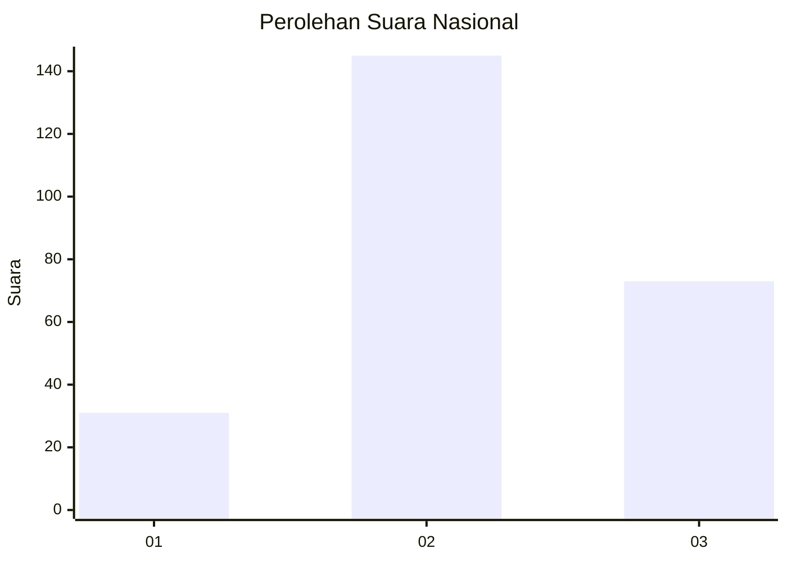
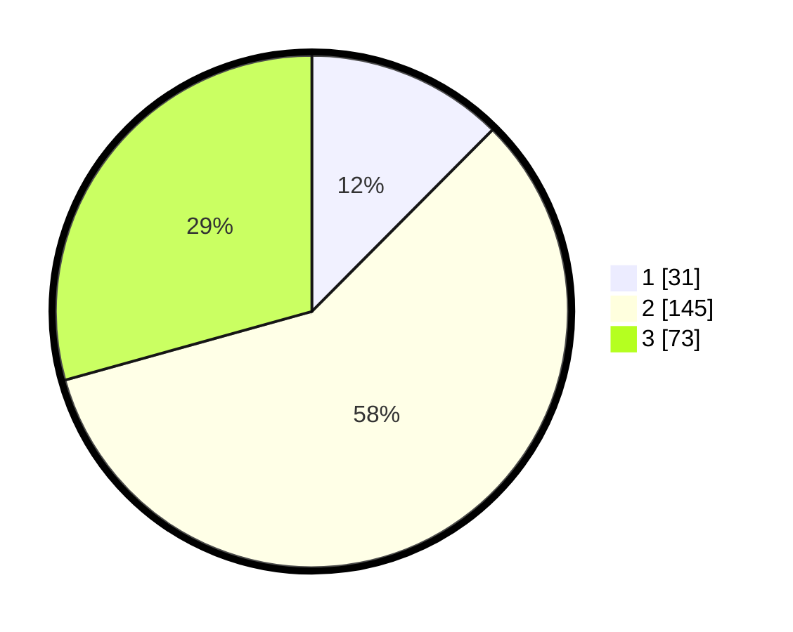

# Hasil

## Grafik

## Tabel

| No. | Nama Paslon    | Suara | Suara (raw) | Persentase |
|:--- |:-------------- | -----:| -----------:| ----------:|
| 1   | ANIES MUHAIMIN | 31    | [31][p-1]   | 12,45      |
| 2   | PRABOWO GIBRAN | 145   | [145][p-2]  | 58,23      |
| 3   | GANJAR MAHFUD  | 73    | [73][p-3]   | 29,32      |

[p-1]: https://github.com/gigit-pemilu/pemilu-2024/blob/main/pilpres/hitung-suara/sub/51-bali/sub/02-tabanan/sub/06-kediri/sub/2015-banjar-anyar/sub/042-tps/sub/paslon-1.txt
[p-2]: https://github.com/gigit-pemilu/pemilu-2024/blob/main/pilpres/hitung-suara/sub/51-bali/sub/02-tabanan/sub/06-kediri/sub/2015-banjar-anyar/sub/042-tps/sub/paslon-2.txt
[p-3]: https://github.com/gigit-pemilu/pemilu-2024/blob/main/pilpres/hitung-suara/sub/51-bali/sub/02-tabanan/sub/06-kediri/sub/2015-banjar-anyar/sub/042-tps/sub/paslon-3.txt

## Foto C Plano

https://sirekap-obj-formc.kpu.go.id/a4b8/pemilu/ppwp/51/02/06/20/15/5102062015042-20240214-190742--6239a8c8-2eb5-4b4c-8df2-40d02b498b6f.jpg

https://sirekap-obj-formc.kpu.go.id/a4b8/pemilu/ppwp/51/02/06/20/15/5102062015042-20240214-190815--927bcd91-bb57-4948-9492-ca5559dba4a4.jpg

https://sirekap-obj-formc.kpu.go.id/a4b8/pemilu/ppwp/51/02/06/20/15/5102062015042-20240214-190849--c520a43f-a3bb-4941-bf1c-f625d67db2ec.jpg

## Metadata

| Key        | Value               |
| ---------- | ------------------- |
| Time Stamp | 2024-02-14 21:46:01 |

## DATA PEMILIH TETAP

Jumlah pemilih dalam DPT: **290**.
 * L: **140**.
 * P: **150**.

## DATA PENGGUNA HAK PILIH

Jumlah pengguna hak pilih dalam DPT: **226**.
 * L: **112**.
 * P: **114**.

Jumlah pengguna hak pilih dalam DPTb: **10**.
 * L: **4**.
 * P: **6**.

Jumlah pengguna hak pilih dalam DPK: **15**.
 * L: **5**.
 * P: **10**.

Jumlah pengguna hak pilih: **251**.
 * L: **121**.
 * P: **130**.

## JUMLAH SUARA SAH DAN TIDAK SAH

JUMLAH SELURUH SUARA SAH: **249**.

JUMLAH SUARA TIDAK SAH: **2**.

JUMLAH SELURUH SUARA SAH DAN SUARA TIDAK SAH: **251**.

