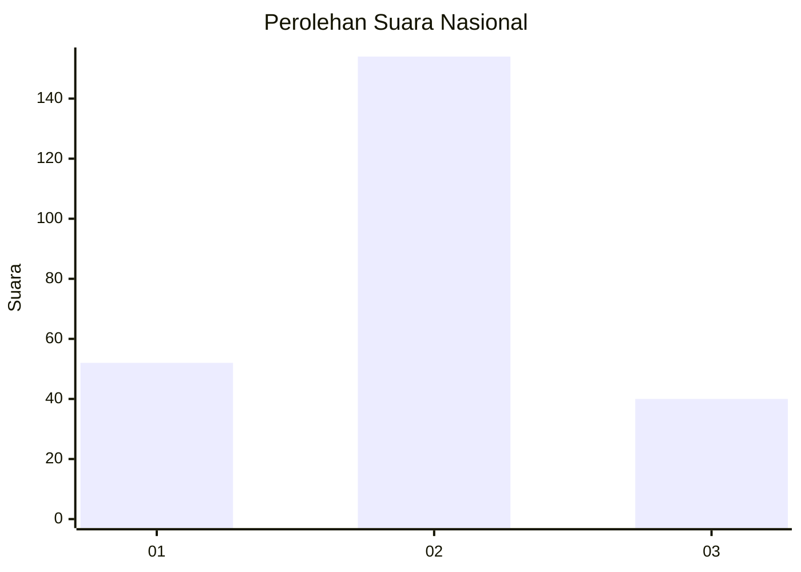

# Hasil

## Grafik

## Tabel

| No. | Nama Paslon    | Suara | Suara (raw) | Persentase |
|:--- |:-------------- | -----:| -----------:| ----------:|
| 1   | ANIES MUHAIMIN | 52    | [52][p-1]   | 21,14      |
| 2   | PRABOWO GIBRAN | 154   | [154][p-2]  | 62,60      |
| 3   | GANJAR MAHFUD  | 40    | [40][p-3]   | 16,26      |

[p-1]: https://github.com/gigit-pemilu/pemilu-2024/blob/main/pilpres/hitung-suara/sub/51-bali/sub/02-tabanan/sub/06-kediri/sub/2015-banjar-anyar/sub/043-tps/sub/paslon-1.txt
[p-2]: https://github.com/gigit-pemilu/pemilu-2024/blob/main/pilpres/hitung-suara/sub/51-bali/sub/02-tabanan/sub/06-kediri/sub/2015-banjar-anyar/sub/043-tps/sub/paslon-2.txt
[p-3]: https://github.com/gigit-pemilu/pemilu-2024/blob/main/pilpres/hitung-suara/sub/51-bali/sub/02-tabanan/sub/06-kediri/sub/2015-banjar-anyar/sub/043-tps/sub/paslon-3.txt

## Foto C Plano

https://sirekap-obj-formc.kpu.go.id/8f32/pemilu/ppwp/51/02/06/20/15/5102062015043-20240216-002107--61d3cf74-fe5d-4898-b3b8-3a2c7d3fe248.jpg

https://sirekap-obj-formc.kpu.go.id/8f32/pemilu/ppwp/51/02/06/20/15/5102062015043-20240216-002110--b30753f4-7b15-4733-beb9-aa406c40e237.jpg

https://sirekap-obj-formc.kpu.go.id/8f32/pemilu/ppwp/51/02/06/20/15/5102062015043-20240216-002109--e454cb34-42a0-445d-a75f-7257679abb12.jpg

## Metadata

| Key        | Value               |
| ---------- | ------------------- |
| Time Stamp | 2024-02-16 11:00:29 |

## DATA PEMILIH TETAP

Jumlah pemilih dalam DPT: **216**.
 * L: **103**.
 * P: **113**.

## DATA PENGGUNA HAK PILIH

Jumlah pengguna hak pilih dalam DPT: **216**.
 * L: **103**.
 * P: **113**.

Jumlah pengguna hak pilih dalam DPTb: **4**.
 * L: **2**.
 * P: **2**.

Jumlah pengguna hak pilih dalam DPK: **27**.
 * L: **13**.
 * P: **14**.

Jumlah pengguna hak pilih: **247**.
 * L: **118**.
 * P: **129**.

## JUMLAH SUARA SAH DAN TIDAK SAH

JUMLAH SELURUH SUARA SAH: **246**.

JUMLAH SUARA TIDAK SAH: **1**.

JUMLAH SELURUH SUARA SAH DAN SUARA TIDAK SAH: **247**.

