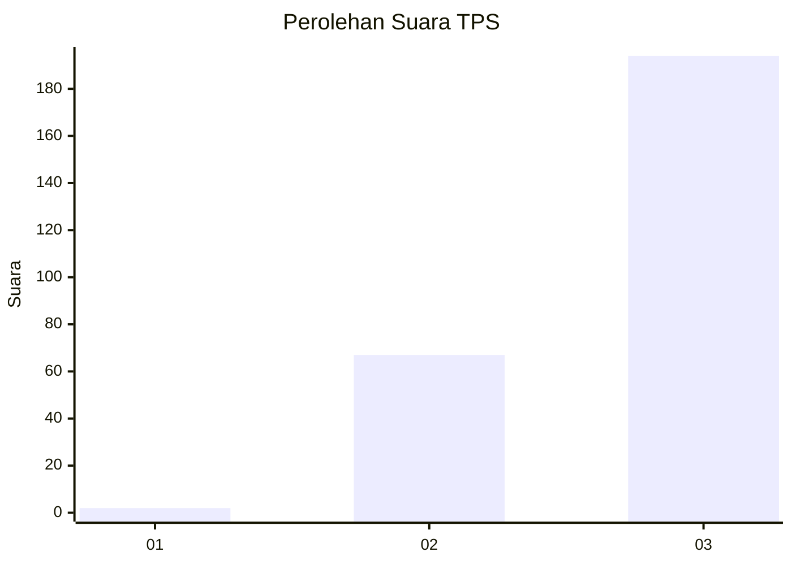
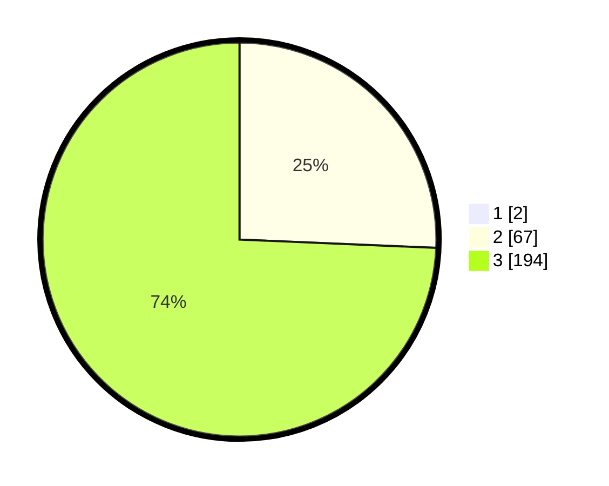

# Hasil

## Grafik

## Tabel

| No. | Nama Paslon    | Suara | Suara (raw) | Persentase |
|:--- |:-------------- | -----:| -----------:| ----------:|
| 1   | ANIES MUHAIMIN | 2     | [2][p-1]    | 0,76       |
| 2   | PRABOWO GIBRAN | 67    | [67][p-2]   | 25,48      |
| 3   | GANJAR MAHFUD  | 194   | [194][p-3]  | 73,76      |

[p-1]: https://github.com/gigit-pemilu/pemilu-2024-51-bali/blob/main/pilpres/hitung-suara/sub/51-bali/sub/02-tabanan/sub/06-kediri/sub/2015-banjar-anyar/sub/047-tps/sub/paslon-1.txt
[p-2]: https://github.com/gigit-pemilu/pemilu-2024-51-bali/blob/main/pilpres/hitung-suara/sub/51-bali/sub/02-tabanan/sub/06-kediri/sub/2015-banjar-anyar/sub/047-tps/sub/paslon-2.txt
[p-3]: https://github.com/gigit-pemilu/pemilu-2024-51-bali/blob/main/pilpres/hitung-suara/sub/51-bali/sub/02-tabanan/sub/06-kediri/sub/2015-banjar-anyar/sub/047-tps/sub/paslon-3.txt

## Foto C Plano

https://sirekap-obj-formc.kpu.go.id/64f9/pemilu/ppwp/51/02/06/20/15/5102062015047-20240214-224544--f4c90a06-a0ee-4e7a-8ebd-2999b2f46acb.jpg

https://sirekap-obj-formc.kpu.go.id/64f9/pemilu/ppwp/51/02/06/20/15/5102062015047-20240214-224702--8802f9a1-ac37-4486-9ead-33462f28018c.jpg

https://sirekap-obj-formc.kpu.go.id/64f9/pemilu/ppwp/51/02/06/20/15/5102062015047-20240214-224753--fa81e858-ab09-4359-9818-ab774250e51c.jpg

## Metadata

| Key        | Value               |
| ---------- | ------------------- |
| Time Stamp | 2024-02-24 22:31:28 |

