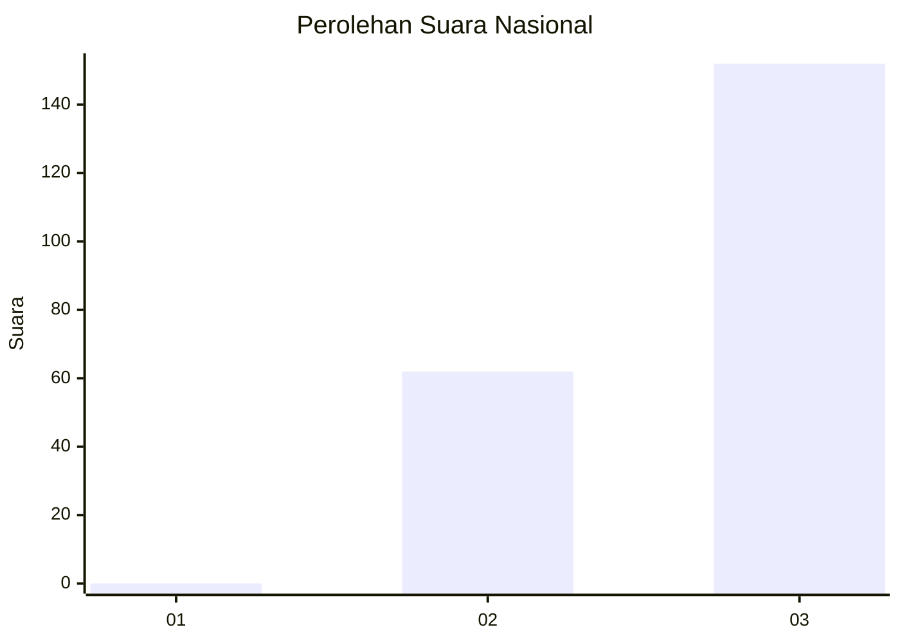
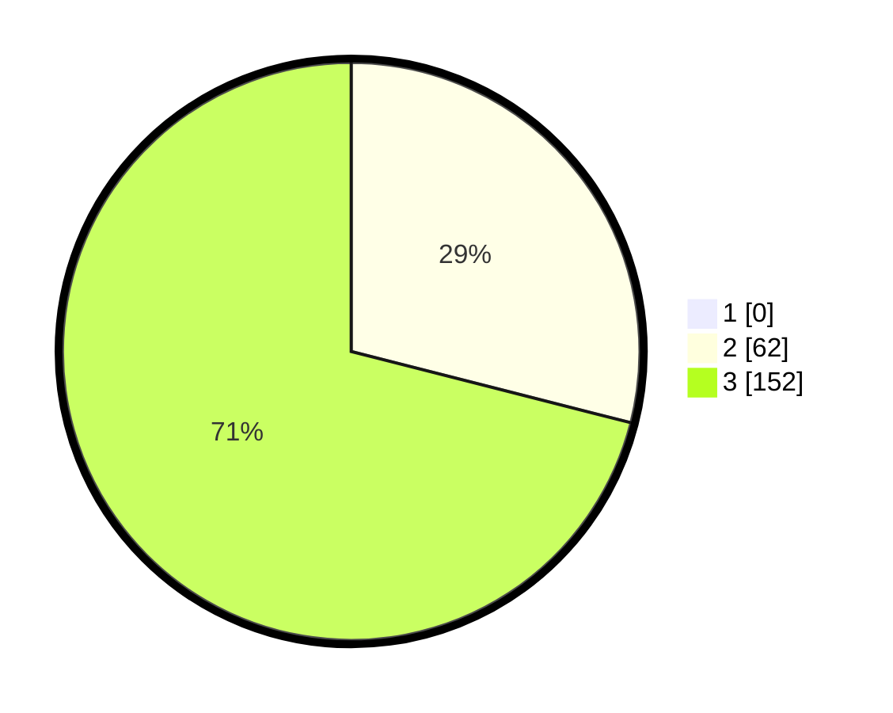

# Hasil

## Grafik

## Tabel

| No. | Nama Paslon    | Suara | Suara (raw) | Persentase |
|:--- |:-------------- | -----:| -----------:| ----------:|
| 1   | ANIES MUHAIMIN | 0     | [0][p-1]    | 0,00       |
| 2   | PRABOWO GIBRAN | 62    | [62][p-2]   | 28,97      |
| 3   | GANJAR MAHFUD  | 152   | [152][p-3]  | 71,03      |

[p-1]: https://github.com/gigit-pemilu/pemilu-2024/blob/main/pilpres/hitung-suara/sub/51-bali/sub/02-tabanan/sub/07-marga/sub/2001-kukuh/sub/001-tps/sub/paslon-1.txt
[p-2]: https://github.com/gigit-pemilu/pemilu-2024/blob/main/pilpres/hitung-suara/sub/51-bali/sub/02-tabanan/sub/07-marga/sub/2001-kukuh/sub/001-tps/sub/paslon-2.txt
[p-3]: https://github.com/gigit-pemilu/pemilu-2024/blob/main/pilpres/hitung-suara/sub/51-bali/sub/02-tabanan/sub/07-marga/sub/2001-kukuh/sub/001-tps/sub/paslon-3.txt

## Foto C Plano

https://sirekap-obj-formc.kpu.go.id/5140/pemilu/ppwp/51/02/07/20/01/5102072001001-20240216-003920--9135267c-8c16-4603-bf85-8ceeaaae5b5e.jpg

https://sirekap-obj-formc.kpu.go.id/5140/pemilu/ppwp/51/02/07/20/01/5102072001001-20240216-003921--82c59108-64b6-4594-b75a-637852fed107.jpg

https://sirekap-obj-formc.kpu.go.id/5140/pemilu/ppwp/51/02/07/20/01/5102072001001-20240216-003921--eb1ca05b-9143-4a15-b7c1-d7536e417630.jpg

## Metadata

| Key        | Value               |
| ---------- | ------------------- |
| Time Stamp | 2024-02-16 11:00:29 |

## DATA PEMILIH TETAP

Jumlah pemilih dalam DPT: **238**.
 * L: **119**.
 * P: **119**.

## DATA PENGGUNA HAK PILIH

Jumlah pengguna hak pilih dalam DPT: **214**.
 * L: **109**.
 * P: **105**.

Jumlah pengguna hak pilih dalam DPTb: **0**.
 * L: **0**.
 * P: **0**.

Jumlah pengguna hak pilih dalam DPK: **1**.
 * L: **1**.
 * P: **0**.

Jumlah pengguna hak pilih: **215**.
 * L: **110**.
 * P: **105**.

## JUMLAH SUARA SAH DAN TIDAK SAH

JUMLAH SELURUH SUARA SAH: **214**.

JUMLAH SUARA TIDAK SAH: **1**.

JUMLAH SELURUH SUARA SAH DAN SUARA TIDAK SAH: **215**.

