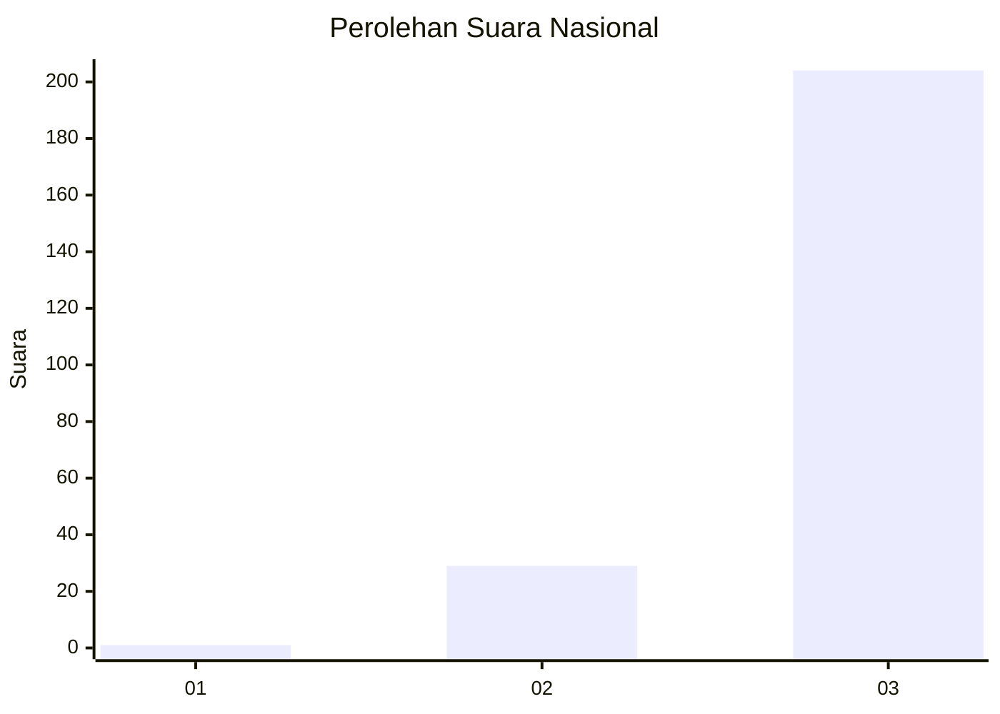
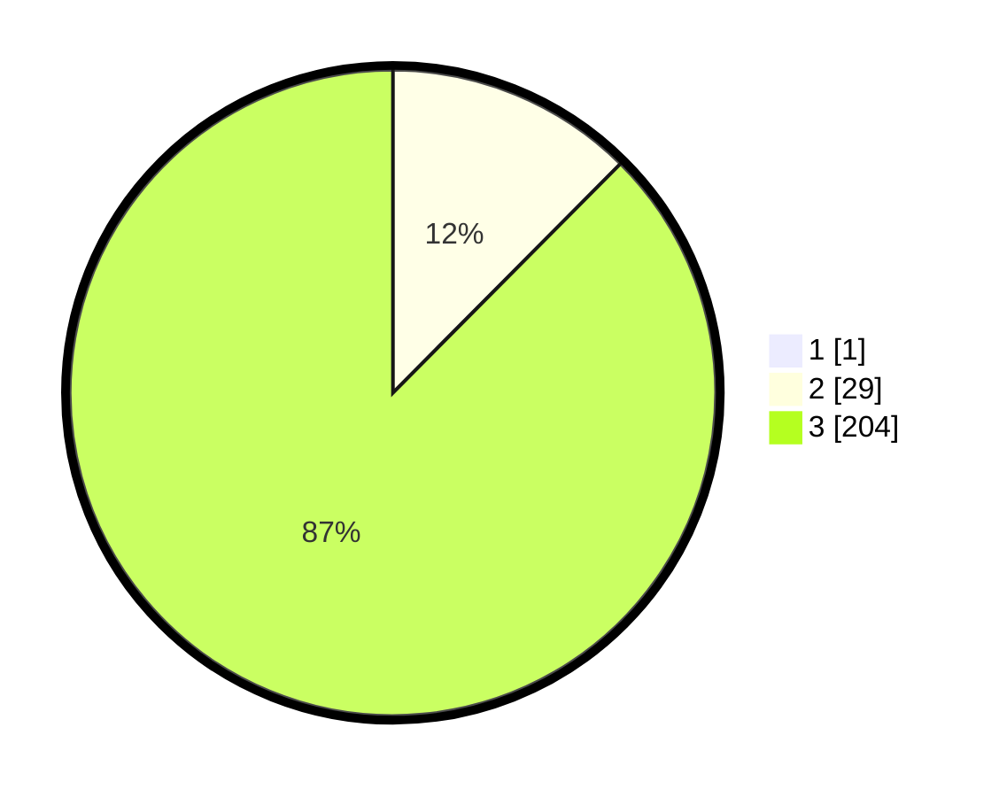

# Hasil

## Grafik

## Tabel

| No. | Nama Paslon    | Suara | Suara (raw) | Persentase |
|:--- |:-------------- | -----:| -----------:| ----------:|
| 1   | ANIES MUHAIMIN | 1     | [1][p-1]    | 0,43       |
| 2   | PRABOWO GIBRAN | 29    | [29][p-2]   | 12,39      |
| 3   | GANJAR MAHFUD  | 204   | [204][p-3]  | 87,18      |

[p-1]: https://github.com/gigit-pemilu/pemilu-2024/blob/main/pilpres/hitung-suara/sub/51-bali/sub/02-tabanan/sub/07-marga/sub/2001-kukuh/sub/002-tps/sub/paslon-1.txt
[p-2]: https://github.com/gigit-pemilu/pemilu-2024/blob/main/pilpres/hitung-suara/sub/51-bali/sub/02-tabanan/sub/07-marga/sub/2001-kukuh/sub/002-tps/sub/paslon-2.txt
[p-3]: https://github.com/gigit-pemilu/pemilu-2024/blob/main/pilpres/hitung-suara/sub/51-bali/sub/02-tabanan/sub/07-marga/sub/2001-kukuh/sub/002-tps/sub/paslon-3.txt

## Foto C Plano

https://sirekap-obj-formc.kpu.go.id/f85d/pemilu/ppwp/51/02/07/20/01/5102072001002-20240214-203641--22342219-09b6-4425-9a28-cb2e0dd36f7c.jpg

https://sirekap-obj-formc.kpu.go.id/f85d/pemilu/ppwp/51/02/07/20/01/5102072001002-20240214-204328--e0868fa4-a8ab-4095-81cb-350380d287c5.jpg

## Metadata

| Key        | Value               |
| ---------- | ------------------- |
| Time Stamp | 2024-02-15 22:30:27 |

