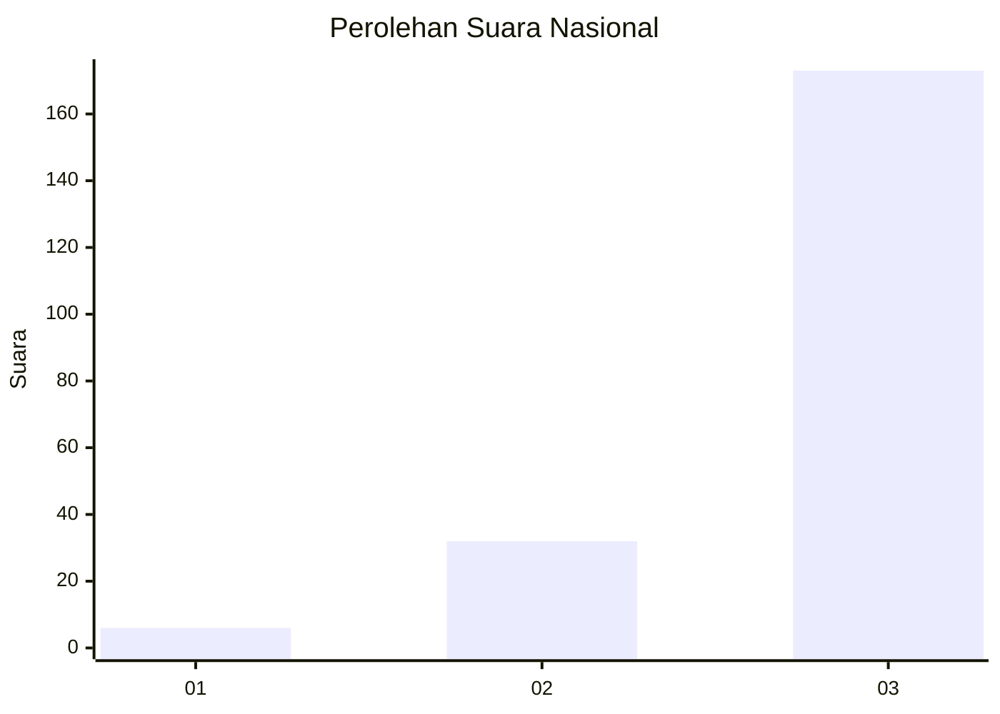
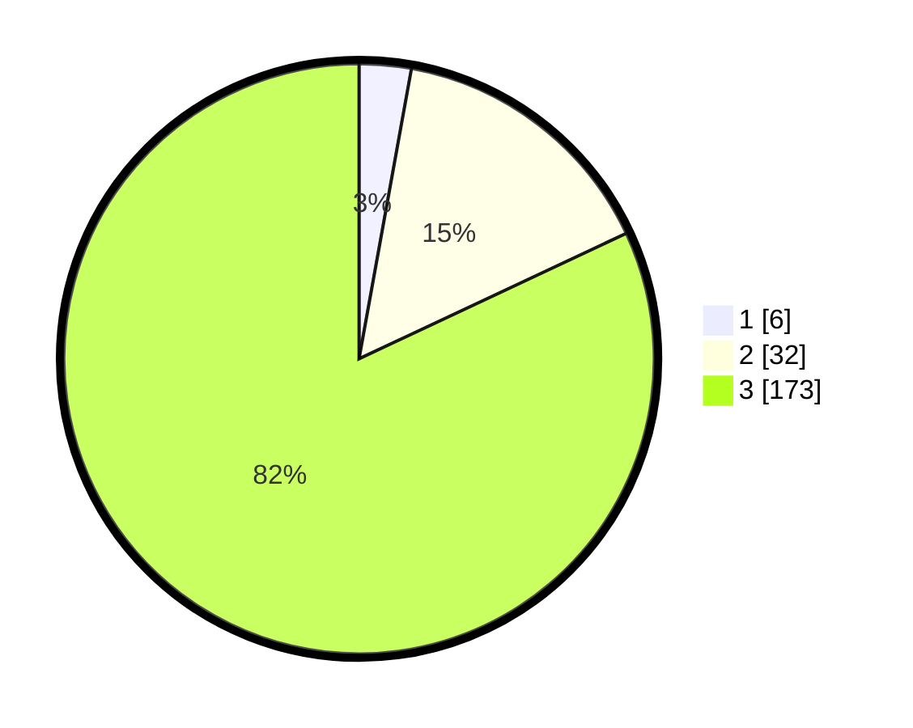

# Hasil

## Grafik

## Tabel

| No. | Nama Paslon    | Suara | Suara (raw) | Persentase |
|:--- |:-------------- | -----:| -----------:| ----------:|
| 1   | ANIES MUHAIMIN | 6     | [6][p-1]    | 2,84       |
| 2   | PRABOWO GIBRAN | 32    | [32][p-2]   | 15,17      |
| 3   | GANJAR MAHFUD  | 173   | [173][p-3]  | 81,99      |

[p-1]: https://github.com/gigit-pemilu/pemilu-2024/blob/main/pilpres/hitung-suara/sub/51-bali/sub/02-tabanan/sub/07-marga/sub/2001-kukuh/sub/003-tps/sub/paslon-1.txt
[p-2]: https://github.com/gigit-pemilu/pemilu-2024/blob/main/pilpres/hitung-suara/sub/51-bali/sub/02-tabanan/sub/07-marga/sub/2001-kukuh/sub/003-tps/sub/paslon-2.txt
[p-3]: https://github.com/gigit-pemilu/pemilu-2024/blob/main/pilpres/hitung-suara/sub/51-bali/sub/02-tabanan/sub/07-marga/sub/2001-kukuh/sub/003-tps/sub/paslon-3.txt

## Foto C Plano

https://sirekap-obj-formc.kpu.go.id/d1a3/pemilu/ppwp/51/02/07/20/01/5102072001003-20240216-024235--8472e0d9-d8be-45f1-b6e0-086df478e891.jpg

https://sirekap-obj-formc.kpu.go.id/d1a3/pemilu/ppwp/51/02/07/20/01/5102072001003-20240216-024810--63407410-cb0f-4634-a894-f7f439635701.jpg

https://sirekap-obj-formc.kpu.go.id/d1a3/pemilu/ppwp/51/02/07/20/01/5102072001003-20240216-024240--d92d7afc-6d9c-48a5-b782-38a1bc6eaf62.jpg

## Metadata

| Key        | Value               |
| ---------- | ------------------- |
| Time Stamp | 2024-02-16 11:00:29 |

## DATA PEMILIH TETAP

Jumlah pemilih dalam DPT: **226**.
 * L: **115**.
 * P: **111**.

## DATA PENGGUNA HAK PILIH

Jumlah pengguna hak pilih dalam DPT: **215**.
 * L: **111**.
 * P: **104**.

Jumlah pengguna hak pilih dalam DPTb: **0**.
 * L: **0**.
 * P: **0**.

Jumlah pengguna hak pilih dalam DPK: **0**.
 * L: **0**.
 * P: **0**.

Jumlah pengguna hak pilih: **215**.
 * L: **111**.
 * P: **104**.

## JUMLAH SUARA SAH DAN TIDAK SAH

JUMLAH SELURUH SUARA SAH: **211**.

JUMLAH SUARA TIDAK SAH: **4**.

JUMLAH SELURUH SUARA SAH DAN SUARA TIDAK SAH: **215**.

