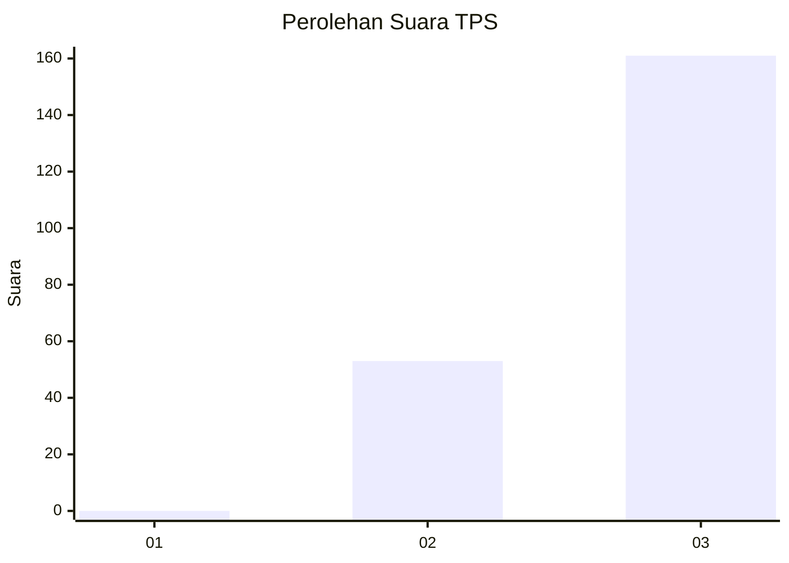
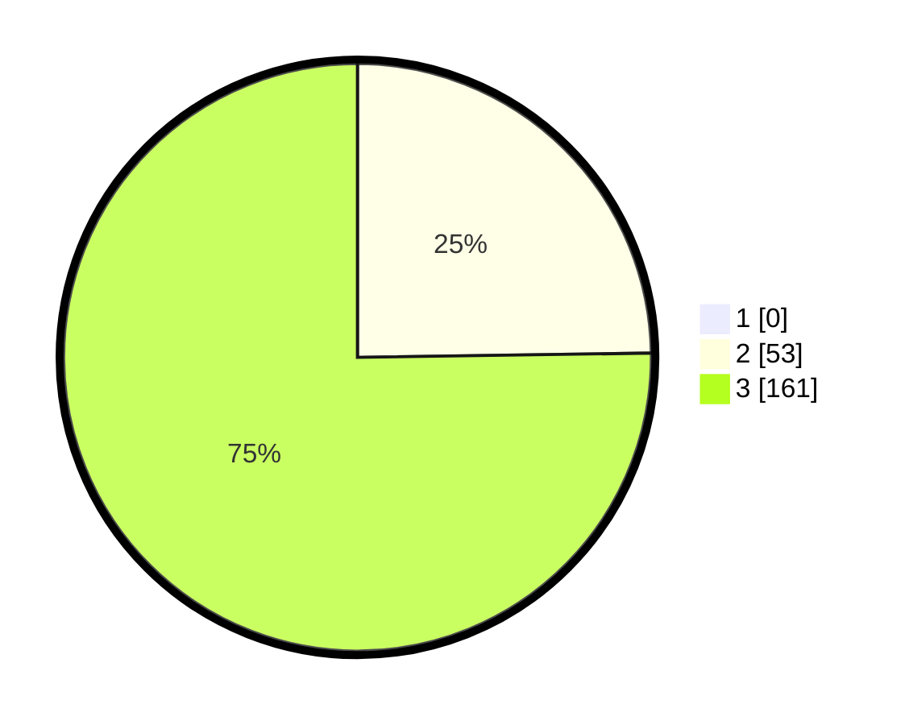

# Hasil

## Grafik

## Tabel

| No. | Nama Paslon    | Suara | Suara (raw) | Persentase |
|:--- |:-------------- | -----:| -----------:| ----------:|
| 1   | ANIES MUHAIMIN | 0     | [0][p-1]    | 0,00       |
| 2   | PRABOWO GIBRAN | 53    | [53][p-2]   | 24,77      |
| 3   | GANJAR MAHFUD  | 161   | [161][p-3]  | 75,23      |

[p-1]: https://github.com/gigit-pemilu/pemilu-2024-51-bali/blob/main/pilpres/hitung-suara/sub/51-bali/sub/02-tabanan/sub/07-marga/sub/2001-kukuh/sub/008-tps/sub/paslon-1.txt
[p-2]: https://github.com/gigit-pemilu/pemilu-2024-51-bali/blob/main/pilpres/hitung-suara/sub/51-bali/sub/02-tabanan/sub/07-marga/sub/2001-kukuh/sub/008-tps/sub/paslon-2.txt
[p-3]: https://github.com/gigit-pemilu/pemilu-2024-51-bali/blob/main/pilpres/hitung-suara/sub/51-bali/sub/02-tabanan/sub/07-marga/sub/2001-kukuh/sub/008-tps/sub/paslon-3.txt

## Foto C Plano

https://sirekap-obj-formc.kpu.go.id/a78d/pemilu/ppwp/51/02/07/20/01/5102072001008-20240214-131508--249b0d09-bfa8-4500-bdbe-47b8715d73e4.jpg

https://sirekap-obj-formc.kpu.go.id/a78d/pemilu/ppwp/51/02/07/20/01/5102072001008-20240214-131802--7142561e-a61c-42e1-b5b5-96828152649f.jpg

https://sirekap-obj-formc.kpu.go.id/a78d/pemilu/ppwp/51/02/07/20/01/5102072001008-20240214-132052--70f691f8-57ae-4b37-8fdb-3a5dfb144679.jpg

## Metadata

| Key        | Value               |
| ---------- | ------------------- |
| Time Stamp | 2024-02-14 21:46:01 |

## DATA PEMILIH TETAP

Jumlah pemilih dalam DPT: **230**.
 * L: **114**.
 * P: **116**.

## DATA PENGGUNA HAK PILIH

Jumlah pengguna hak pilih dalam DPT: **213**.
 * L: **106**.
 * P: **107**.

Jumlah pengguna hak pilih dalam DPTb: **1**.
 * L: **0**.
 * P: **1**.

Jumlah pengguna hak pilih dalam DPK: **1**.
 * L: **0**.
 * P: **1**.

Jumlah pengguna hak pilih: **215**.
 * L: **106**.
 * P: **109**.

## JUMLAH SUARA SAH DAN TIDAK SAH

JUMLAH SELURUH SUARA SAH: **214**.

JUMLAH SUARA TIDAK SAH: **1**.

JUMLAH SELURUH SUARA SAH DAN SUARA TIDAK SAH: **215**.

