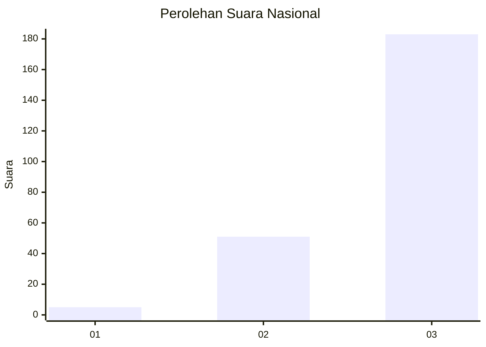
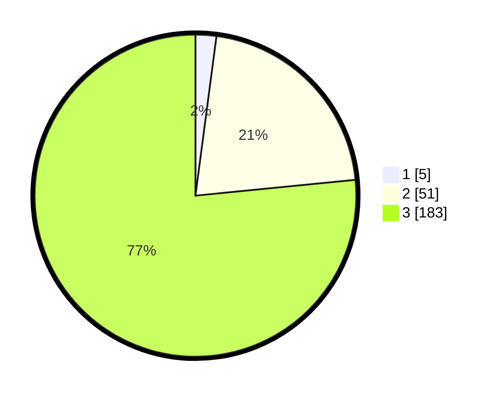

# Hasil

## Grafik

## Tabel

| No. | Nama Paslon    | Suara | Suara (raw) | Persentase |
|:--- |:-------------- | -----:| -----------:| ----------:|
| 1   | ANIES MUHAIMIN | 5     | [5][p-1]    | 2,09       |
| 2   | PRABOWO GIBRAN | 51    | [51][p-2]   | 21,34      |
| 3   | GANJAR MAHFUD  | 183   | [183][p-3]  | 76,57      |

[p-1]: https://github.com/gigit-pemilu/pemilu-2024/blob/main/pilpres/hitung-suara/sub/51-bali/sub/02-tabanan/sub/07-marga/sub/2001-kukuh/sub/012-tps/sub/paslon-1.txt
[p-2]: https://github.com/gigit-pemilu/pemilu-2024/blob/main/pilpres/hitung-suara/sub/51-bali/sub/02-tabanan/sub/07-marga/sub/2001-kukuh/sub/012-tps/sub/paslon-2.txt
[p-3]: https://github.com/gigit-pemilu/pemilu-2024/blob/main/pilpres/hitung-suara/sub/51-bali/sub/02-tabanan/sub/07-marga/sub/2001-kukuh/sub/012-tps/sub/paslon-3.txt

## Foto C Plano

https://sirekap-obj-formc.kpu.go.id/7aca/pemilu/ppwp/51/02/07/20/01/5102072001012-20240214-210348--38e3cef2-4f28-4cba-8ddb-89ffa03c58cf.jpg

https://sirekap-obj-formc.kpu.go.id/7aca/pemilu/ppwp/51/02/07/20/01/5102072001012-20240214-210413--706235d7-a851-4f68-aa20-1365c3ad9665.jpg

https://sirekap-obj-formc.kpu.go.id/7aca/pemilu/ppwp/51/02/07/20/01/5102072001012-20240214-210422--c72cbfd6-51d4-407b-8471-c5daafcad0bf.jpg

## Metadata

| Key        | Value               |
| ---------- | ------------------- |
| Time Stamp | 2024-02-15 23:29:50 |

