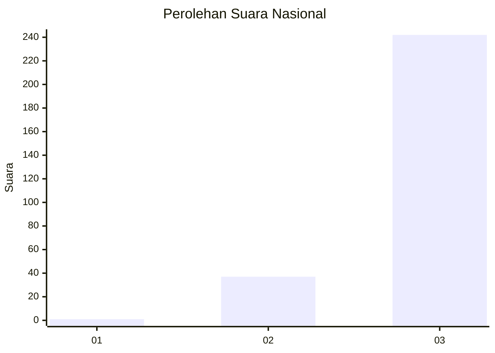
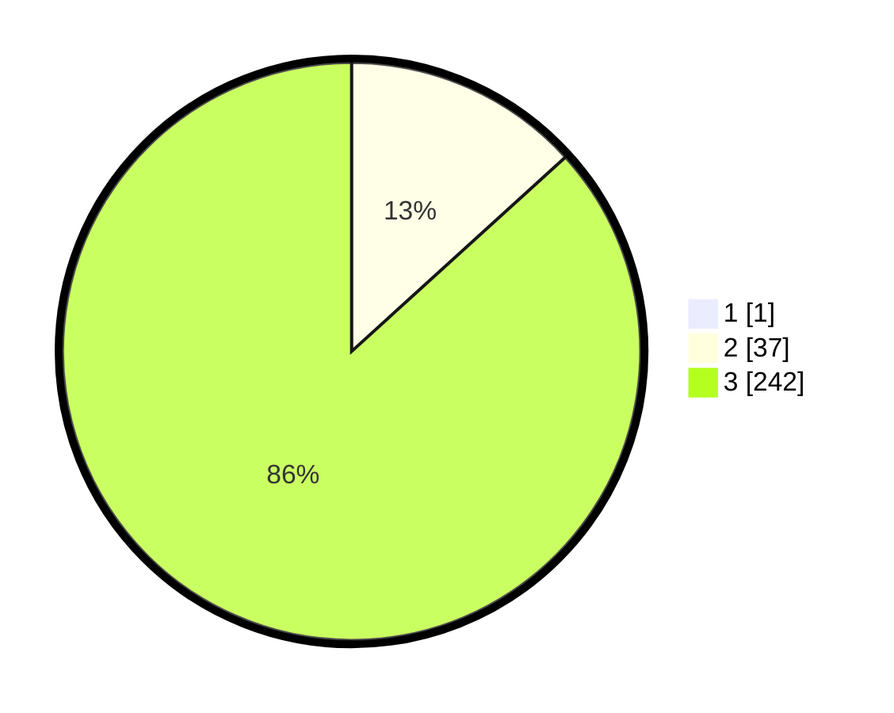

# Hasil

## Grafik

## Tabel

| No. | Nama Paslon    | Suara | Suara (raw) | Persentase |
|:--- |:-------------- | -----:| -----------:| ----------:|
| 1   | ANIES MUHAIMIN | 1     | [1][p-1]    | 0,36       |
| 2   | PRABOWO GIBRAN | 37    | [37][p-2]   | 13,21      |
| 3   | GANJAR MAHFUD  | 242   | [242][p-3]  | 86,43      |

[p-1]: https://github.com/gigit-pemilu/pemilu-2024/blob/main/pilpres/hitung-suara/sub/51-bali/sub/02-tabanan/sub/07-marga/sub/2002-beringkit-belayu/sub/005-tps/sub/paslon-1.txt
[p-2]: https://github.com/gigit-pemilu/pemilu-2024/blob/main/pilpres/hitung-suara/sub/51-bali/sub/02-tabanan/sub/07-marga/sub/2002-beringkit-belayu/sub/005-tps/sub/paslon-2.txt
[p-3]: https://github.com/gigit-pemilu/pemilu-2024/blob/main/pilpres/hitung-suara/sub/51-bali/sub/02-tabanan/sub/07-marga/sub/2002-beringkit-belayu/sub/005-tps/sub/paslon-3.txt

## Foto C Plano

https://sirekap-obj-formc.kpu.go.id/7ce4/pemilu/ppwp/51/02/07/20/02/5102072002005-20240214-194547--3bb9a259-8931-4ad8-8abe-9f444709eff5.jpg

https://sirekap-obj-formc.kpu.go.id/7ce4/pemilu/ppwp/51/02/07/20/02/5102072002005-20240214-194946--c4a3686f-583b-4bfd-8f23-1491f44cd2ad.jpg

https://sirekap-obj-formc.kpu.go.id/7ce4/pemilu/ppwp/51/02/07/20/02/5102072002005-20240214-195130--4d9f0755-ea39-4d97-9ba0-76d36f8e8719.jpg

## Metadata

| Key        | Value               |
| ---------- | ------------------- |
| Time Stamp | 2024-02-15 23:29:50 |

## DATA PEMILIH TETAP

Jumlah pemilih dalam DPT: **285**.
 * L: **144**.
 * P: **141**.

## DATA PENGGUNA HAK PILIH

Jumlah pengguna hak pilih dalam DPT: **280**.
 * L: **140**.
 * P: **140**.

Jumlah pengguna hak pilih dalam DPTb: **0**.
 * L: **0**.
 * P: **0**.

Jumlah pengguna hak pilih dalam DPK: **0**.
 * L: **0**.
 * P: **0**.

Jumlah pengguna hak pilih: **280**.
 * L: **140**.
 * P: **140**.

## JUMLAH SUARA SAH DAN TIDAK SAH

JUMLAH SELURUH SUARA SAH: **280**.

JUMLAH SUARA TIDAK SAH: **0**.

JUMLAH SELURUH SUARA SAH DAN SUARA TIDAK SAH: **280**.

