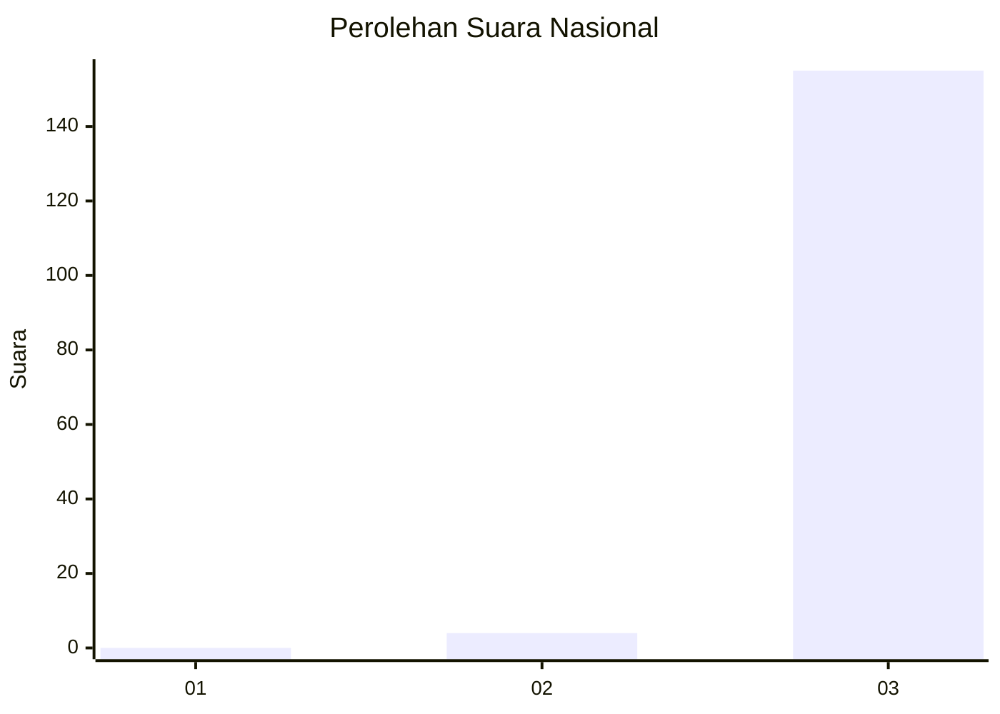
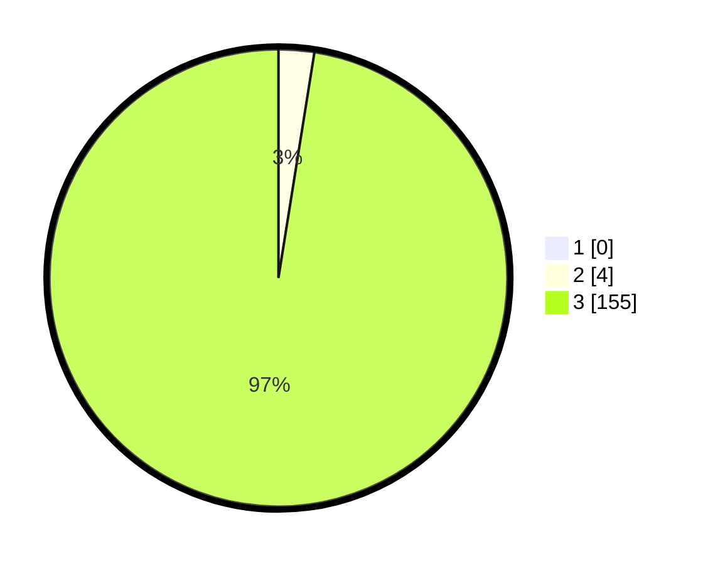

# Hasil

## Grafik

## Tabel

| No. | Nama Paslon    | Suara | Suara (raw) | Persentase |
|:--- |:-------------- | -----:| -----------:| ----------:|
| 1   | ANIES MUHAIMIN | 0     | [0][p-1]    | 0,00       |
| 2   | PRABOWO GIBRAN | 4     | [4][p-2]    | 2,52       |
| 3   | GANJAR MAHFUD  | 155   | [155][p-3]  | 97,48      |

[p-1]: https://github.com/gigit-pemilu/pemilu-2024/blob/main/pilpres/hitung-suara/sub/51-bali/sub/02-tabanan/sub/07-marga/sub/2002-beringkit-belayu/sub/006-tps/sub/paslon-1.txt
[p-2]: https://github.com/gigit-pemilu/pemilu-2024/blob/main/pilpres/hitung-suara/sub/51-bali/sub/02-tabanan/sub/07-marga/sub/2002-beringkit-belayu/sub/006-tps/sub/paslon-2.txt
[p-3]: https://github.com/gigit-pemilu/pemilu-2024/blob/main/pilpres/hitung-suara/sub/51-bali/sub/02-tabanan/sub/07-marga/sub/2002-beringkit-belayu/sub/006-tps/sub/paslon-3.txt

## Foto C Plano

https://sirekap-obj-formc.kpu.go.id/d9c5/pemilu/ppwp/51/02/07/20/02/5102072002006-20240214-124154--ac8ce00b-c049-406b-8567-adfc9472f8f8.jpg

https://sirekap-obj-formc.kpu.go.id/d9c5/pemilu/ppwp/51/02/07/20/02/5102072002006-20240214-124631--847d0df7-67bf-4f59-b20b-9114318441cc.jpg

https://sirekap-obj-formc.kpu.go.id/d9c5/pemilu/ppwp/51/02/07/20/02/5102072002006-20240214-124744--0e31a75a-33fe-460e-8336-b3212594cefc.jpg

## Metadata

| Key        | Value               |
| ---------- | ------------------- |
| Time Stamp | 2024-02-15 23:29:50 |

## DATA PEMILIH TETAP

Jumlah pemilih dalam DPT: **160**.
 * L: **80**.
 * P: **80**.

## DATA PENGGUNA HAK PILIH

Jumlah pengguna hak pilih dalam DPT: **159**.
 * L: **80**.
 * P: **79**.

Jumlah pengguna hak pilih dalam DPTb: **2**.
 * L: **0**.
 * P: **2**.

Jumlah pengguna hak pilih dalam DPK: **0**.
 * L: **0**.
 * P: **0**.

Jumlah pengguna hak pilih: **161**.
 * L: **80**.
 * P: **81**.

## JUMLAH SUARA SAH DAN TIDAK SAH

JUMLAH SELURUH SUARA SAH: **159**.

JUMLAH SUARA TIDAK SAH: **2**.

JUMLAH SELURUH SUARA SAH DAN SUARA TIDAK SAH: **161**.

