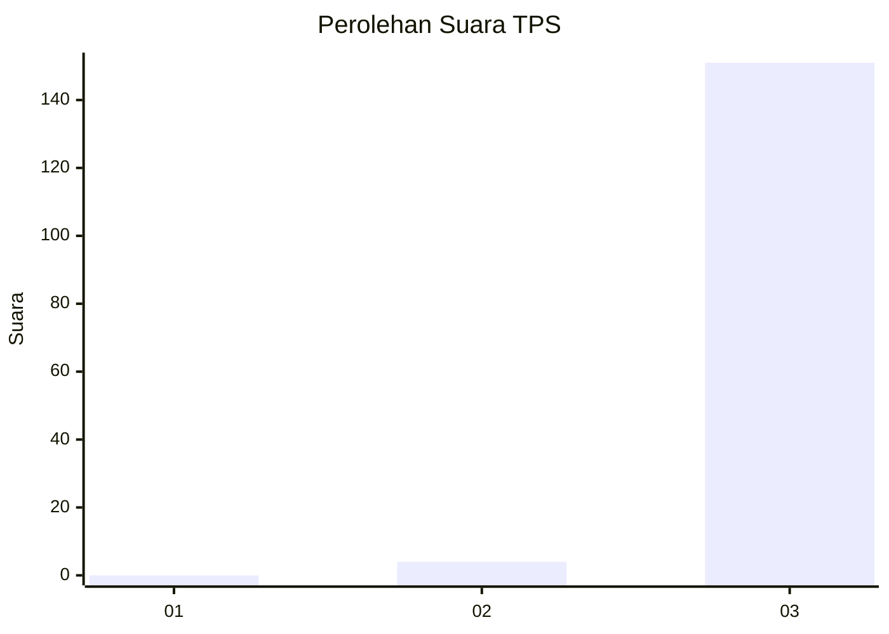
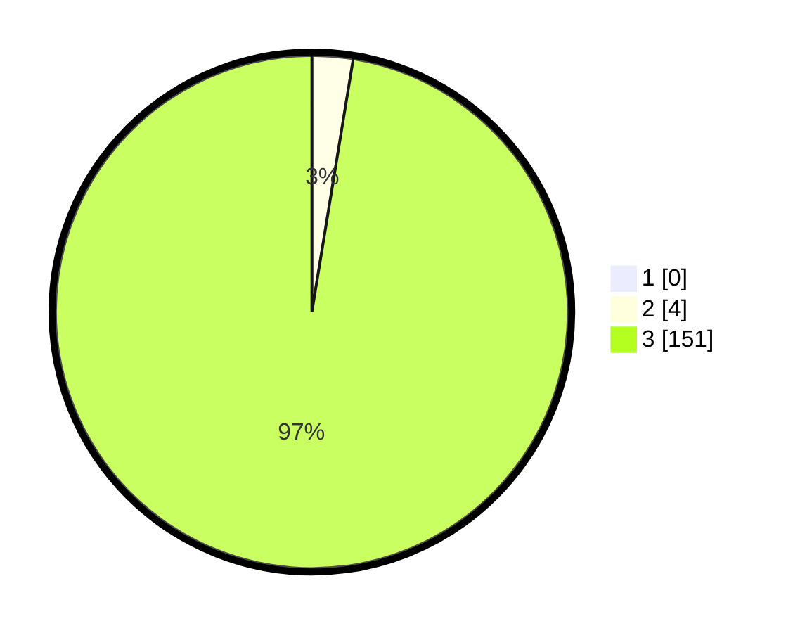

# Hasil

## Grafik

## Tabel

| No. | Nama Paslon    | Suara | Suara (raw) | Persentase |
|:--- |:-------------- | -----:| -----------:| ----------:|
| 1   | ANIES MUHAIMIN | 0     | [0][p-1]    | 0,00       |
| 2   | PRABOWO GIBRAN | 4     | [4][p-2]    | 2,58       |
| 3   | GANJAR MAHFUD  | 151   | [151][p-3]  | 97,42      |

[p-1]: https://github.com/gigit-pemilu/pemilu-2024-51-bali/blob/main/pilpres/hitung-suara/sub/51-bali/sub/02-tabanan/sub/07-marga/sub/2002-beringkit-belayu/sub/007-tps/sub/paslon-1.txt
[p-2]: https://github.com/gigit-pemilu/pemilu-2024-51-bali/blob/main/pilpres/hitung-suara/sub/51-bali/sub/02-tabanan/sub/07-marga/sub/2002-beringkit-belayu/sub/007-tps/sub/paslon-2.txt
[p-3]: https://github.com/gigit-pemilu/pemilu-2024-51-bali/blob/main/pilpres/hitung-suara/sub/51-bali/sub/02-tabanan/sub/07-marga/sub/2002-beringkit-belayu/sub/007-tps/sub/paslon-3.txt

## Foto C Plano

https://sirekap-obj-formc.kpu.go.id/e25d/pemilu/ppwp/51/02/07/20/02/5102072002007-20240214-130637--5095550a-3fa9-4c34-bab8-0033c8b12e73.jpg

https://sirekap-obj-formc.kpu.go.id/e25d/pemilu/ppwp/51/02/07/20/02/5102072002007-20240214-130808--c5dad864-c488-4d2c-9bd7-26b48be79031.jpg

https://sirekap-obj-formc.kpu.go.id/e25d/pemilu/ppwp/51/02/07/20/02/5102072002007-20240214-130930--dbb37447-247f-4e50-bf6a-bc06873c5be9.jpg

## Metadata

| Key        | Value               |
| ---------- | ------------------- |
| Time Stamp | 2024-02-14 21:46:01 |

## DATA PEMILIH TETAP

Jumlah pemilih dalam DPT: **162**.
 * L: **87**.
 * P: **75**.

## DATA PENGGUNA HAK PILIH

Jumlah pengguna hak pilih dalam DPT: **156**.
 * L: **83**.
 * P: **73**.

Jumlah pengguna hak pilih dalam DPTb: **2**.
 * L: **1**.
 * P: **1**.

Jumlah pengguna hak pilih dalam DPK: **0**.
 * L: **0**.
 * P: **0**.

Jumlah pengguna hak pilih: **158**.
 * L: **84**.
 * P: **74**.

## JUMLAH SUARA SAH DAN TIDAK SAH

JUMLAH SELURUH SUARA SAH: **155**.

JUMLAH SUARA TIDAK SAH: **3**.

JUMLAH SELURUH SUARA SAH DAN SUARA TIDAK SAH: **158**.

