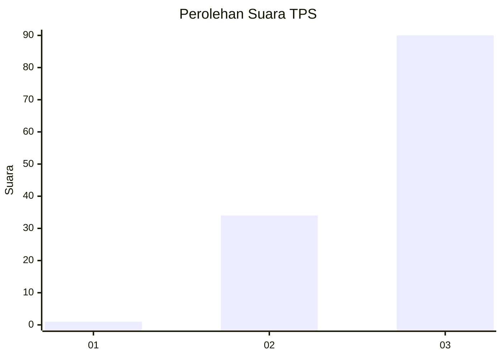
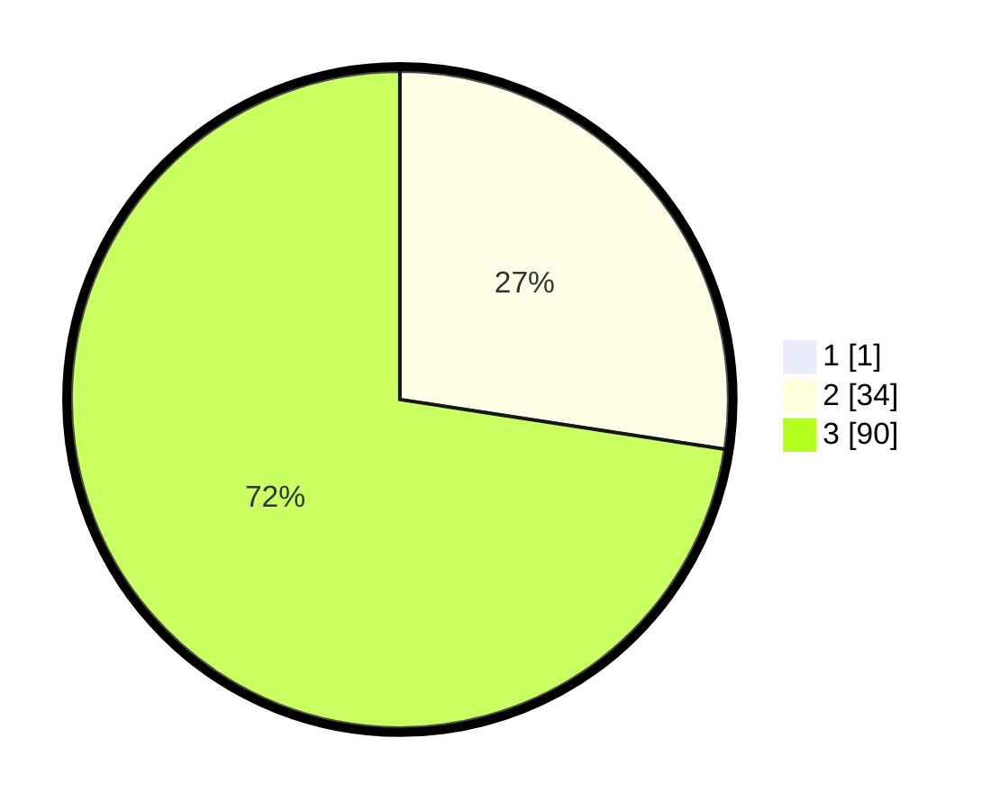

# Hasil

## Grafik

## Tabel

| No. | Nama Paslon    | Suara | Suara (raw) | Persentase |
|:--- |:-------------- | -----:| -----------:| ----------:|
| 1   | ANIES MUHAIMIN | 1     | [1][p-1]    | 0,80       |
| 2   | PRABOWO GIBRAN | 34    | [34][p-2]   | 27,20      |
| 3   | GANJAR MAHFUD  | 90    | [90][p-3]   | 72,00      |

[p-1]: https://github.com/gigit-pemilu/pemilu-2024-51-bali/blob/main/pilpres/hitung-suara/sub/51-bali/sub/02-tabanan/sub/07-marga/sub/2002-beringkit-belayu/sub/008-tps/sub/paslon-1.txt
[p-2]: https://github.com/gigit-pemilu/pemilu-2024-51-bali/blob/main/pilpres/hitung-suara/sub/51-bali/sub/02-tabanan/sub/07-marga/sub/2002-beringkit-belayu/sub/008-tps/sub/paslon-2.txt
[p-3]: https://github.com/gigit-pemilu/pemilu-2024-51-bali/blob/main/pilpres/hitung-suara/sub/51-bali/sub/02-tabanan/sub/07-marga/sub/2002-beringkit-belayu/sub/008-tps/sub/paslon-3.txt

## Foto C Plano

https://sirekap-obj-formc.kpu.go.id/8279/pemilu/ppwp/51/02/07/20/02/5102072002008-20240214-133037--bb855335-c649-4072-b481-31984c02a0de.jpg

https://sirekap-obj-formc.kpu.go.id/8279/pemilu/ppwp/51/02/07/20/02/5102072002008-20240214-125431--16165b78-85f5-4e1f-9c93-9b23bf2d9da3.jpg

https://sirekap-obj-formc.kpu.go.id/8279/pemilu/ppwp/51/02/07/20/02/5102072002008-20240214-185159--f9f43f01-049c-4f0e-b32c-6f44265a9cd2.jpg

## Metadata

| Key        | Value               |
| ---------- | ------------------- |
| Time Stamp | 2024-02-14 21:46:01 |

## DATA PEMILIH TETAP

Jumlah pemilih dalam DPT: **129**.
 * L: **62**.
 * P: **67**.

## DATA PENGGUNA HAK PILIH

Jumlah pengguna hak pilih dalam DPT: **126**.
 * L: **60**.
 * P: **66**.

Jumlah pengguna hak pilih dalam DPTb: **0**.
 * L: **0**.
 * P: **0**.

Jumlah pengguna hak pilih dalam DPK: **0**.
 * L: **0**.
 * P: **0**.

Jumlah pengguna hak pilih: **126**.
 * L: **60**.
 * P: **66**.

## JUMLAH SUARA SAH DAN TIDAK SAH

JUMLAH SELURUH SUARA SAH: **125**.

JUMLAH SUARA TIDAK SAH: **1**.

JUMLAH SELURUH SUARA SAH DAN SUARA TIDAK SAH: **126**.

