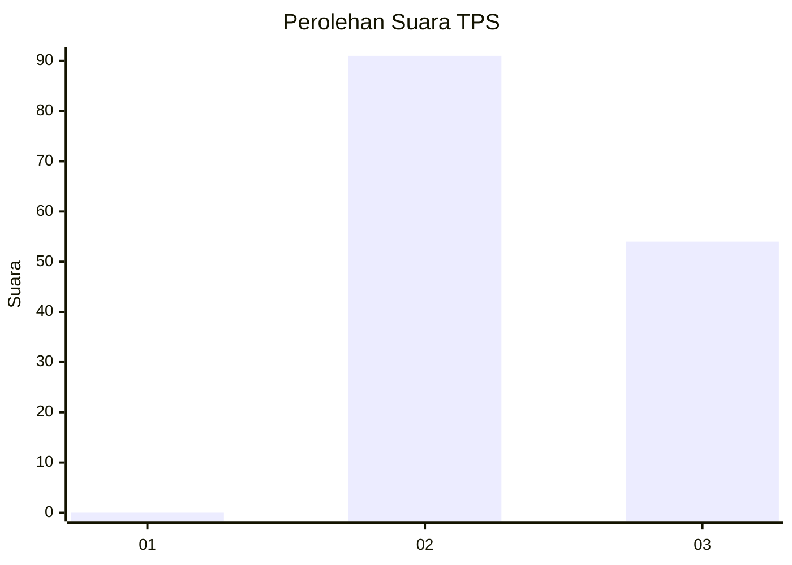
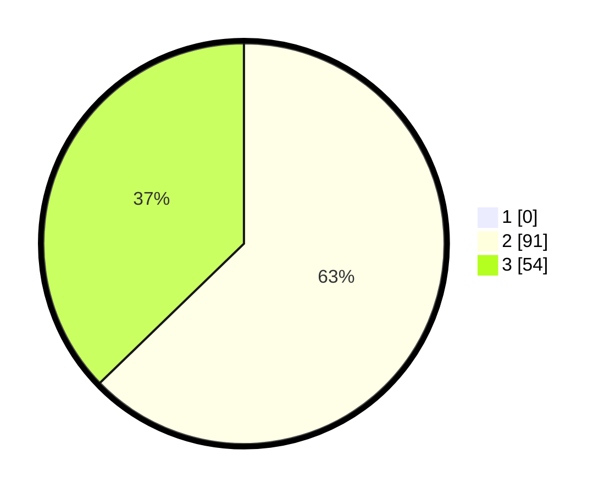

# Hasil

## Grafik

## Tabel

| No. | Nama Paslon    | Suara | Suara (raw) | Persentase |
|:--- |:-------------- | -----:| -----------:| ----------:|
| 1   | ANIES MUHAIMIN | 0     | [0][p-1]    | 0,00       |
| 2   | PRABOWO GIBRAN | 91    | [91][p-2]   | 62,76      |
| 3   | GANJAR MAHFUD  | 54    | [54][p-3]   | 37,24      |

[p-1]: https://github.com/gigit-pemilu/pemilu-2024-51-bali/blob/main/pilpres/hitung-suara/sub/51-bali/sub/02-tabanan/sub/07-marga/sub/2003-peken-belayu/sub/003-tps/sub/paslon-1.txt
[p-2]: https://github.com/gigit-pemilu/pemilu-2024-51-bali/blob/main/pilpres/hitung-suara/sub/51-bali/sub/02-tabanan/sub/07-marga/sub/2003-peken-belayu/sub/003-tps/sub/paslon-2.txt
[p-3]: https://github.com/gigit-pemilu/pemilu-2024-51-bali/blob/main/pilpres/hitung-suara/sub/51-bali/sub/02-tabanan/sub/07-marga/sub/2003-peken-belayu/sub/003-tps/sub/paslon-3.txt

## Foto C Plano

https://sirekap-obj-formc.kpu.go.id/a256/pemilu/ppwp/51/02/07/20/03/5102072003003-20240214-195423--30fe1637-fc24-4d6e-9dbb-cfd75c182fef.jpg

https://sirekap-obj-formc.kpu.go.id/a256/pemilu/ppwp/51/02/07/20/03/5102072003003-20240214-195546--7fb07f18-777a-4805-819e-ffd6c0323389.jpg

https://sirekap-obj-formc.kpu.go.id/a256/pemilu/ppwp/51/02/07/20/03/5102072003003-20240214-195801--122ddaec-8ad0-4b38-b332-522ea243fbd0.jpg

## Metadata

| Key        | Value               |
| ---------- | ------------------- |
| Time Stamp | 2024-02-14 21:46:01 |

## DATA PEMILIH TETAP

Jumlah pemilih dalam DPT: **190**.
 * L: **84**.
 * P: **106**.

## DATA PENGGUNA HAK PILIH

Jumlah pengguna hak pilih dalam DPT: **148**.
 * L: **72**.
 * P: **76**.

Jumlah pengguna hak pilih dalam DPTb: **0**.
 * L: **0**.
 * P: **0**.

Jumlah pengguna hak pilih dalam DPK: **0**.
 * L: **0**.
 * P: **0**.

Jumlah pengguna hak pilih: **148**.
 * L: **72**.
 * P: **76**.

## JUMLAH SUARA SAH DAN TIDAK SAH

JUMLAH SELURUH SUARA SAH: **145**.

JUMLAH SUARA TIDAK SAH: **3**.

JUMLAH SELURUH SUARA SAH DAN SUARA TIDAK SAH: **148**.

