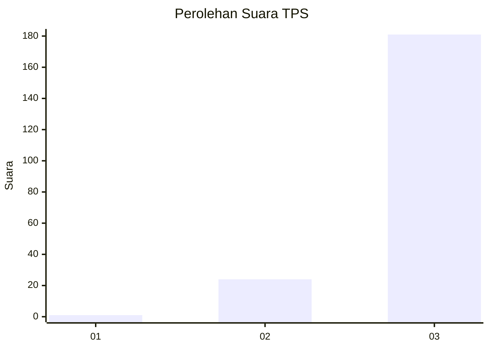
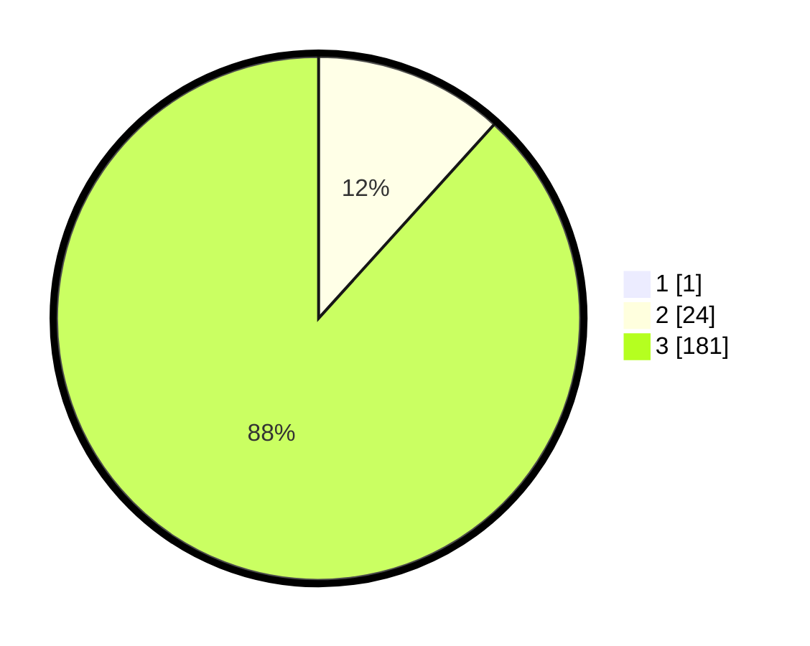

# Hasil

## Grafik

## Tabel

| No. | Nama Paslon    | Suara | Suara (raw) | Persentase |
|:--- |:-------------- | -----:| -----------:| ----------:|
| 1   | ANIES MUHAIMIN | 1     | [1][p-1]    | 0,49       |
| 2   | PRABOWO GIBRAN | 24    | [24][p-2]   | 11,65      |
| 3   | GANJAR MAHFUD  | 181   | [181][p-3]  | 87,86      |

[p-1]: https://github.com/gigit-pemilu/pemilu-2024-51-bali/blob/main/pilpres/hitung-suara/sub/51-bali/sub/02-tabanan/sub/07-marga/sub/2003-peken-belayu/sub/004-tps/sub/paslon-1.txt
[p-2]: https://github.com/gigit-pemilu/pemilu-2024-51-bali/blob/main/pilpres/hitung-suara/sub/51-bali/sub/02-tabanan/sub/07-marga/sub/2003-peken-belayu/sub/004-tps/sub/paslon-2.txt
[p-3]: https://github.com/gigit-pemilu/pemilu-2024-51-bali/blob/main/pilpres/hitung-suara/sub/51-bali/sub/02-tabanan/sub/07-marga/sub/2003-peken-belayu/sub/004-tps/sub/paslon-3.txt

## Foto C Plano

https://sirekap-obj-formc.kpu.go.id/7251/pemilu/ppwp/51/02/07/20/03/5102072003004-20240216-134933--73a51e54-fd52-40e8-aca8-d2d84ee65575.jpg

https://sirekap-obj-formc.kpu.go.id/7251/pemilu/ppwp/51/02/07/20/03/5102072003004-20240216-134935--2b8351d9-fa33-46a2-aa91-41f44c235164.jpg

https://sirekap-obj-formc.kpu.go.id/7251/pemilu/ppwp/51/02/07/20/03/5102072003004-20240216-134934--6ff20ec4-8e3d-4c22-a85b-70b67bd8ff5b.jpg

## Metadata

| Key        | Value               |
| ---------- | ------------------- |
| Time Stamp | 2024-02-16 14:30:33 |

## DATA PEMILIH TETAP

Jumlah pemilih dalam DPT: **243**.
 * L: **116**.
 * P: **127**.

## DATA PENGGUNA HAK PILIH

Jumlah pengguna hak pilih dalam DPT: **243**.
 * L: **116**.
 * P: **127**.

Jumlah pengguna hak pilih dalam DPTb: **1**.
 * L: **0**.
 * P: **1**.

Jumlah pengguna hak pilih dalam DPK: **0**.
 * L: **0**.
 * P: **0**.

Jumlah pengguna hak pilih: **244**.
 * L: **116**.
 * P: **128**.

## JUMLAH SUARA SAH DAN TIDAK SAH

JUMLAH SELURUH SUARA SAH: **206**.

JUMLAH SUARA TIDAK SAH: **38**.

JUMLAH SELURUH SUARA SAH DAN SUARA TIDAK SAH: **244**.

