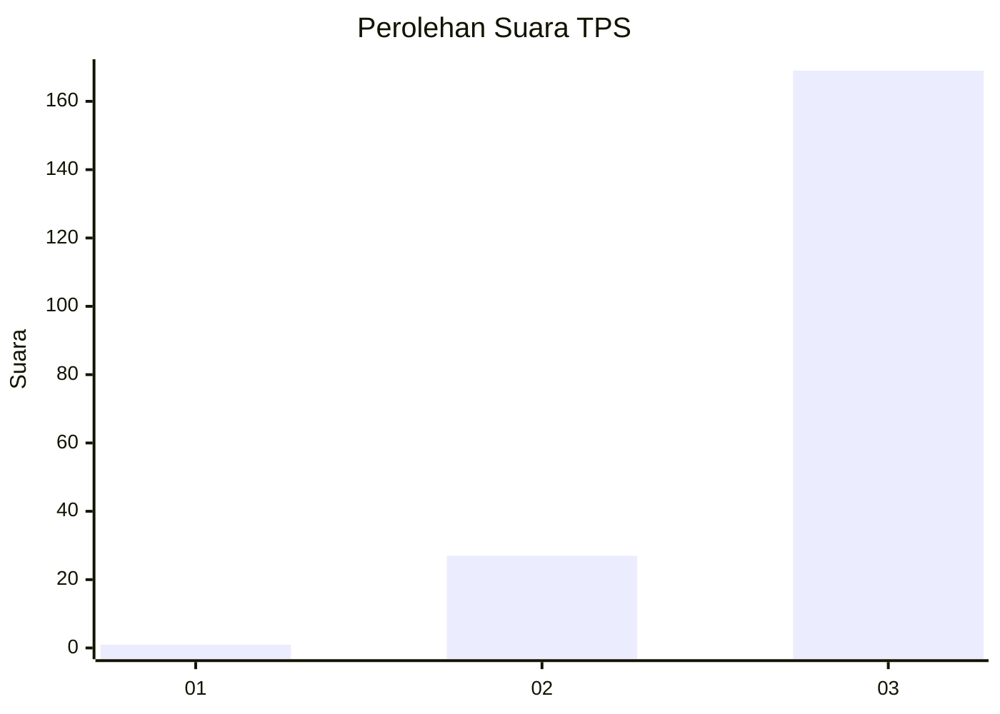
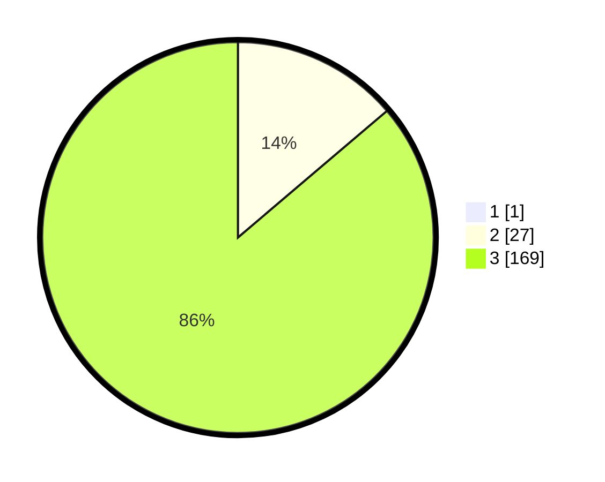

# Hasil

## Grafik

## Tabel

| No. | Nama Paslon    | Suara | Suara (raw) | Persentase |
|:--- |:-------------- | -----:| -----------:| ----------:|
| 1   | ANIES MUHAIMIN | 1     | [1][p-1]    | 0,51       |
| 2   | PRABOWO GIBRAN | 27    | [27][p-2]   | 13,71      |
| 3   | GANJAR MAHFUD  | 169   | [169][p-3]  | 85,79      |

[p-1]: https://github.com/gigit-pemilu/pemilu-2024-51-bali/blob/main/pilpres/hitung-suara/sub/51-bali/sub/02-tabanan/sub/07-marga/sub/2003-peken-belayu/sub/006-tps/sub/paslon-1.txt
[p-2]: https://github.com/gigit-pemilu/pemilu-2024-51-bali/blob/main/pilpres/hitung-suara/sub/51-bali/sub/02-tabanan/sub/07-marga/sub/2003-peken-belayu/sub/006-tps/sub/paslon-2.txt
[p-3]: https://github.com/gigit-pemilu/pemilu-2024-51-bali/blob/main/pilpres/hitung-suara/sub/51-bali/sub/02-tabanan/sub/07-marga/sub/2003-peken-belayu/sub/006-tps/sub/paslon-3.txt

## Foto C Plano

https://sirekap-obj-formc.kpu.go.id/3399/pemilu/ppwp/51/02/07/20/03/5102072003006-20240216-145004--2b154c5b-fdda-4b8c-b41a-2233a6f9e52f.jpg

https://sirekap-obj-formc.kpu.go.id/3399/pemilu/ppwp/51/02/07/20/03/5102072003006-20240216-145006--87d97ea4-75c5-4e0b-a55f-c444f4e689cd.jpg

https://sirekap-obj-formc.kpu.go.id/3399/pemilu/ppwp/51/02/07/20/03/5102072003006-20240216-145005--f61a3809-df9f-47e9-99fe-18a9122acd77.jpg

## Metadata

| Key        | Value               |
| ---------- | ------------------- |
| Time Stamp | 2024-02-24 22:31:28 |

## DATA PEMILIH TETAP

Jumlah pemilih dalam DPT: **254**.
 * L: **129**.
 * P: **125**.

## DATA PENGGUNA HAK PILIH

Jumlah pengguna hak pilih dalam DPT: **250**.
 * L: **126**.
 * P: **124**.

Jumlah pengguna hak pilih dalam DPTb: **3**.
 * L: **2**.
 * P: **1**.

Jumlah pengguna hak pilih dalam DPK: **0**.
 * L: **0**.
 * P: **0**.

Jumlah pengguna hak pilih: **253**.
 * L: **128**.
 * P: **125**.

## JUMLAH SUARA SAH DAN TIDAK SAH

JUMLAH SELURUH SUARA SAH: **197**.

JUMLAH SUARA TIDAK SAH: **56**.

JUMLAH SELURUH SUARA SAH DAN SUARA TIDAK SAH: **253**.

