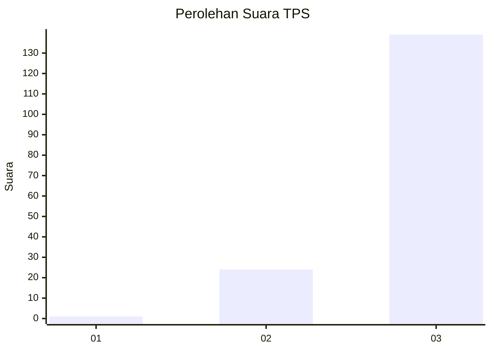
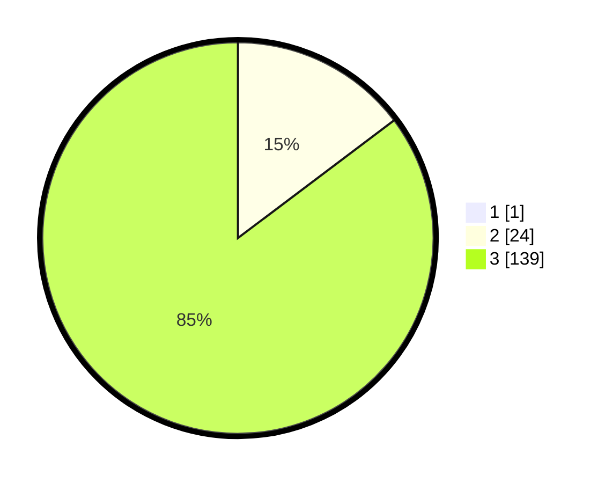

# Hasil

## Grafik

## Tabel

| No. | Nama Paslon    | Suara | Suara (raw) | Persentase |
|:--- |:-------------- | -----:| -----------:| ----------:|
| 1   | ANIES MUHAIMIN | 1     | [1][p-1]    | 0,61       |
| 2   | PRABOWO GIBRAN | 24    | [24][p-2]   | 14,63      |
| 3   | GANJAR MAHFUD  | 139   | [139][p-3]  | 84,76      |

[p-1]: https://github.com/gigit-pemilu/pemilu-2024-51-bali/blob/main/pilpres/hitung-suara/sub/51-bali/sub/02-tabanan/sub/07-marga/sub/2003-peken-belayu/sub/011-tps/sub/paslon-1.txt
[p-2]: https://github.com/gigit-pemilu/pemilu-2024-51-bali/blob/main/pilpres/hitung-suara/sub/51-bali/sub/02-tabanan/sub/07-marga/sub/2003-peken-belayu/sub/011-tps/sub/paslon-2.txt
[p-3]: https://github.com/gigit-pemilu/pemilu-2024-51-bali/blob/main/pilpres/hitung-suara/sub/51-bali/sub/02-tabanan/sub/07-marga/sub/2003-peken-belayu/sub/011-tps/sub/paslon-3.txt

## Foto C Plano

https://sirekap-obj-formc.kpu.go.id/6766/pemilu/ppwp/51/02/07/20/03/5102072003011-20240214-195647--c6fa2f39-fd8d-4699-8270-7f249c6f0a11.jpg

https://sirekap-obj-formc.kpu.go.id/6766/pemilu/ppwp/51/02/07/20/03/5102072003011-20240214-195014--e8399195-b99a-46d5-9a97-52a078ba1a73.jpg

## Metadata

| Key        | Value               |
| ---------- | ------------------- |
| Time Stamp | 2024-02-25 16:00:00 |

