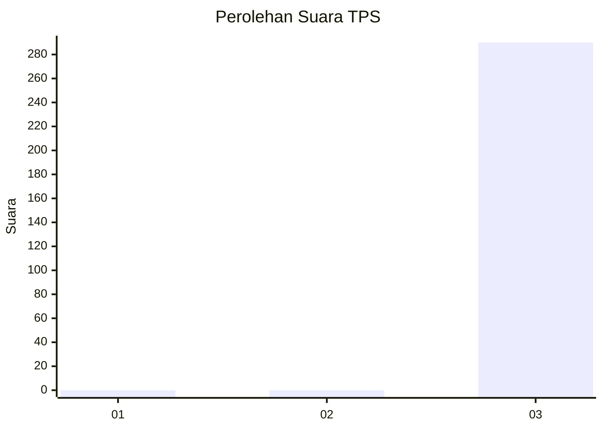
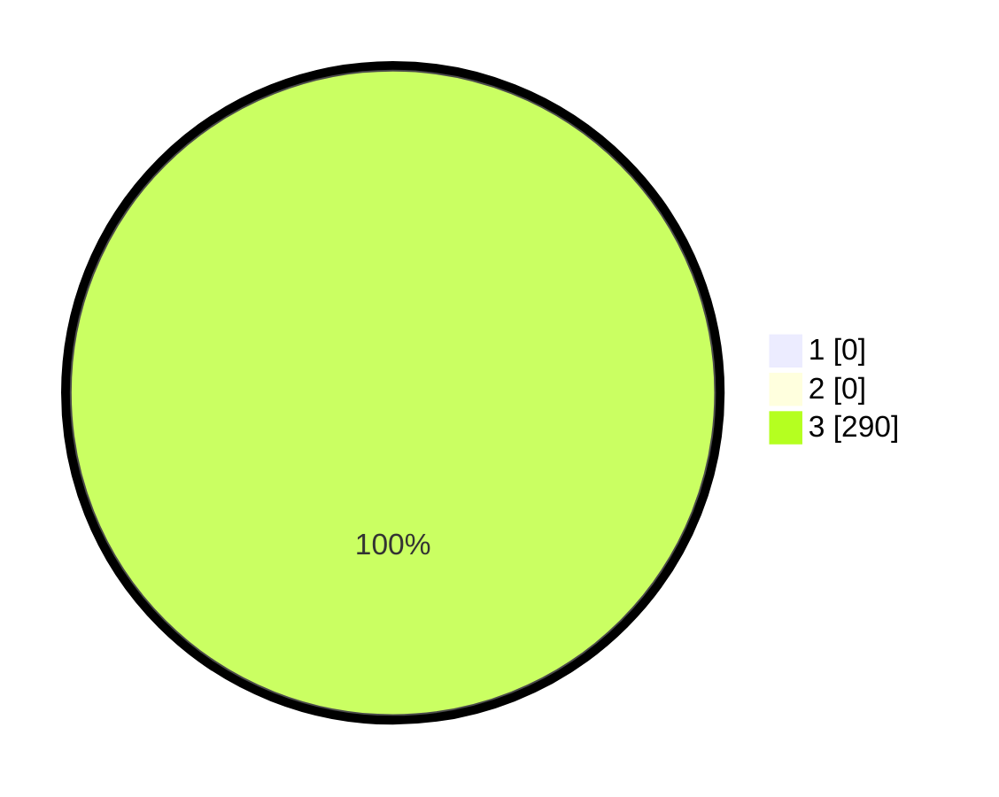

# Hasil

## Grafik

## Tabel

| No. | Nama Paslon    | Suara | Suara (raw) | Persentase |
|:--- |:-------------- | -----:| -----------:| ----------:|
| 1   | ANIES MUHAIMIN | 0     | [0][p-1]    | 0,00       |
| 2   | PRABOWO GIBRAN | 0     | [0][p-2]    | 0,00       |
| 3   | GANJAR MAHFUD  | 290   | [290][p-3]  | 100,00     |

[p-1]: https://github.com/gigit-pemilu/pemilu-2024-51-bali/blob/main/pilpres/hitung-suara/sub/51-bali/sub/02-tabanan/sub/07-marga/sub/2004-batannyuh/sub/001-tps/sub/paslon-1.txt
[p-2]: https://github.com/gigit-pemilu/pemilu-2024-51-bali/blob/main/pilpres/hitung-suara/sub/51-bali/sub/02-tabanan/sub/07-marga/sub/2004-batannyuh/sub/001-tps/sub/paslon-2.txt
[p-3]: https://github.com/gigit-pemilu/pemilu-2024-51-bali/blob/main/pilpres/hitung-suara/sub/51-bali/sub/02-tabanan/sub/07-marga/sub/2004-batannyuh/sub/001-tps/sub/paslon-3.txt

## Foto C Plano

https://sirekap-obj-formc.kpu.go.id/28df/pemilu/ppwp/51/02/07/20/04/5102072004001-20240214-190457--dbb5d49e-f05e-4c36-a47b-122bb5136bf8.jpg

https://sirekap-obj-formc.kpu.go.id/28df/pemilu/ppwp/51/02/07/20/04/5102072004001-20240214-190501--06ecbc8e-f30a-4418-b055-443f9ff4a75d.jpg

https://sirekap-obj-formc.kpu.go.id/28df/pemilu/ppwp/51/02/07/20/04/5102072004001-20240214-190504--43e06c3a-4cad-4c11-b9f5-776b93eb361f.jpg

## Metadata

| Key        | Value               |
| ---------- | ------------------- |
| Time Stamp | 2024-02-14 21:46:01 |

## DATA PEMILIH TETAP

Jumlah pemilih dalam DPT: **293**.
 * L: **147**.
 * P: **146**.

## DATA PENGGUNA HAK PILIH

Jumlah pengguna hak pilih dalam DPT: **289**.
 * L: **145**.
 * P: **144**.

Jumlah pengguna hak pilih dalam DPTb: **1**.
 * L: **1**.
 * P: **0**.

Jumlah pengguna hak pilih dalam DPK: **0**.
 * L: **0**.
 * P: **0**.

Jumlah pengguna hak pilih: **290**.
 * L: **146**.
 * P: **144**.

## JUMLAH SUARA SAH DAN TIDAK SAH

JUMLAH SELURUH SUARA SAH: **290**.

JUMLAH SUARA TIDAK SAH: **0**.

JUMLAH SELURUH SUARA SAH DAN SUARA TIDAK SAH: **290**.

