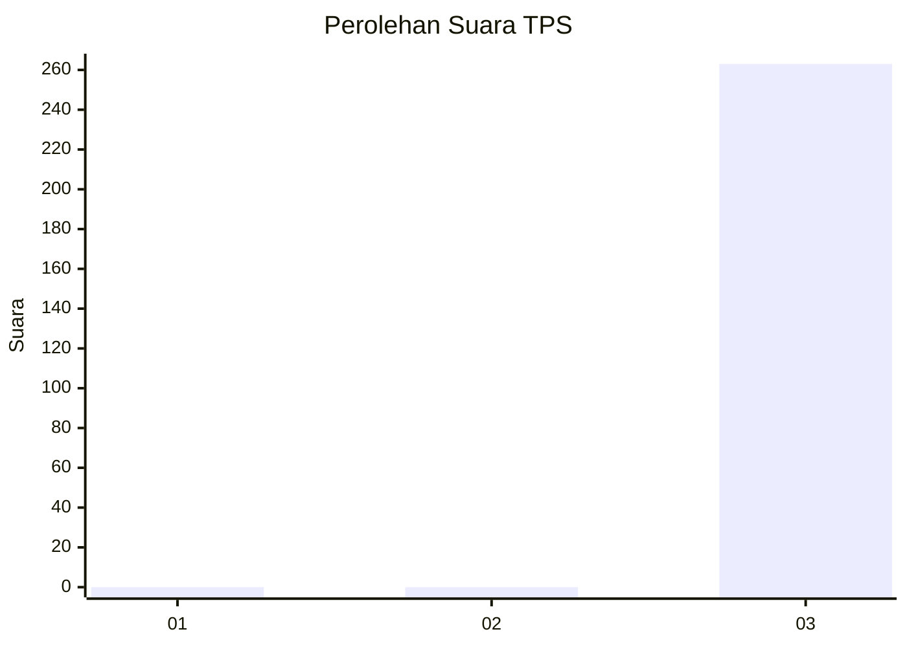
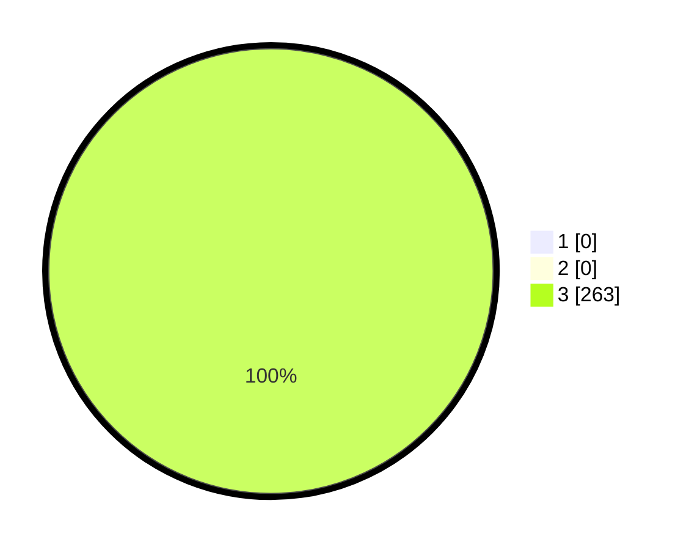

# Hasil

## Grafik

## Tabel

| No. | Nama Paslon    | Suara | Suara (raw) | Persentase |
|:--- |:-------------- | -----:| -----------:| ----------:|
| 1   | ANIES MUHAIMIN | 0     | [0][p-1]    | 0,00       |
| 2   | PRABOWO GIBRAN | 0     | [0][p-2]    | 0,00       |
| 3   | GANJAR MAHFUD  | 263   | [263][p-3]  | 100,00     |

[p-1]: https://github.com/gigit-pemilu/pemilu-2024-51-bali/blob/main/pilpres/hitung-suara/sub/51-bali/sub/02-tabanan/sub/07-marga/sub/2004-batannyuh/sub/003-tps/sub/paslon-1.txt
[p-2]: https://github.com/gigit-pemilu/pemilu-2024-51-bali/blob/main/pilpres/hitung-suara/sub/51-bali/sub/02-tabanan/sub/07-marga/sub/2004-batannyuh/sub/003-tps/sub/paslon-2.txt
[p-3]: https://github.com/gigit-pemilu/pemilu-2024-51-bali/blob/main/pilpres/hitung-suara/sub/51-bali/sub/02-tabanan/sub/07-marga/sub/2004-batannyuh/sub/003-tps/sub/paslon-3.txt

## Foto C Plano

https://sirekap-obj-formc.kpu.go.id/fe85/pemilu/ppwp/51/02/07/20/04/5102072004003-20240215-045705--7f1fdc44-1178-437e-aaec-17a9eae7fe86.jpg

https://sirekap-obj-formc.kpu.go.id/fe85/pemilu/ppwp/51/02/07/20/04/5102072004003-20240215-045726--fff5ea54-2abf-4a29-8b68-6df37c01dee4.jpg

https://sirekap-obj-formc.kpu.go.id/fe85/pemilu/ppwp/51/02/07/20/04/5102072004003-20240215-045716--78a56f5f-9af0-4d01-8688-6766e8db34bf.jpg

## Metadata

| Key        | Value               |
| ---------- | ------------------- |
| Time Stamp | 2024-02-15 23:29:50 |

## DATA PEMILIH TETAP

Jumlah pemilih dalam DPT: **262**.
 * L: **123**.
 * P: **139**.

## DATA PENGGUNA HAK PILIH

Jumlah pengguna hak pilih dalam DPT: **262**.
 * L: **123**.
 * P: **139**.

Jumlah pengguna hak pilih dalam DPTb: **1**.
 * L: **1**.
 * P: **0**.

Jumlah pengguna hak pilih dalam DPK: **0**.
 * L: **0**.
 * P: **0**.

Jumlah pengguna hak pilih: **263**.
 * L: **124**.
 * P: **139**.

## JUMLAH SUARA SAH DAN TIDAK SAH

JUMLAH SELURUH SUARA SAH: **263**.

JUMLAH SUARA TIDAK SAH: **0**.

JUMLAH SELURUH SUARA SAH DAN SUARA TIDAK SAH: **263**.

