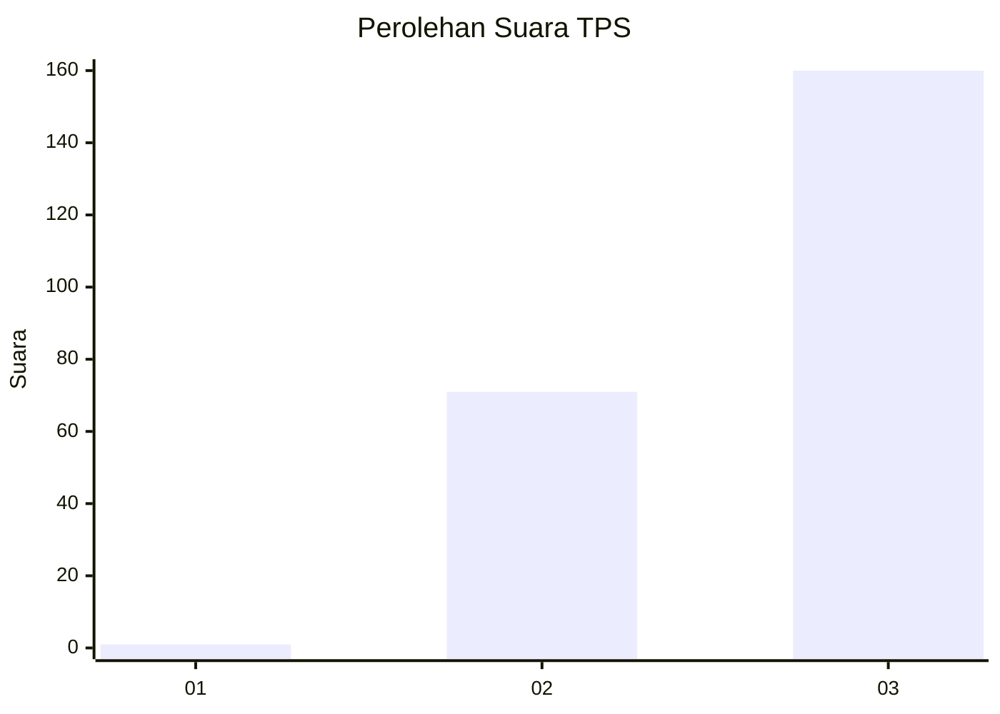
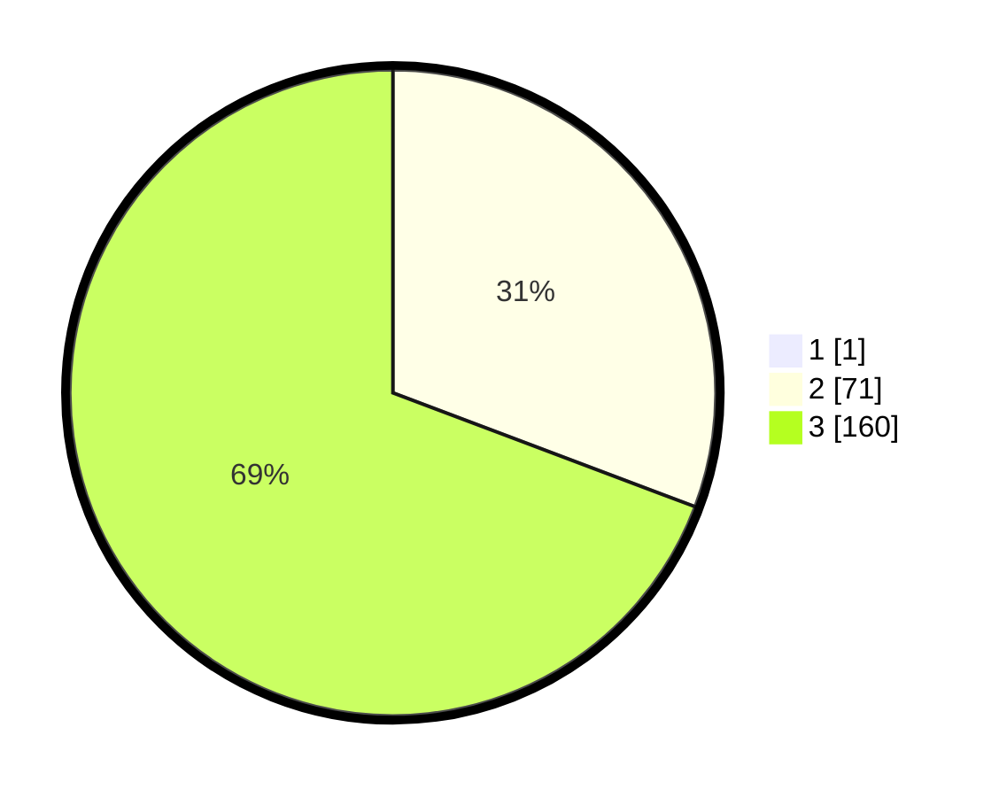

# Hasil

## Grafik

## Tabel

| No. | Nama Paslon    | Suara | Suara (raw) | Persentase |
|:--- |:-------------- | -----:| -----------:| ----------:|
| 1   | ANIES MUHAIMIN | 1     | [1][p-1]    | 0,43       |
| 2   | PRABOWO GIBRAN | 71    | [71][p-2]   | 30,60      |
| 3   | GANJAR MAHFUD  | 160   | [160][p-3]  | 68,97      |

[p-1]: https://github.com/gigit-pemilu/pemilu-2024-51-bali/blob/main/pilpres/hitung-suara/sub/51-bali/sub/02-tabanan/sub/07-marga/sub/2005-tegaljadi/sub/001-tps/sub/paslon-1.txt
[p-2]: https://github.com/gigit-pemilu/pemilu-2024-51-bali/blob/main/pilpres/hitung-suara/sub/51-bali/sub/02-tabanan/sub/07-marga/sub/2005-tegaljadi/sub/001-tps/sub/paslon-2.txt
[p-3]: https://github.com/gigit-pemilu/pemilu-2024-51-bali/blob/main/pilpres/hitung-suara/sub/51-bali/sub/02-tabanan/sub/07-marga/sub/2005-tegaljadi/sub/001-tps/sub/paslon-3.txt

## Foto C Plano

https://sirekap-obj-formc.kpu.go.id/4430/pemilu/ppwp/51/02/07/20/05/5102072005001-20240216-152736--f2a104ce-8139-469a-9f5f-3fb3d3b473f9.jpg

https://sirekap-obj-formc.kpu.go.id/4430/pemilu/ppwp/51/02/07/20/05/5102072005001-20240216-152737--0270d337-fb5b-4b7f-a921-cc39aeb435c8.jpg

https://sirekap-obj-formc.kpu.go.id/4430/pemilu/ppwp/51/02/07/20/05/5102072005001-20240216-152736--8ca56f28-6c95-422d-8146-a12d529a29f2.jpg

## Metadata

| Key        | Value               |
| ---------- | ------------------- |
| Time Stamp | 2024-02-21 17:00:00 |

## DATA PEMILIH TETAP

Jumlah pemilih dalam DPT: **248**.
 * L: **117**.
 * P: **131**.

## DATA PENGGUNA HAK PILIH

Jumlah pengguna hak pilih dalam DPT: **233**.
 * L: **111**.
 * P: **122**.

Jumlah pengguna hak pilih dalam DPTb: **0**.
 * L: **0**.
 * P: **0**.

Jumlah pengguna hak pilih dalam DPK: **0**.
 * L: **0**.
 * P: **0**.

Jumlah pengguna hak pilih: **233**.
 * L: **111**.
 * P: **122**.

## JUMLAH SUARA SAH DAN TIDAK SAH

JUMLAH SELURUH SUARA SAH: **232**.

JUMLAH SUARA TIDAK SAH: **1**.

JUMLAH SELURUH SUARA SAH DAN SUARA TIDAK SAH: **233**.

