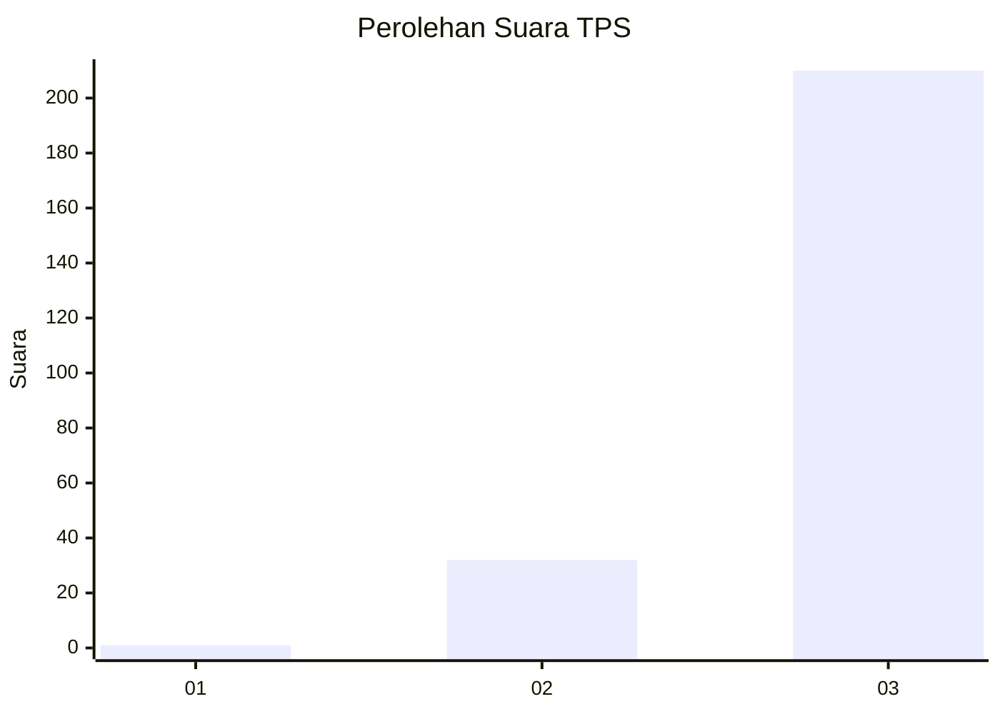
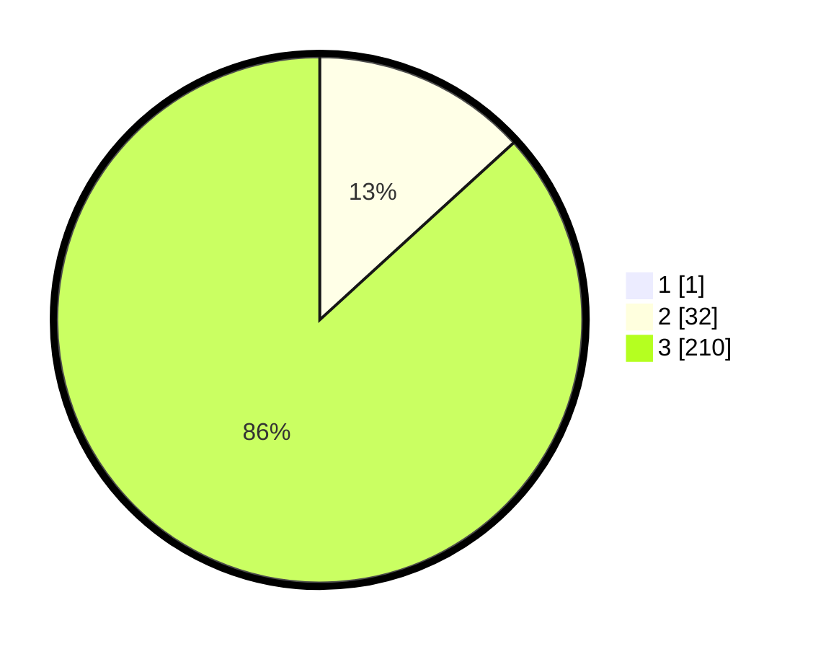

# Hasil

## Grafik

## Tabel

| No. | Nama Paslon    | Suara | Suara (raw) | Persentase |
|:--- |:-------------- | -----:| -----------:| ----------:|
| 1   | ANIES MUHAIMIN | 1     | [1][p-1]    | 0,41       |
| 2   | PRABOWO GIBRAN | 32    | [32][p-2]   | 13,17      |
| 3   | GANJAR MAHFUD  | 210   | [210][p-3]  | 86,42      |

[p-1]: https://github.com/gigit-pemilu/pemilu-2024-51-bali/blob/main/pilpres/hitung-suara/sub/51-bali/sub/02-tabanan/sub/07-marga/sub/2005-tegaljadi/sub/002-tps/sub/paslon-1.txt
[p-2]: https://github.com/gigit-pemilu/pemilu-2024-51-bali/blob/main/pilpres/hitung-suara/sub/51-bali/sub/02-tabanan/sub/07-marga/sub/2005-tegaljadi/sub/002-tps/sub/paslon-2.txt
[p-3]: https://github.com/gigit-pemilu/pemilu-2024-51-bali/blob/main/pilpres/hitung-suara/sub/51-bali/sub/02-tabanan/sub/07-marga/sub/2005-tegaljadi/sub/002-tps/sub/paslon-3.txt

## Foto C Plano

https://sirekap-obj-formc.kpu.go.id/8213/pemilu/ppwp/51/02/07/20/05/5102072005002-20240216-142755--21d699fe-a06a-42a0-9d16-b61a88a4da28.jpg

https://sirekap-obj-formc.kpu.go.id/8213/pemilu/ppwp/51/02/07/20/05/5102072005002-20240216-142756--3d4d5398-6286-4c72-8b66-0d3173838992.jpg

https://sirekap-obj-formc.kpu.go.id/8213/pemilu/ppwp/51/02/07/20/05/5102072005002-20240216-142756--406dc702-5edb-4a76-9681-592ca9d30e1a.jpg

## Metadata

| Key        | Value               |
| ---------- | ------------------- |
| Time Stamp | 2024-02-21 13:00:00 |

## DATA PEMILIH TETAP

Jumlah pemilih dalam DPT: **252**.
 * L: **124**.
 * P: **128**.

## DATA PENGGUNA HAK PILIH

Jumlah pengguna hak pilih dalam DPT: **244**.
 * L: **119**.
 * P: **125**.

Jumlah pengguna hak pilih dalam DPTb: **0**.
 * L: **0**.
 * P: **0**.

Jumlah pengguna hak pilih dalam DPK: **0**.
 * L: **0**.
 * P: **0**.

Jumlah pengguna hak pilih: **244**.
 * L: **119**.
 * P: **125**.

## JUMLAH SUARA SAH DAN TIDAK SAH

JUMLAH SELURUH SUARA SAH: **243**.

JUMLAH SUARA TIDAK SAH: **1**.

JUMLAH SELURUH SUARA SAH DAN SUARA TIDAK SAH: **244**.

