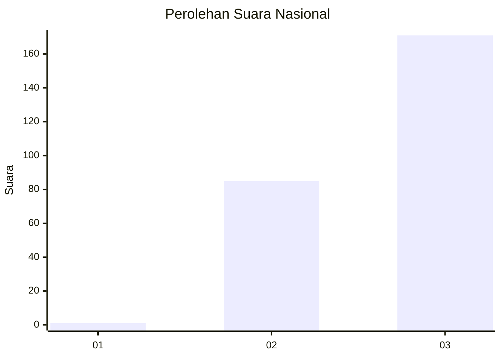
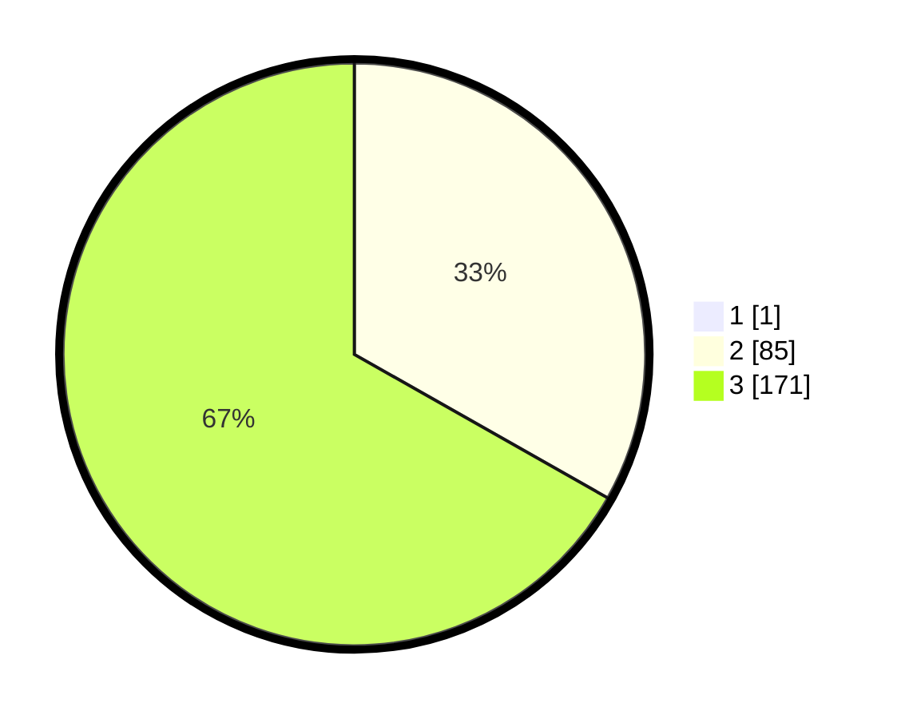

# Hasil

## Grafik

## Tabel

| No. | Nama Paslon    | Suara | Suara (raw) | Persentase |
|:--- |:-------------- | -----:| -----------:| ----------:|
| 1   | ANIES MUHAIMIN | 1     | [1][p-1]    | 0,39       |
| 2   | PRABOWO GIBRAN | 85    | [85][p-2]   | 33,07      |
| 3   | GANJAR MAHFUD  | 171   | [171][p-3]  | 66,54      |

[p-1]: https://github.com/gigit-pemilu/pemilu-2024/blob/main/pilpres/hitung-suara/sub/51-bali/sub/02-tabanan/sub/07-marga/sub/2005-tegaljadi/sub/004-tps/sub/paslon-1.txt
[p-2]: https://github.com/gigit-pemilu/pemilu-2024/blob/main/pilpres/hitung-suara/sub/51-bali/sub/02-tabanan/sub/07-marga/sub/2005-tegaljadi/sub/004-tps/sub/paslon-2.txt
[p-3]: https://github.com/gigit-pemilu/pemilu-2024/blob/main/pilpres/hitung-suara/sub/51-bali/sub/02-tabanan/sub/07-marga/sub/2005-tegaljadi/sub/004-tps/sub/paslon-3.txt

## Foto C Plano

https://sirekap-obj-formc.kpu.go.id/a855/pemilu/ppwp/51/02/07/20/05/5102072005004-20240216-143218--e3c01de7-1d17-4dd5-9c6d-38ed9d4c932c.jpg

https://sirekap-obj-formc.kpu.go.id/a855/pemilu/ppwp/51/02/07/20/05/5102072005004-20240216-143219--e59c1486-c135-4a72-b690-8d0fb28808e8.jpg

https://sirekap-obj-formc.kpu.go.id/a855/pemilu/ppwp/51/02/07/20/05/5102072005004-20240216-143219--9714ce4e-54f5-4592-83a7-ddb50c17de2a.jpg

## Metadata

| Key        | Value               |
| ---------- | ------------------- |
| Time Stamp | 2024-02-21 10:00:00 |

## DATA PEMILIH TETAP

Jumlah pemilih dalam DPT: **267**.
 * L: **124**.
 * P: **143**.

## DATA PENGGUNA HAK PILIH

Jumlah pengguna hak pilih dalam DPT: **258**.
 * L: **118**.
 * P: **140**.

Jumlah pengguna hak pilih dalam DPTb: **1**.
 * L: **0**.
 * P: **1**.

Jumlah pengguna hak pilih dalam DPK: **0**.
 * L: **0**.
 * P: **0**.

Jumlah pengguna hak pilih: **259**.
 * L: **118**.
 * P: **141**.

## JUMLAH SUARA SAH DAN TIDAK SAH

JUMLAH SELURUH SUARA SAH: **257**.

JUMLAH SUARA TIDAK SAH: **2**.

JUMLAH SELURUH SUARA SAH DAN SUARA TIDAK SAH: **259**.

