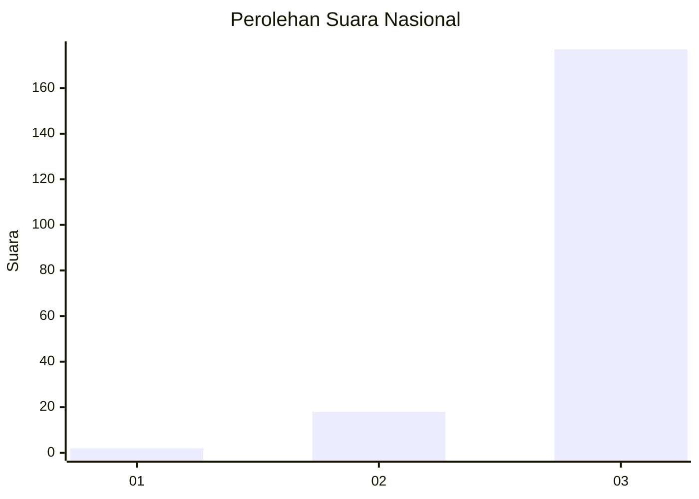
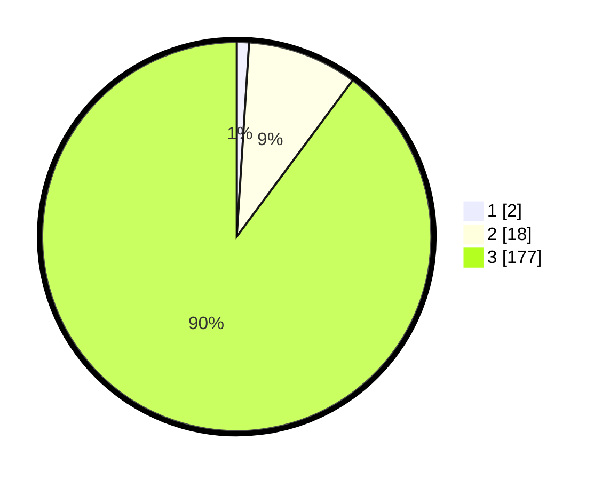

# Hasil

## Grafik

## Tabel

| No. | Nama Paslon    | Suara | Suara (raw) | Persentase |
|:--- |:-------------- | -----:| -----------:| ----------:|
| 1   | ANIES MUHAIMIN | 2     | [2][p-1]    | 1,02       |
| 2   | PRABOWO GIBRAN | 18    | [18][p-2]   | 9,14       |
| 3   | GANJAR MAHFUD  | 177   | [177][p-3]  | 89,85      |

[p-1]: https://github.com/gigit-pemilu/pemilu-2024/blob/main/pilpres/hitung-suara/sub/51-bali/sub/02-tabanan/sub/07-marga/sub/2005-tegaljadi/sub/005-tps/sub/paslon-1.txt
[p-2]: https://github.com/gigit-pemilu/pemilu-2024/blob/main/pilpres/hitung-suara/sub/51-bali/sub/02-tabanan/sub/07-marga/sub/2005-tegaljadi/sub/005-tps/sub/paslon-2.txt
[p-3]: https://github.com/gigit-pemilu/pemilu-2024/blob/main/pilpres/hitung-suara/sub/51-bali/sub/02-tabanan/sub/07-marga/sub/2005-tegaljadi/sub/005-tps/sub/paslon-3.txt

## Foto C Plano

https://sirekap-obj-formc.kpu.go.id/6ef6/pemilu/ppwp/51/02/07/20/05/5102072005005-20240215-221415--539541ea-a2d4-444a-9515-557136cdb9d9.jpg

https://sirekap-obj-formc.kpu.go.id/6ef6/pemilu/ppwp/51/02/07/20/05/5102072005005-20240215-221418--235dceca-320d-462a-b2c1-ad418916c8ef.jpg

https://sirekap-obj-formc.kpu.go.id/6ef6/pemilu/ppwp/51/02/07/20/05/5102072005005-20240215-221416--ecf15afc-5b12-4cf0-9428-dfd769856346.jpg

## Metadata

| Key        | Value               |
| ---------- | ------------------- |
| Time Stamp | 2024-02-15 23:29:50 |

## DATA PEMILIH TETAP

Jumlah pemilih dalam DPT: **203**.
 * L: **103**.
 * P: **100**.

## DATA PENGGUNA HAK PILIH

Jumlah pengguna hak pilih dalam DPT: **199**.
 * L: **102**.
 * P: **97**.

Jumlah pengguna hak pilih dalam DPTb: **0**.
 * L: **0**.
 * P: **0**.

Jumlah pengguna hak pilih dalam DPK: **0**.
 * L: **0**.
 * P: **0**.

Jumlah pengguna hak pilih: **199**.
 * L: **102**.
 * P: **97**.

## JUMLAH SUARA SAH DAN TIDAK SAH

JUMLAH SELURUH SUARA SAH: **197**.

JUMLAH SUARA TIDAK SAH: **2**.

JUMLAH SELURUH SUARA SAH DAN SUARA TIDAK SAH: **199**.

