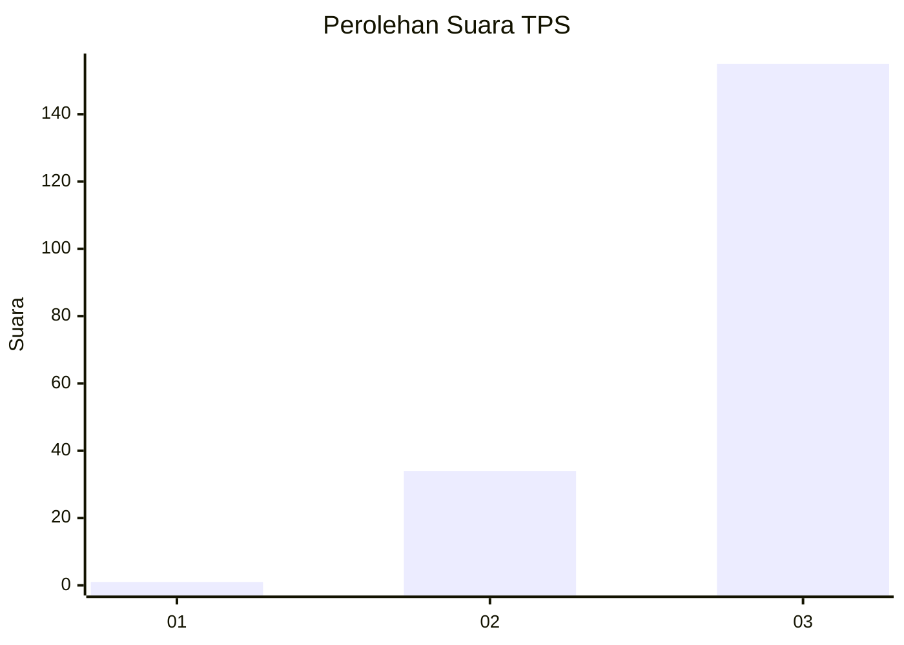
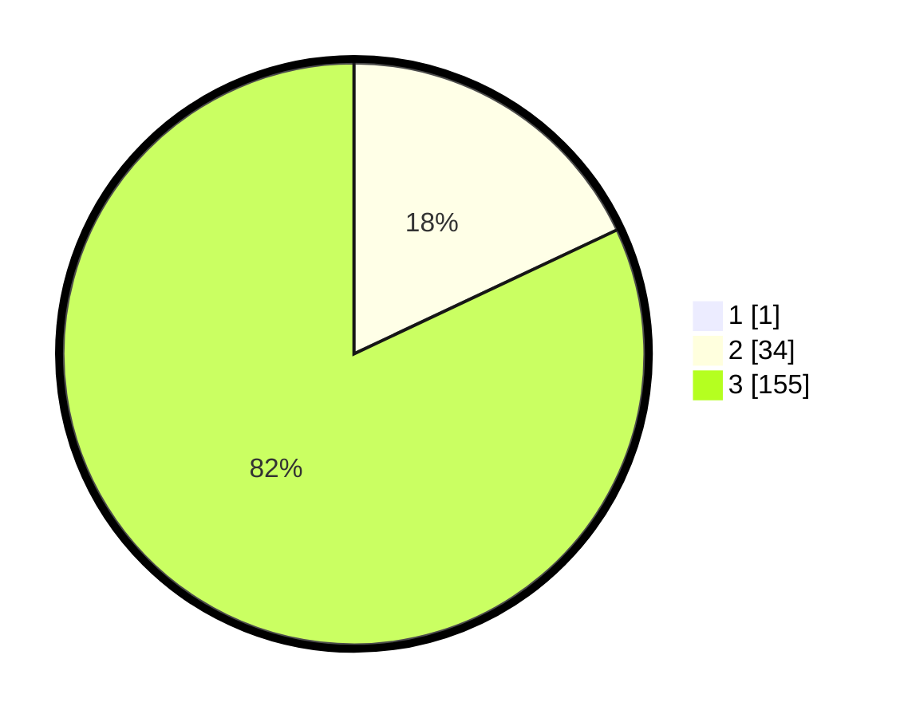

# Hasil

## Grafik

## Tabel

| No. | Nama Paslon    | Suara | Suara (raw) | Persentase |
|:--- |:-------------- | -----:| -----------:| ----------:|
| 1   | ANIES MUHAIMIN | 1     | [1][p-1]    | 0,53       |
| 2   | PRABOWO GIBRAN | 34    | [34][p-2]   | 17,89      |
| 3   | GANJAR MAHFUD  | 155   | [155][p-3]  | 81,58      |

[p-1]: https://github.com/gigit-pemilu/pemilu-2024-51-bali/blob/main/pilpres/hitung-suara/sub/51-bali/sub/02-tabanan/sub/07-marga/sub/2005-tegaljadi/sub/006-tps/sub/paslon-1.txt
[p-2]: https://github.com/gigit-pemilu/pemilu-2024-51-bali/blob/main/pilpres/hitung-suara/sub/51-bali/sub/02-tabanan/sub/07-marga/sub/2005-tegaljadi/sub/006-tps/sub/paslon-2.txt
[p-3]: https://github.com/gigit-pemilu/pemilu-2024-51-bali/blob/main/pilpres/hitung-suara/sub/51-bali/sub/02-tabanan/sub/07-marga/sub/2005-tegaljadi/sub/006-tps/sub/paslon-3.txt

## Foto C Plano

https://sirekap-obj-formc.kpu.go.id/f2ab/pemilu/ppwp/51/02/07/20/05/5102072005006-20240216-054238--36aa7559-a967-4049-92e1-ef9e5f3908a8.jpg

https://sirekap-obj-formc.kpu.go.id/f2ab/pemilu/ppwp/51/02/07/20/05/5102072005006-20240216-054250--8bb459c1-8281-45d2-8a35-f8f4c777510d.jpg

https://sirekap-obj-formc.kpu.go.id/f2ab/pemilu/ppwp/51/02/07/20/05/5102072005006-20240216-054246--94dd6f1d-92b4-4b02-aa05-6ad798378bfb.jpg

## Metadata

| Key        | Value               |
| ---------- | ------------------- |
| Time Stamp | 2024-02-16 12:51:22 |

## DATA PEMILIH TETAP

Jumlah pemilih dalam DPT: **208**.
 * L: **103**.
 * P: **105**.

## DATA PENGGUNA HAK PILIH

Jumlah pengguna hak pilih dalam DPT: **190**.
 * L: **97**.
 * P: **93**.

Jumlah pengguna hak pilih dalam DPTb: **0**.
 * L: **0**.
 * P: **0**.

Jumlah pengguna hak pilih dalam DPK: **0**.
 * L: **0**.
 * P: **0**.

Jumlah pengguna hak pilih: **190**.
 * L: **97**.
 * P: **93**.

## JUMLAH SUARA SAH DAN TIDAK SAH

JUMLAH SELURUH SUARA SAH: **190**.

JUMLAH SUARA TIDAK SAH: **0**.

JUMLAH SELURUH SUARA SAH DAN SUARA TIDAK SAH: **190**.

