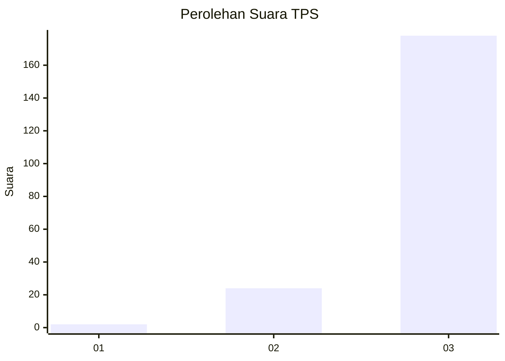
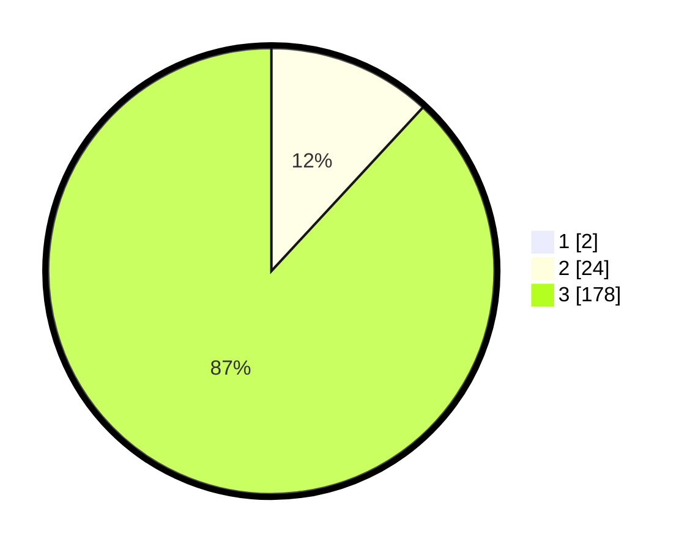

# Hasil

## Grafik

## Tabel

| No. | Nama Paslon    | Suara | Suara (raw) | Persentase |
|:--- |:-------------- | -----:| -----------:| ----------:|
| 1   | ANIES MUHAIMIN | 2     | [2][p-1]    | 0,98       |
| 2   | PRABOWO GIBRAN | 24    | [24][p-2]   | 11,76      |
| 3   | GANJAR MAHFUD  | 178   | [178][p-3]  | 87,25      |

[p-1]: https://github.com/gigit-pemilu/pemilu-2024-51-bali/blob/main/pilpres/hitung-suara/sub/51-bali/sub/02-tabanan/sub/07-marga/sub/2005-tegaljadi/sub/008-tps/sub/paslon-1.txt
[p-2]: https://github.com/gigit-pemilu/pemilu-2024-51-bali/blob/main/pilpres/hitung-suara/sub/51-bali/sub/02-tabanan/sub/07-marga/sub/2005-tegaljadi/sub/008-tps/sub/paslon-2.txt
[p-3]: https://github.com/gigit-pemilu/pemilu-2024-51-bali/blob/main/pilpres/hitung-suara/sub/51-bali/sub/02-tabanan/sub/07-marga/sub/2005-tegaljadi/sub/008-tps/sub/paslon-3.txt

## Foto C Plano

https://sirekap-obj-formc.kpu.go.id/57da/pemilu/ppwp/51/02/07/20/05/5102072005008-20240214-212902--99d32db1-ab27-4131-a5dc-ff3cbe5ac30a.jpg

https://sirekap-obj-formc.kpu.go.id/57da/pemilu/ppwp/51/02/07/20/05/5102072005008-20240214-212946--730b1b24-3240-40e2-8288-bdb551884480.jpg

https://sirekap-obj-formc.kpu.go.id/57da/pemilu/ppwp/51/02/07/20/05/5102072005008-20240214-213012--1e4d3bc9-b87c-414d-823a-5c5d91333c5e.jpg

## Metadata

| Key        | Value               |
| ---------- | ------------------- |
| Time Stamp | 2024-02-15 17:00:25 |

## DATA PEMILIH TETAP

Jumlah pemilih dalam DPT: **215**.
 * L: **107**.
 * P: **108**.

## DATA PENGGUNA HAK PILIH

Jumlah pengguna hak pilih dalam DPT: **207**.
 * L: **104**.
 * P: **103**.

Jumlah pengguna hak pilih dalam DPTb: **0**.
 * L: **0**.
 * P: **0**.

Jumlah pengguna hak pilih dalam DPK: **0**.
 * L: **0**.
 * P: **0**.

Jumlah pengguna hak pilih: **207**.
 * L: **104**.
 * P: **103**.

## JUMLAH SUARA SAH DAN TIDAK SAH

JUMLAH SELURUH SUARA SAH: **204**.

JUMLAH SUARA TIDAK SAH: **3**.

JUMLAH SELURUH SUARA SAH DAN SUARA TIDAK SAH: **207**.

