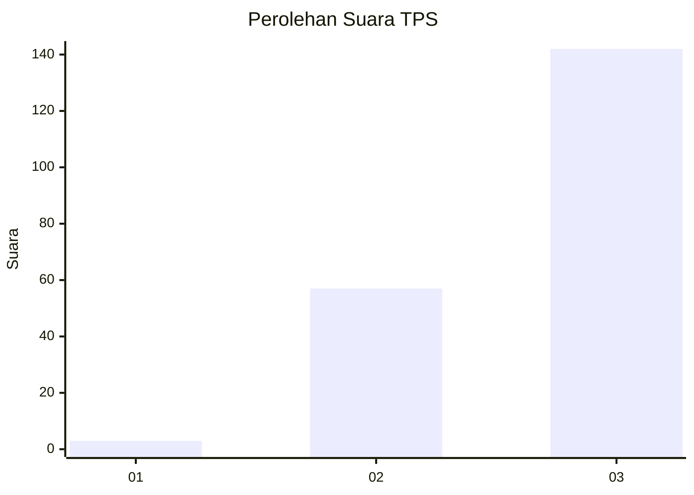
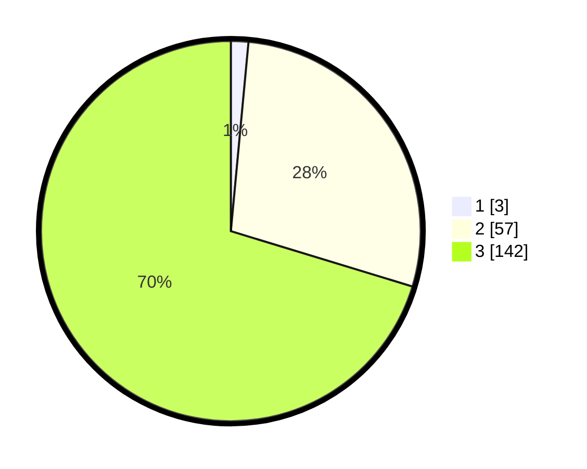

# Hasil

## Grafik

## Tabel

| No. | Nama Paslon    | Suara | Suara (raw) | Persentase |
|:--- |:-------------- | -----:| -----------:| ----------:|
| 1   | ANIES MUHAIMIN | 3     | [3][p-1]    | 1,49       |
| 2   | PRABOWO GIBRAN | 57    | [57][p-2]   | 28,22      |
| 3   | GANJAR MAHFUD  | 142   | [142][p-3]  | 70,30      |

[p-1]: https://github.com/gigit-pemilu/pemilu-2024-51-bali/blob/main/pilpres/hitung-suara/sub/51-bali/sub/02-tabanan/sub/07-marga/sub/2006-kuwum/sub/001-tps/sub/paslon-1.txt
[p-2]: https://github.com/gigit-pemilu/pemilu-2024-51-bali/blob/main/pilpres/hitung-suara/sub/51-bali/sub/02-tabanan/sub/07-marga/sub/2006-kuwum/sub/001-tps/sub/paslon-2.txt
[p-3]: https://github.com/gigit-pemilu/pemilu-2024-51-bali/blob/main/pilpres/hitung-suara/sub/51-bali/sub/02-tabanan/sub/07-marga/sub/2006-kuwum/sub/001-tps/sub/paslon-3.txt

## Foto C Plano

https://sirekap-obj-formc.kpu.go.id/edb2/pemilu/ppwp/51/02/07/20/06/5102072006001-20240216-074051--b38d41c5-e9d4-4cc9-9c6c-d891b4ef450e.jpg

https://sirekap-obj-formc.kpu.go.id/edb2/pemilu/ppwp/51/02/07/20/06/5102072006001-20240216-074054--b4f12eac-9fc9-467b-9498-bed6e956e6da.jpg

https://sirekap-obj-formc.kpu.go.id/edb2/pemilu/ppwp/51/02/07/20/06/5102072006001-20240216-074053--2229f662-9a63-4fd0-89f8-fb8ec600b7bb.jpg

## Metadata

| Key        | Value               |
| ---------- | ------------------- |
| Time Stamp | 2024-02-16 12:51:22 |

## DATA PEMILIH TETAP

Jumlah pemilih dalam DPT: **226**.
 * L: **110**.
 * P: **116**.

## DATA PENGGUNA HAK PILIH

Jumlah pengguna hak pilih dalam DPT: **207**.
 * L: **102**.
 * P: **105**.

Jumlah pengguna hak pilih dalam DPTb: **1**.
 * L: **0**.
 * P: **1**.

Jumlah pengguna hak pilih dalam DPK: **0**.
 * L: **0**.
 * P: **0**.

Jumlah pengguna hak pilih: **208**.
 * L: **102**.
 * P: **106**.

## JUMLAH SUARA SAH DAN TIDAK SAH

JUMLAH SELURUH SUARA SAH: **202**.

JUMLAH SUARA TIDAK SAH: **6**.

JUMLAH SELURUH SUARA SAH DAN SUARA TIDAK SAH: **208**.

