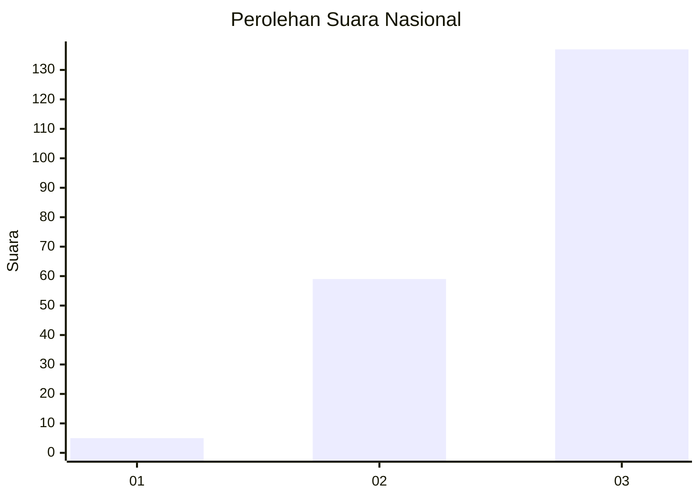
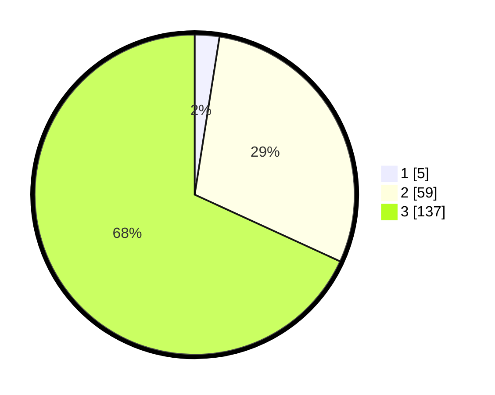

# Hasil

## Grafik

## Tabel

| No. | Nama Paslon    | Suara | Suara (raw) | Persentase |
|:--- |:-------------- | -----:| -----------:| ----------:|
| 1   | ANIES MUHAIMIN | 5     | [5][p-1]    | 2,49       |
| 2   | PRABOWO GIBRAN | 59    | [59][p-2]   | 29,35      |
| 3   | GANJAR MAHFUD  | 137   | [137][p-3]  | 68,16      |

[p-1]: https://github.com/gigit-pemilu/pemilu-2024/blob/main/pilpres/hitung-suara/sub/51-bali/sub/02-tabanan/sub/07-marga/sub/2006-kuwum/sub/002-tps/sub/paslon-1.txt
[p-2]: https://github.com/gigit-pemilu/pemilu-2024/blob/main/pilpres/hitung-suara/sub/51-bali/sub/02-tabanan/sub/07-marga/sub/2006-kuwum/sub/002-tps/sub/paslon-2.txt
[p-3]: https://github.com/gigit-pemilu/pemilu-2024/blob/main/pilpres/hitung-suara/sub/51-bali/sub/02-tabanan/sub/07-marga/sub/2006-kuwum/sub/002-tps/sub/paslon-3.txt

## Foto C Plano

https://sirekap-obj-formc.kpu.go.id/59e8/pemilu/ppwp/51/02/07/20/06/5102072006002-20240216-002954--417c5bfa-c4fc-4f49-a553-6de58b2df35b.jpg

https://sirekap-obj-formc.kpu.go.id/59e8/pemilu/ppwp/51/02/07/20/06/5102072006002-20240216-002956--625ad83d-b635-446d-a7f8-e38016ef855e.jpg

https://sirekap-obj-formc.kpu.go.id/59e8/pemilu/ppwp/51/02/07/20/06/5102072006002-20240216-002955--6be6a616-f470-4136-9efa-7578b0e33a7d.jpg

## Metadata

| Key        | Value               |
| ---------- | ------------------- |
| Time Stamp | 2024-02-16 12:51:22 |

## DATA PEMILIH TETAP

Jumlah pemilih dalam DPT: **231**.
 * L: **112**.
 * P: **119**.

## DATA PENGGUNA HAK PILIH

Jumlah pengguna hak pilih dalam DPT: **205**.
 * L: **100**.
 * P: **105**.

Jumlah pengguna hak pilih dalam DPTb: **0**.
 * L: **0**.
 * P: **0**.

Jumlah pengguna hak pilih dalam DPK: **0**.
 * L: **0**.
 * P: **0**.

Jumlah pengguna hak pilih: **205**.
 * L: **100**.
 * P: **105**.

## JUMLAH SUARA SAH DAN TIDAK SAH

JUMLAH SELURUH SUARA SAH: **201**.

JUMLAH SUARA TIDAK SAH: **4**.

JUMLAH SELURUH SUARA SAH DAN SUARA TIDAK SAH: **205**.

