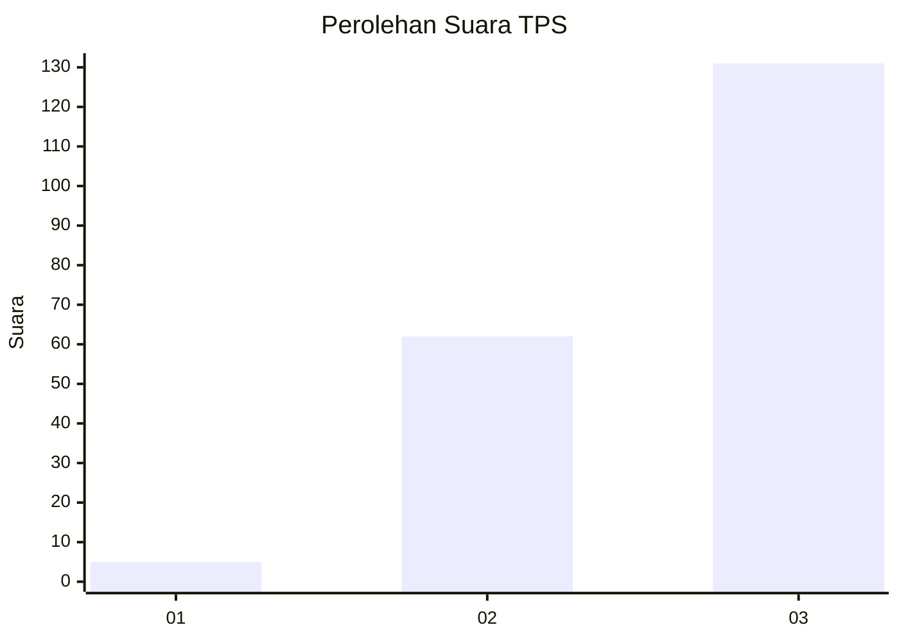
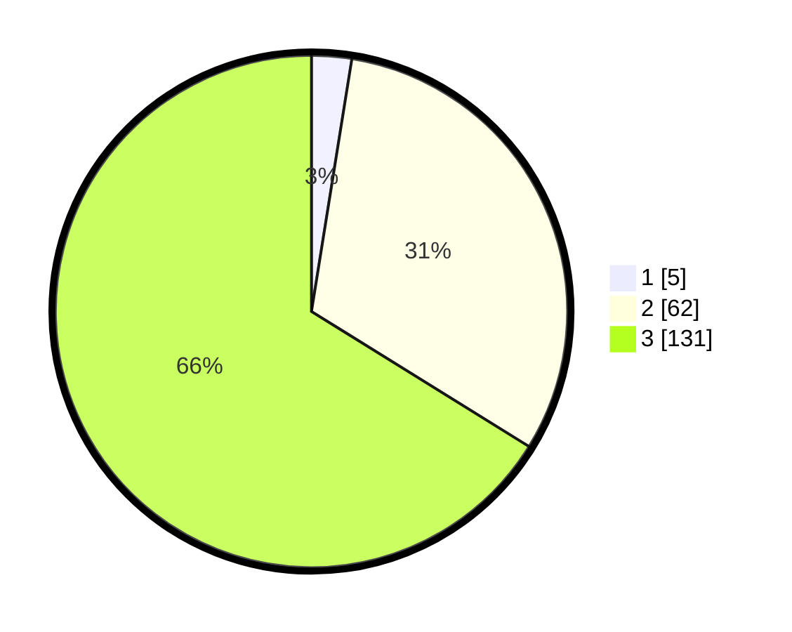

# Hasil

## Grafik

## Tabel

| No. | Nama Paslon    | Suara | Suara (raw) | Persentase |
|:--- |:-------------- | -----:| -----------:| ----------:|
| 1   | ANIES MUHAIMIN | 5     | [5][p-1]    | 2,53       |
| 2   | PRABOWO GIBRAN | 62    | [62][p-2]   | 31,31      |
| 3   | GANJAR MAHFUD  | 131   | [131][p-3]  | 66,16      |

[p-1]: https://github.com/gigit-pemilu/pemilu-2024-51-bali/blob/main/pilpres/hitung-suara/sub/51-bali/sub/02-tabanan/sub/07-marga/sub/2006-kuwum/sub/003-tps/sub/paslon-1.txt
[p-2]: https://github.com/gigit-pemilu/pemilu-2024-51-bali/blob/main/pilpres/hitung-suara/sub/51-bali/sub/02-tabanan/sub/07-marga/sub/2006-kuwum/sub/003-tps/sub/paslon-2.txt
[p-3]: https://github.com/gigit-pemilu/pemilu-2024-51-bali/blob/main/pilpres/hitung-suara/sub/51-bali/sub/02-tabanan/sub/07-marga/sub/2006-kuwum/sub/003-tps/sub/paslon-3.txt

## Foto C Plano

https://sirekap-obj-formc.kpu.go.id/fb6b/pemilu/ppwp/51/02/07/20/06/5102072006003-20240215-000430--589297ce-db2a-41a0-9318-d9db488dfa19.jpg

https://sirekap-obj-formc.kpu.go.id/fb6b/pemilu/ppwp/51/02/07/20/06/5102072006003-20240215-000554--483fc60c-e2df-497d-95e0-6f87a4a97efe.jpg

https://sirekap-obj-formc.kpu.go.id/fb6b/pemilu/ppwp/51/02/07/20/06/5102072006003-20240215-000736--69c2b798-f0d8-477d-8bd1-2f48dc528bda.jpg

## Metadata

| Key        | Value               |
| ---------- | ------------------- |
| Time Stamp | 2024-02-24 22:31:28 |

## DATA PEMILIH TETAP

Jumlah pemilih dalam DPT: **219**.
 * L: **105**.
 * P: **114**.

## DATA PENGGUNA HAK PILIH

Jumlah pengguna hak pilih dalam DPT: **200**.
 * L: **96**.
 * P: **104**.

Jumlah pengguna hak pilih dalam DPTb: **1**.
 * L: **1**.
 * P: **0**.

Jumlah pengguna hak pilih dalam DPK: **0**.
 * L: **0**.
 * P: **0**.

Jumlah pengguna hak pilih: **201**.
 * L: **97**.
 * P: **104**.

## JUMLAH SUARA SAH DAN TIDAK SAH

JUMLAH SELURUH SUARA SAH: **198**.

JUMLAH SUARA TIDAK SAH: **3**.

JUMLAH SELURUH SUARA SAH DAN SUARA TIDAK SAH: **201**.

