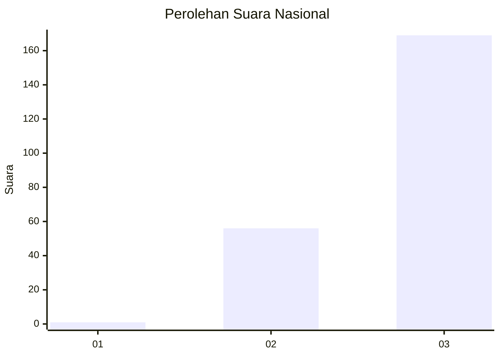
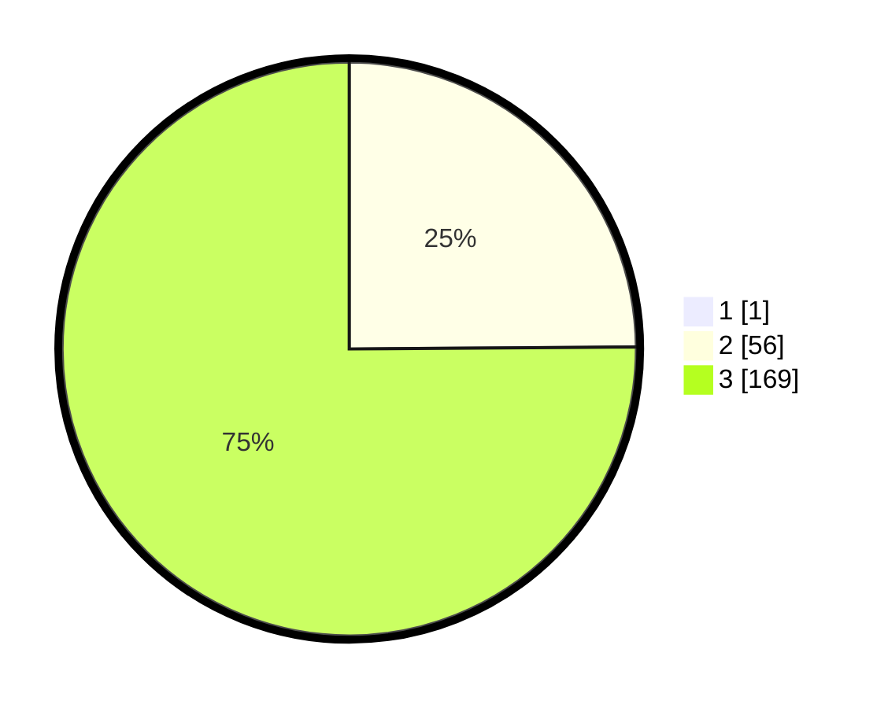

# Hasil

## Grafik

## Tabel

| No. | Nama Paslon    | Suara | Suara (raw) | Persentase |
|:--- |:-------------- | -----:| -----------:| ----------:|
| 1   | ANIES MUHAIMIN | 1     | [1][p-1]    | 0,44       |
| 2   | PRABOWO GIBRAN | 56    | [56][p-2]   | 24,78      |
| 3   | GANJAR MAHFUD  | 169   | [169][p-3]  | 74,78      |

[p-1]: https://github.com/gigit-pemilu/pemilu-2024/blob/main/pilpres/hitung-suara/sub/51-bali/sub/02-tabanan/sub/07-marga/sub/2006-kuwum/sub/004-tps/sub/paslon-1.txt
[p-2]: https://github.com/gigit-pemilu/pemilu-2024/blob/main/pilpres/hitung-suara/sub/51-bali/sub/02-tabanan/sub/07-marga/sub/2006-kuwum/sub/004-tps/sub/paslon-2.txt
[p-3]: https://github.com/gigit-pemilu/pemilu-2024/blob/main/pilpres/hitung-suara/sub/51-bali/sub/02-tabanan/sub/07-marga/sub/2006-kuwum/sub/004-tps/sub/paslon-3.txt

## Foto C Plano

https://sirekap-obj-formc.kpu.go.id/2782/pemilu/ppwp/51/02/07/20/06/5102072006004-20240214-185744--9ec164df-b4a1-426e-ad97-2bf24ac7f9ce.jpg

https://sirekap-obj-formc.kpu.go.id/2782/pemilu/ppwp/51/02/07/20/06/5102072006004-20240214-185736--bc34128c-d8a2-45c3-9568-dbca4ae00406.jpg

https://sirekap-obj-formc.kpu.go.id/2782/pemilu/ppwp/51/02/07/20/06/5102072006004-20240214-185751--7af3d5a6-553d-449e-b4ae-773b329aeea8.jpg

## Metadata

| Key        | Value               |
| ---------- | ------------------- |
| Time Stamp | 2024-02-14 21:46:01 |

## DATA PEMILIH TETAP

Jumlah pemilih dalam DPT: **237**.
 * L: **118**.
 * P: **119**.

## DATA PENGGUNA HAK PILIH

Jumlah pengguna hak pilih dalam DPT: **221**.
 * L: **111**.
 * P: **110**.

Jumlah pengguna hak pilih dalam DPTb: **0**.
 * L: **0**.
 * P: **0**.

Jumlah pengguna hak pilih dalam DPK: **5**.
 * L: **3**.
 * P: **2**.

Jumlah pengguna hak pilih: **226**.
 * L: **114**.
 * P: **112**.

## JUMLAH SUARA SAH DAN TIDAK SAH

JUMLAH SELURUH SUARA SAH: **226**.

JUMLAH SUARA TIDAK SAH: **0**.

JUMLAH SELURUH SUARA SAH DAN SUARA TIDAK SAH: **226**.

