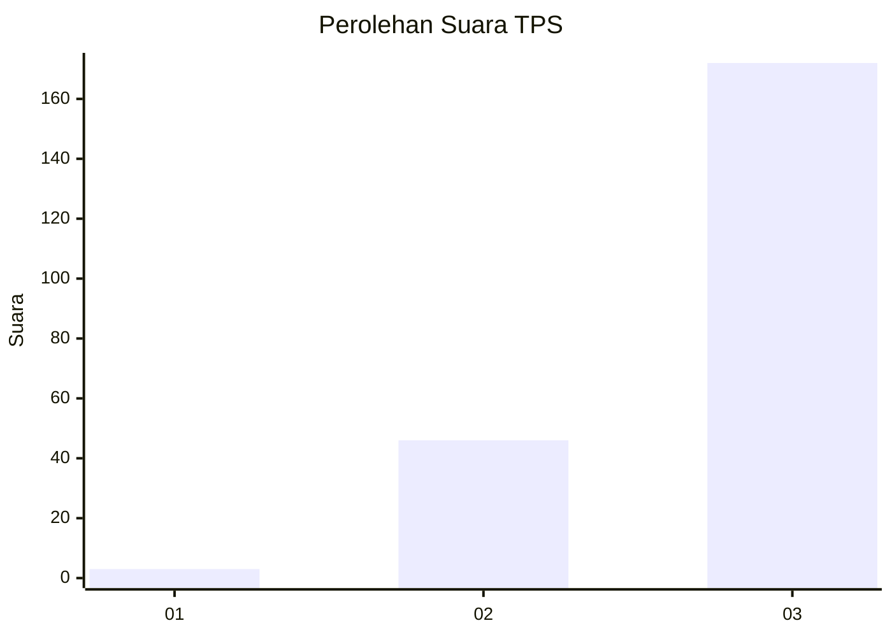
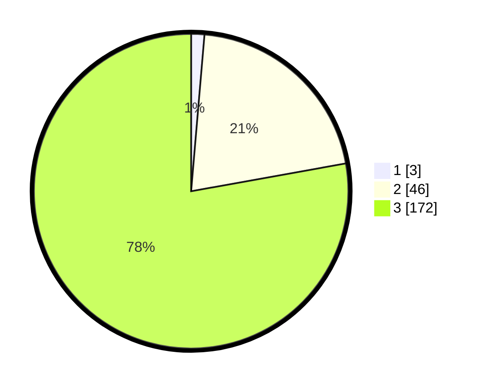

# Hasil

## Grafik

## Tabel

| No. | Nama Paslon    | Suara | Suara (raw) | Persentase |
|:--- |:-------------- | -----:| -----------:| ----------:|
| 1   | ANIES MUHAIMIN | 3     | [3][p-1]    | 1,36       |
| 2   | PRABOWO GIBRAN | 46    | [46][p-2]   | 20,81      |
| 3   | GANJAR MAHFUD  | 172   | [172][p-3]  | 77,83      |

[p-1]: https://github.com/gigit-pemilu/pemilu-2024-51-bali/blob/main/pilpres/hitung-suara/sub/51-bali/sub/02-tabanan/sub/07-marga/sub/2006-kuwum/sub/007-tps/sub/paslon-1.txt
[p-2]: https://github.com/gigit-pemilu/pemilu-2024-51-bali/blob/main/pilpres/hitung-suara/sub/51-bali/sub/02-tabanan/sub/07-marga/sub/2006-kuwum/sub/007-tps/sub/paslon-2.txt
[p-3]: https://github.com/gigit-pemilu/pemilu-2024-51-bali/blob/main/pilpres/hitung-suara/sub/51-bali/sub/02-tabanan/sub/07-marga/sub/2006-kuwum/sub/007-tps/sub/paslon-3.txt

## Foto C Plano

https://sirekap-obj-formc.kpu.go.id/ddd2/pemilu/ppwp/51/02/07/20/06/5102072006007-20240214-141635--3f1c3dc8-6969-4fff-843e-23d3c3210ec9.jpg

https://sirekap-obj-formc.kpu.go.id/ddd2/pemilu/ppwp/51/02/07/20/06/5102072006007-20240214-200328--28379f31-870b-463d-a049-da05313f93d2.jpg

https://sirekap-obj-formc.kpu.go.id/ddd2/pemilu/ppwp/51/02/07/20/06/5102072006007-20240216-033209--86508f1a-1681-4128-a108-4e6f85a1139b.jpg

## Metadata

| Key        | Value               |
| ---------- | ------------------- |
| Time Stamp | 2024-02-16 04:00:27 |

## DATA PEMILIH TETAP

Jumlah pemilih dalam DPT: **251**.
 * L: **123**.
 * P: **128**.

## DATA PENGGUNA HAK PILIH

Jumlah pengguna hak pilih dalam DPT: **222**.
 * L: **108**.
 * P: **114**.

Jumlah pengguna hak pilih dalam DPTb: **0**.
 * L: **0**.
 * P: **0**.

Jumlah pengguna hak pilih dalam DPK: **0**.
 * L: **0**.
 * P: **0**.

Jumlah pengguna hak pilih: **222**.
 * L: **108**.
 * P: **114**.

## JUMLAH SUARA SAH DAN TIDAK SAH

JUMLAH SELURUH SUARA SAH: **221**.

JUMLAH SUARA TIDAK SAH: **1**.

JUMLAH SELURUH SUARA SAH DAN SUARA TIDAK SAH: **222**.

