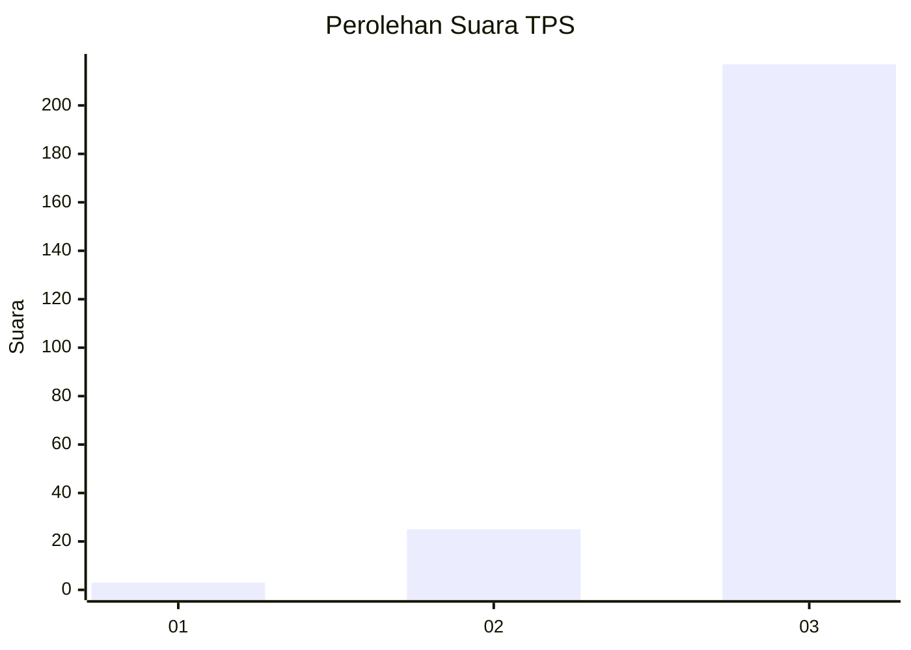
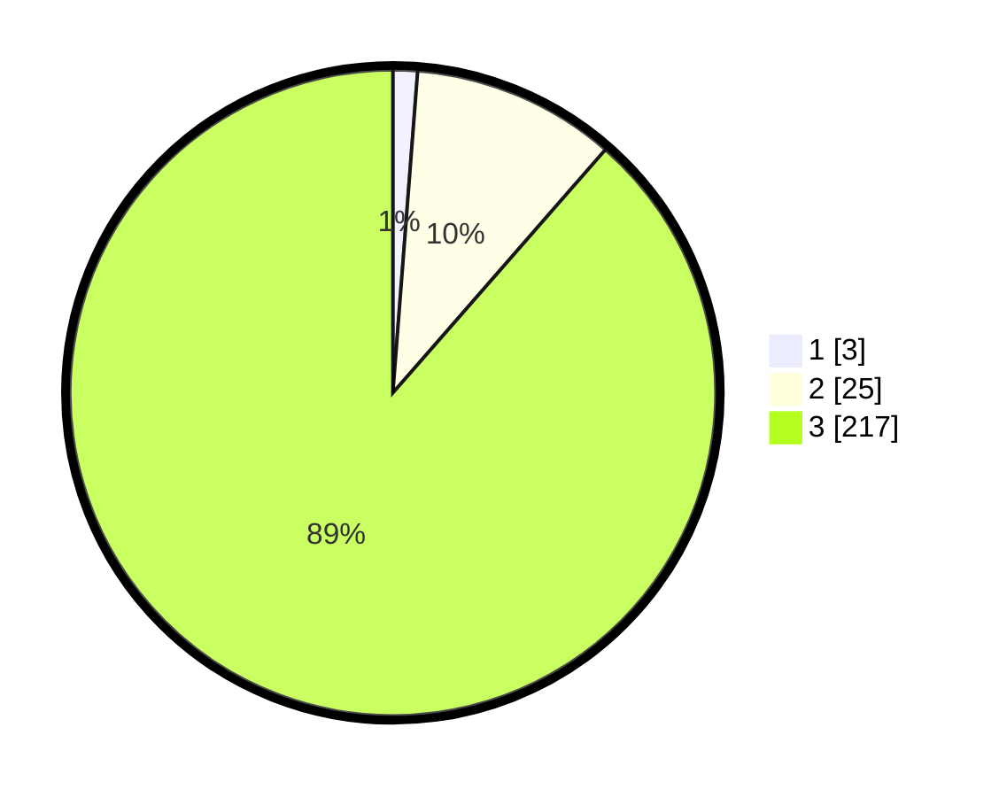

# Hasil

## Grafik

## Tabel

| No. | Nama Paslon    | Suara | Suara (raw) | Persentase |
|:--- |:-------------- | -----:| -----------:| ----------:|
| 1   | ANIES MUHAIMIN | 3     | [3][p-1]    | 1,22       |
| 2   | PRABOWO GIBRAN | 25    | [25][p-2]   | 10,20      |
| 3   | GANJAR MAHFUD  | 217   | [217][p-3]  | 88,57      |

[p-1]: https://github.com/gigit-pemilu/pemilu-2024-51-bali/blob/main/pilpres/hitung-suara/sub/51-bali/sub/02-tabanan/sub/07-marga/sub/2007-selanbawak/sub/001-tps/sub/paslon-1.txt
[p-2]: https://github.com/gigit-pemilu/pemilu-2024-51-bali/blob/main/pilpres/hitung-suara/sub/51-bali/sub/02-tabanan/sub/07-marga/sub/2007-selanbawak/sub/001-tps/sub/paslon-2.txt
[p-3]: https://github.com/gigit-pemilu/pemilu-2024-51-bali/blob/main/pilpres/hitung-suara/sub/51-bali/sub/02-tabanan/sub/07-marga/sub/2007-selanbawak/sub/001-tps/sub/paslon-3.txt

## Foto C Plano

https://sirekap-obj-formc.kpu.go.id/f44a/pemilu/ppwp/51/02/07/20/07/5102072007001-20240216-013834--813649b8-8123-4b82-a554-1fc8dd9e3be9.jpg

https://sirekap-obj-formc.kpu.go.id/f44a/pemilu/ppwp/51/02/07/20/07/5102072007001-20240216-013845--786cd8d7-7956-4c40-9ce5-42fda07a3b91.jpg

https://sirekap-obj-formc.kpu.go.id/f44a/pemilu/ppwp/51/02/07/20/07/5102072007001-20240216-013843--69966012-9a9a-4169-b779-63bcac53b955.jpg

## Metadata

| Key        | Value               |
| ---------- | ------------------- |
| Time Stamp | 2024-02-16 12:51:22 |

## DATA PEMILIH TETAP

Jumlah pemilih dalam DPT: **247**.
 * L: **121**.
 * P: **126**.

## DATA PENGGUNA HAK PILIH

Jumlah pengguna hak pilih dalam DPT: **245**.
 * L: **120**.
 * P: **125**.

Jumlah pengguna hak pilih dalam DPTb: **2**.
 * L: **2**.
 * P: **0**.

Jumlah pengguna hak pilih dalam DPK: **0**.
 * L: **0**.
 * P: **0**.

Jumlah pengguna hak pilih: **247**.
 * L: **122**.
 * P: **125**.

## JUMLAH SUARA SAH DAN TIDAK SAH

JUMLAH SELURUH SUARA SAH: **245**.

JUMLAH SUARA TIDAK SAH: **2**.

JUMLAH SELURUH SUARA SAH DAN SUARA TIDAK SAH: **247**.

