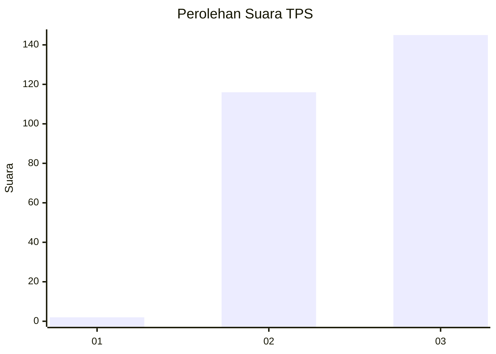
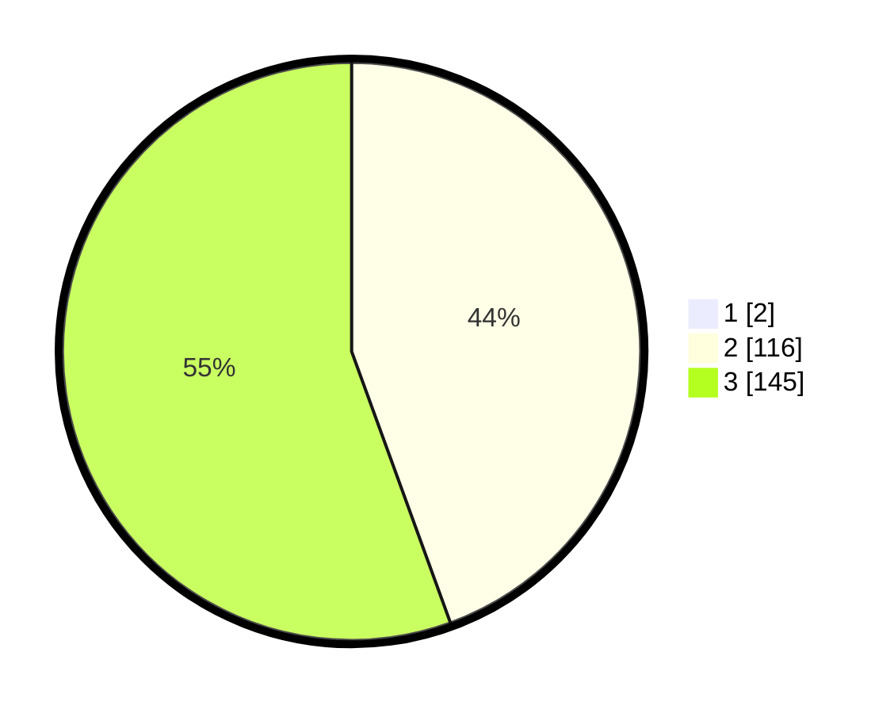

# Hasil

## Grafik

## Tabel

| No. | Nama Paslon    | Suara | Suara (raw) | Persentase |
|:--- |:-------------- | -----:| -----------:| ----------:|
| 1   | ANIES MUHAIMIN | 2     | [2][p-1]    | 0,76       |
| 2   | PRABOWO GIBRAN | 116   | [116][p-2]  | 44,11      |
| 3   | GANJAR MAHFUD  | 145   | [145][p-3]  | 55,13      |

[p-1]: https://github.com/gigit-pemilu/pemilu-2024-51-bali/blob/main/pilpres/hitung-suara/sub/51-bali/sub/02-tabanan/sub/07-marga/sub/2007-selanbawak/sub/011-tps/sub/paslon-1.txt
[p-2]: https://github.com/gigit-pemilu/pemilu-2024-51-bali/blob/main/pilpres/hitung-suara/sub/51-bali/sub/02-tabanan/sub/07-marga/sub/2007-selanbawak/sub/011-tps/sub/paslon-2.txt
[p-3]: https://github.com/gigit-pemilu/pemilu-2024-51-bali/blob/main/pilpres/hitung-suara/sub/51-bali/sub/02-tabanan/sub/07-marga/sub/2007-selanbawak/sub/011-tps/sub/paslon-3.txt

## Foto C Plano

https://sirekap-obj-formc.kpu.go.id/a57f/pemilu/ppwp/51/02/07/20/07/5102072007011-20240216-140408--87ddb8e1-77af-4aed-ac56-fa7d30a5896d.jpg

https://sirekap-obj-formc.kpu.go.id/a57f/pemilu/ppwp/51/02/07/20/07/5102072007011-20240216-140410--7d1cceaf-7b8f-48ec-bc3c-beaf15c47d4f.jpg

https://sirekap-obj-formc.kpu.go.id/a57f/pemilu/ppwp/51/02/07/20/07/5102072007011-20240216-140409--aac816b8-966b-48ef-9837-c2c4ead29498.jpg

## Metadata

| Key        | Value               |
| ---------- | ------------------- |
| Time Stamp | 2024-02-16 14:30:33 |

## DATA PEMILIH TETAP

Jumlah pemilih dalam DPT: **285**.
 * L: **137**.
 * P: **148**.

## DATA PENGGUNA HAK PILIH

Jumlah pengguna hak pilih dalam DPT: **267**.
 * L: **129**.
 * P: **138**.

Jumlah pengguna hak pilih dalam DPTb: **0**.
 * L: **0**.
 * P: **0**.

Jumlah pengguna hak pilih dalam DPK: **0**.
 * L: **0**.
 * P: **0**.

Jumlah pengguna hak pilih: **267**.
 * L: **129**.
 * P: **138**.

## JUMLAH SUARA SAH DAN TIDAK SAH

JUMLAH SELURUH SUARA SAH: **263**.

JUMLAH SUARA TIDAK SAH: **4**.

JUMLAH SELURUH SUARA SAH DAN SUARA TIDAK SAH: **267**.

