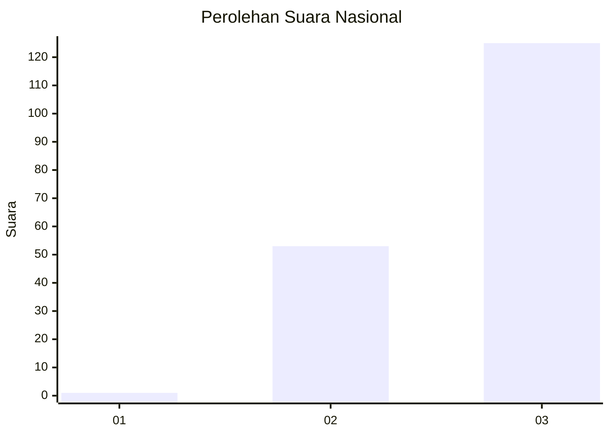
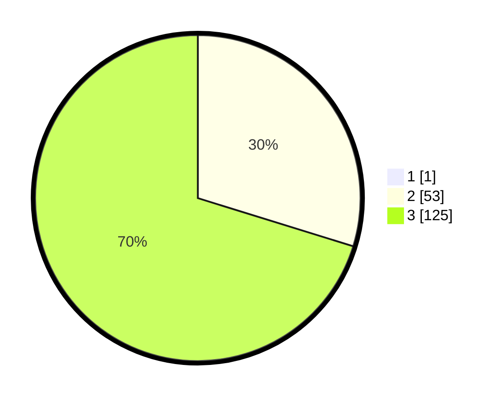

# Hasil

## Grafik

## Tabel

| No. | Nama Paslon    | Suara | Suara (raw) | Persentase |
|:--- |:-------------- | -----:| -----------:| ----------:|
| 1   | ANIES MUHAIMIN | 1     | [1][p-1]    | 0,56       |
| 2   | PRABOWO GIBRAN | 53    | [53][p-2]   | 29,61      |
| 3   | GANJAR MAHFUD  | 125   | [125][p-3]  | 69,83      |

[p-1]: https://github.com/gigit-pemilu/pemilu-2024/blob/main/pilpres/hitung-suara/sub/51-bali/sub/02-tabanan/sub/07-marga/sub/2008-marga/sub/007-tps/sub/paslon-1.txt
[p-2]: https://github.com/gigit-pemilu/pemilu-2024/blob/main/pilpres/hitung-suara/sub/51-bali/sub/02-tabanan/sub/07-marga/sub/2008-marga/sub/007-tps/sub/paslon-2.txt
[p-3]: https://github.com/gigit-pemilu/pemilu-2024/blob/main/pilpres/hitung-suara/sub/51-bali/sub/02-tabanan/sub/07-marga/sub/2008-marga/sub/007-tps/sub/paslon-3.txt

## Foto C Plano

https://sirekap-obj-formc.kpu.go.id/6d69/pemilu/ppwp/51/02/07/20/08/5102072008007-20240214-191101--54e82693-b0ac-4664-b836-2fa9b3d932bc.jpg

https://sirekap-obj-formc.kpu.go.id/6d69/pemilu/ppwp/51/02/07/20/08/5102072008007-20240214-192337--25f536d6-f8ad-428d-b644-c7771f36ba91.jpg

https://sirekap-obj-formc.kpu.go.id/6d69/pemilu/ppwp/51/02/07/20/08/5102072008007-20240216-002838--89dfbe41-7624-4c8a-a953-4a5fccbce45a.jpg

## Metadata

| Key        | Value               |
| ---------- | ------------------- |
| Time Stamp | 2024-02-16 00:30:27 |

## DATA PEMILIH TETAP

Jumlah pemilih dalam DPT: **205**.
 * L: **98**.
 * P: **107**.

## DATA PENGGUNA HAK PILIH

Jumlah pengguna hak pilih dalam DPT: **205**.
 * L: **98**.
 * P: **107**.

Jumlah pengguna hak pilih dalam DPTb: **0**.
 * L: **0**.
 * P: **0**.

Jumlah pengguna hak pilih dalam DPK: **0**.
 * L: **0**.
 * P: **0**.

Jumlah pengguna hak pilih: **205**.
 * L: **98**.
 * P: **107**.

## JUMLAH SUARA SAH DAN TIDAK SAH

JUMLAH SELURUH SUARA SAH: **179**.

JUMLAH SUARA TIDAK SAH: **1**.

JUMLAH SELURUH SUARA SAH DAN SUARA TIDAK SAH: **180**.

