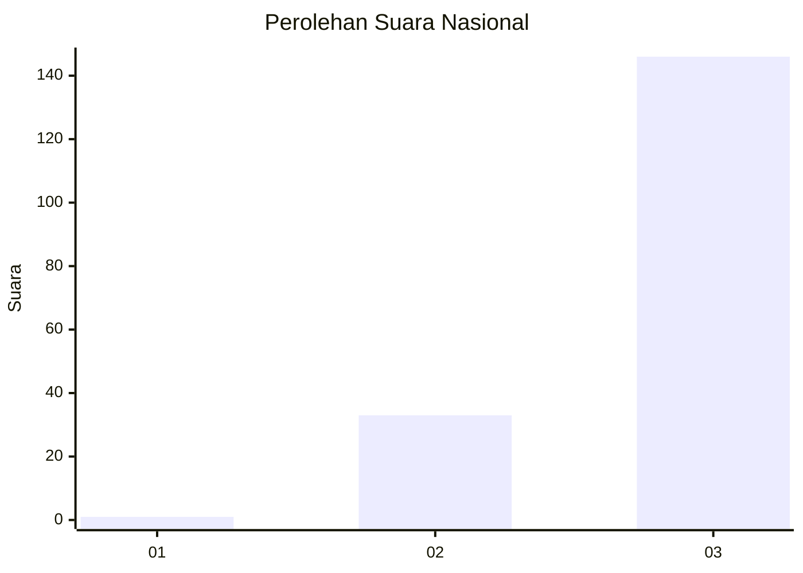
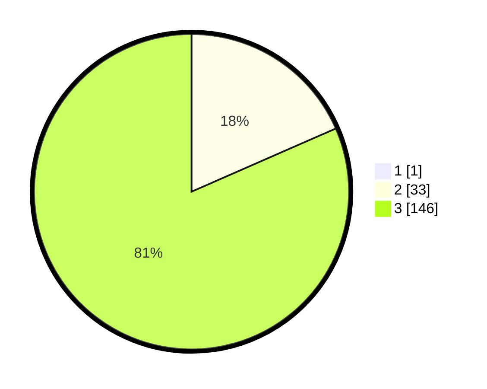

# Hasil

## Grafik

## Tabel

| No. | Nama Paslon    | Suara | Suara (raw) | Persentase |
|:--- |:-------------- | -----:| -----------:| ----------:|
| 1   | ANIES MUHAIMIN | 1     | [1][p-1]    | 0,56       |
| 2   | PRABOWO GIBRAN | 33    | [33][p-2]   | 18,33      |
| 3   | GANJAR MAHFUD  | 146   | [146][p-3]  | 81,11      |

[p-1]: https://github.com/gigit-pemilu/pemilu-2024/blob/main/pilpres/hitung-suara/sub/51-bali/sub/02-tabanan/sub/07-marga/sub/2008-marga/sub/008-tps/sub/paslon-1.txt
[p-2]: https://github.com/gigit-pemilu/pemilu-2024/blob/main/pilpres/hitung-suara/sub/51-bali/sub/02-tabanan/sub/07-marga/sub/2008-marga/sub/008-tps/sub/paslon-2.txt
[p-3]: https://github.com/gigit-pemilu/pemilu-2024/blob/main/pilpres/hitung-suara/sub/51-bali/sub/02-tabanan/sub/07-marga/sub/2008-marga/sub/008-tps/sub/paslon-3.txt

## Foto C Plano

https://sirekap-obj-formc.kpu.go.id/d75a/pemilu/ppwp/51/02/07/20/08/5102072008008-20240216-024528--5d9da169-2332-42f2-bad1-69c68be9649f.jpg

https://sirekap-obj-formc.kpu.go.id/d75a/pemilu/ppwp/51/02/07/20/08/5102072008008-20240216-024529--c8fcebd1-4465-45a7-bb4e-edce376284ac.jpg

https://sirekap-obj-formc.kpu.go.id/d75a/pemilu/ppwp/51/02/07/20/08/5102072008008-20240216-024528--e8961020-8452-4687-96cb-9178ce4bf93b.jpg

## Metadata

| Key        | Value               |
| ---------- | ------------------- |
| Time Stamp | 2024-02-16 12:51:22 |

## DATA PEMILIH TETAP

Jumlah pemilih dalam DPT: **211**.
 * L: **96**.
 * P: **115**.

## DATA PENGGUNA HAK PILIH

Jumlah pengguna hak pilih dalam DPT: **197**.
 * L: **89**.
 * P: **108**.

Jumlah pengguna hak pilih dalam DPTb: **0**.
 * L: **0**.
 * P: **0**.

Jumlah pengguna hak pilih dalam DPK: **1**.
 * L: **1**.
 * P: **0**.

Jumlah pengguna hak pilih: **198**.
 * L: **90**.
 * P: **108**.

## JUMLAH SUARA SAH DAN TIDAK SAH

JUMLAH SELURUH SUARA SAH: **180**.

JUMLAH SUARA TIDAK SAH: **18**.

JUMLAH SELURUH SUARA SAH DAN SUARA TIDAK SAH: **198**.

