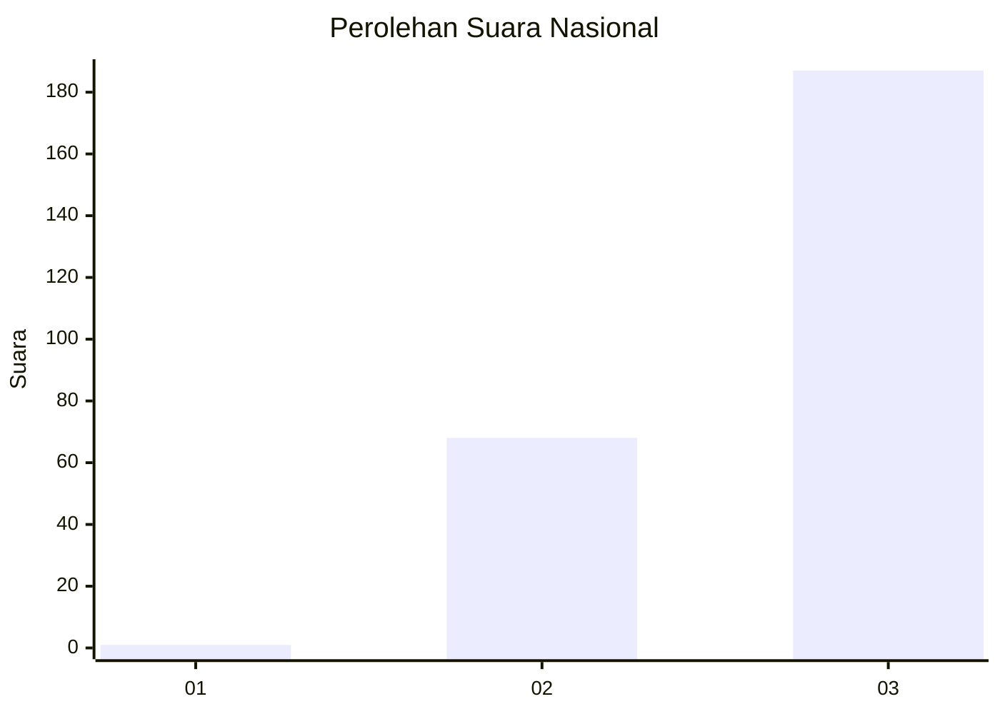
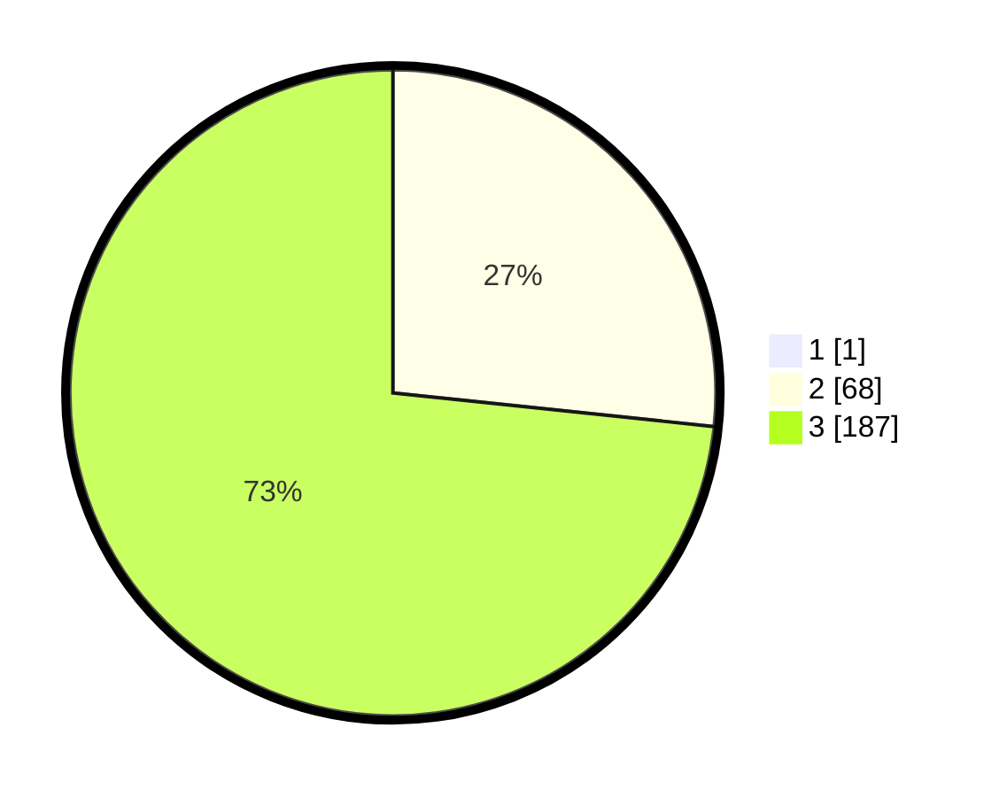

# Hasil

## Grafik

## Tabel

| No. | Nama Paslon    | Suara | Suara (raw) | Persentase |
|:--- |:-------------- | -----:| -----------:| ----------:|
| 1   | ANIES MUHAIMIN | 1     | [1][p-1]    | 0,39       |
| 2   | PRABOWO GIBRAN | 68    | [68][p-2]   | 26,56      |
| 3   | GANJAR MAHFUD  | 187   | [187][p-3]  | 73,05      |

[p-1]: https://github.com/gigit-pemilu/pemilu-2024/blob/main/pilpres/hitung-suara/sub/51-bali/sub/02-tabanan/sub/07-marga/sub/2009-petiga/sub/004-tps/sub/paslon-1.txt
[p-2]: https://github.com/gigit-pemilu/pemilu-2024/blob/main/pilpres/hitung-suara/sub/51-bali/sub/02-tabanan/sub/07-marga/sub/2009-petiga/sub/004-tps/sub/paslon-2.txt
[p-3]: https://github.com/gigit-pemilu/pemilu-2024/blob/main/pilpres/hitung-suara/sub/51-bali/sub/02-tabanan/sub/07-marga/sub/2009-petiga/sub/004-tps/sub/paslon-3.txt

## Foto C Plano

https://sirekap-obj-formc.kpu.go.id/f8d4/pemilu/ppwp/51/02/07/20/09/5102072009004-20240214-132658--364d6ccc-5980-4817-b888-5fec173da762.jpg

https://sirekap-obj-formc.kpu.go.id/f8d4/pemilu/ppwp/51/02/07/20/09/5102072009004-20240214-133048--a45ccac5-b90f-4639-a9da-83e9e42ef714.jpg

https://sirekap-obj-formc.kpu.go.id/f8d4/pemilu/ppwp/51/02/07/20/09/5102072009004-20240216-010131--ae8ca184-1a18-4ac5-b324-5aba00473b3d.jpg

## Metadata

| Key        | Value               |
| ---------- | ------------------- |
| Time Stamp | 2024-02-16 01:30:27 |

## DATA PEMILIH TETAP

Jumlah pemilih dalam DPT: **268**.
 * L: **137**.
 * P: **131**.

## DATA PENGGUNA HAK PILIH

Jumlah pengguna hak pilih dalam DPT: **257**.
 * L: **129**.
 * P: **128**.

Jumlah pengguna hak pilih dalam DPTb: **0**.
 * L: **0**.
 * P: **0**.

Jumlah pengguna hak pilih dalam DPK: **0**.
 * L: **0**.
 * P: **0**.

Jumlah pengguna hak pilih: **257**.
 * L: **129**.
 * P: **128**.

## JUMLAH SUARA SAH DAN TIDAK SAH

JUMLAH SELURUH SUARA SAH: **256**.

JUMLAH SUARA TIDAK SAH: **1**.

JUMLAH SELURUH SUARA SAH DAN SUARA TIDAK SAH: **257**.

