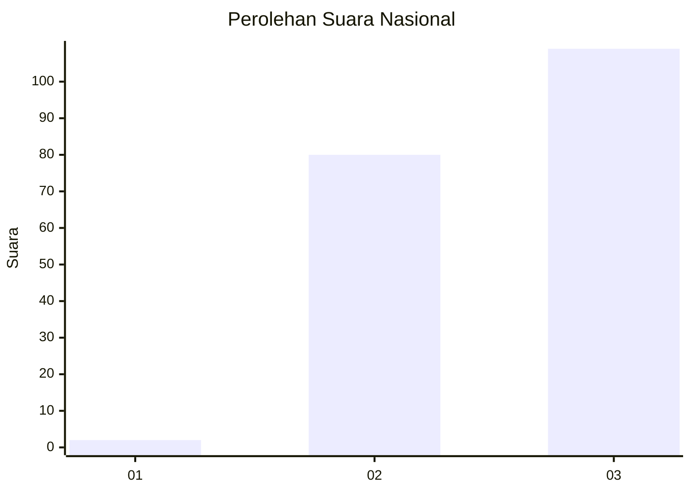
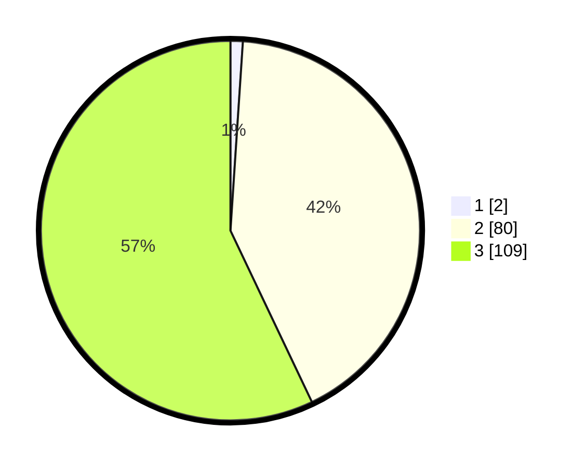

# Hasil

## Grafik

## Tabel

| No. | Nama Paslon    | Suara | Suara (raw) | Persentase |
|:--- |:-------------- | -----:| -----------:| ----------:|
| 1   | ANIES MUHAIMIN | 2     | [2][p-1]    | 1,05       |
| 2   | PRABOWO GIBRAN | 80    | [80][p-2]   | 41,88      |
| 3   | GANJAR MAHFUD  | 109   | [109][p-3]  | 57,07      |

[p-1]: https://github.com/gigit-pemilu/pemilu-2024/blob/main/pilpres/hitung-suara/sub/51-bali/sub/02-tabanan/sub/07-marga/sub/2009-petiga/sub/006-tps/sub/paslon-1.txt
[p-2]: https://github.com/gigit-pemilu/pemilu-2024/blob/main/pilpres/hitung-suara/sub/51-bali/sub/02-tabanan/sub/07-marga/sub/2009-petiga/sub/006-tps/sub/paslon-2.txt
[p-3]: https://github.com/gigit-pemilu/pemilu-2024/blob/main/pilpres/hitung-suara/sub/51-bali/sub/02-tabanan/sub/07-marga/sub/2009-petiga/sub/006-tps/sub/paslon-3.txt

## Foto C Plano

https://sirekap-obj-formc.kpu.go.id/87a7/pemilu/ppwp/51/02/07/20/09/5102072009006-20240216-144458--5c8c8d9a-205e-4353-9303-9f274e85854d.jpg

https://sirekap-obj-formc.kpu.go.id/87a7/pemilu/ppwp/51/02/07/20/09/5102072009006-20240216-144459--06c2072f-8124-4099-aa95-d11b553f4efc.jpg

https://sirekap-obj-formc.kpu.go.id/87a7/pemilu/ppwp/51/02/07/20/09/5102072009006-20240216-144458--95282892-f3fb-4db2-98bd-a2de34f06fcb.jpg

## Metadata

| Key        | Value               |
| ---------- | ------------------- |
| Time Stamp | 2024-02-21 13:00:00 |

## DATA PEMILIH TETAP

Jumlah pemilih dalam DPT: **210**.
 * L: **103**.
 * P: **107**.

## DATA PENGGUNA HAK PILIH

Jumlah pengguna hak pilih dalam DPT: **192**.
 * L: **95**.
 * P: **97**.

Jumlah pengguna hak pilih dalam DPTb: **0**.
 * L: **0**.
 * P: **0**.

Jumlah pengguna hak pilih dalam DPK: **0**.
 * L: **0**.
 * P: **0**.

Jumlah pengguna hak pilih: **192**.
 * L: **95**.
 * P: **97**.

## JUMLAH SUARA SAH DAN TIDAK SAH

JUMLAH SELURUH SUARA SAH: **191**.

JUMLAH SUARA TIDAK SAH: **1**.

JUMLAH SELURUH SUARA SAH DAN SUARA TIDAK SAH: **192**.

