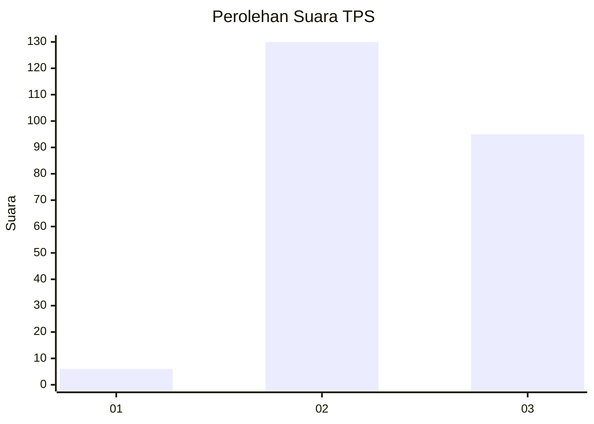
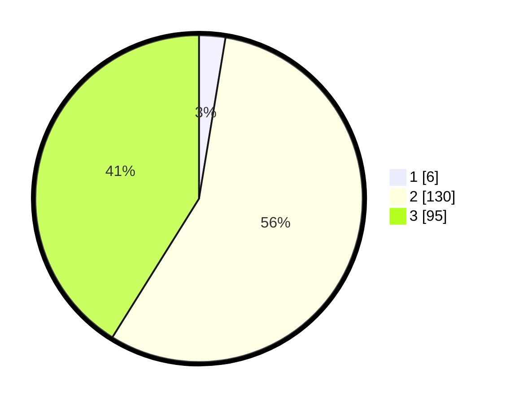

# Hasil

## Grafik

## Tabel

| No. | Nama Paslon    | Suara | Suara (raw) | Persentase |
|:--- |:-------------- | -----:| -----------:| ----------:|
| 1   | ANIES MUHAIMIN | 6     | [6][p-1]    | 2,60       |
| 2   | PRABOWO GIBRAN | 130   | [130][p-2]  | 56,28      |
| 3   | GANJAR MAHFUD  | 95    | [95][p-3]   | 41,13      |

[p-1]: https://github.com/gigit-pemilu/pemilu-2024-51-bali/blob/main/pilpres/hitung-suara/sub/51-bali/sub/02-tabanan/sub/07-marga/sub/2010-cau-belayu/sub/001-tps/sub/paslon-1.txt
[p-2]: https://github.com/gigit-pemilu/pemilu-2024-51-bali/blob/main/pilpres/hitung-suara/sub/51-bali/sub/02-tabanan/sub/07-marga/sub/2010-cau-belayu/sub/001-tps/sub/paslon-2.txt
[p-3]: https://github.com/gigit-pemilu/pemilu-2024-51-bali/blob/main/pilpres/hitung-suara/sub/51-bali/sub/02-tabanan/sub/07-marga/sub/2010-cau-belayu/sub/001-tps/sub/paslon-3.txt

## Foto C Plano

https://sirekap-obj-formc.kpu.go.id/a599/pemilu/ppwp/51/02/07/20/10/5102072010001-20240216-014649--480bde29-cc41-4ad1-987e-87f8703920c7.jpg

https://sirekap-obj-formc.kpu.go.id/a599/pemilu/ppwp/51/02/07/20/10/5102072010001-20240216-014651--6def91a0-0b0b-4870-8505-6da5787b6dcf.jpg

https://sirekap-obj-formc.kpu.go.id/a599/pemilu/ppwp/51/02/07/20/10/5102072010001-20240216-014650--fe689a1a-2b12-4955-a3c3-93df0262759c.jpg

## Metadata

| Key        | Value               |
| ---------- | ------------------- |
| Time Stamp | 2024-02-16 12:51:22 |

## DATA PEMILIH TETAP

Jumlah pemilih dalam DPT: **255**.
 * L: **124**.
 * P: **131**.

## DATA PENGGUNA HAK PILIH

Jumlah pengguna hak pilih dalam DPT: **229**.
 * L: **109**.
 * P: **120**.

Jumlah pengguna hak pilih dalam DPTb: **0**.
 * L: **0**.
 * P: **0**.

Jumlah pengguna hak pilih dalam DPK: **6**.
 * L: **4**.
 * P: **2**.

Jumlah pengguna hak pilih: **235**.
 * L: **113**.
 * P: **122**.

## JUMLAH SUARA SAH DAN TIDAK SAH

JUMLAH SELURUH SUARA SAH: **231**.

JUMLAH SUARA TIDAK SAH: **4**.

JUMLAH SELURUH SUARA SAH DAN SUARA TIDAK SAH: **235**.

