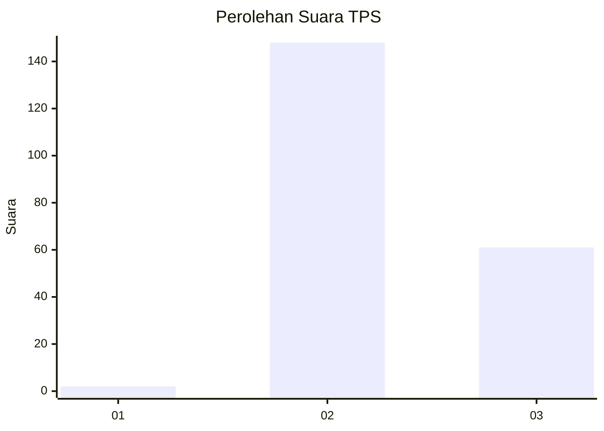
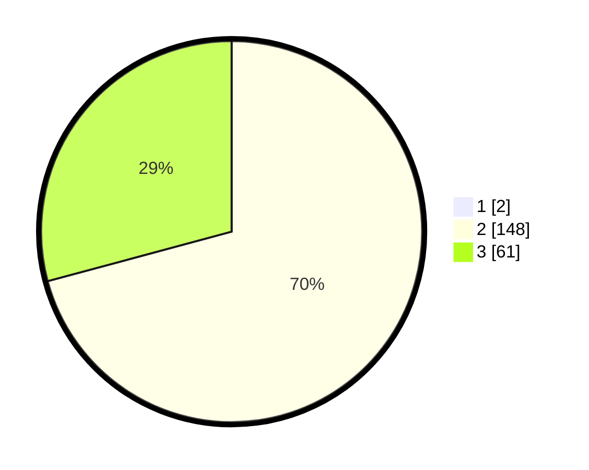

# Hasil

## Grafik

## Tabel

| No. | Nama Paslon    | Suara | Suara (raw) | Persentase |
|:--- |:-------------- | -----:| -----------:| ----------:|
| 1   | ANIES MUHAIMIN | 2     | [2][p-1]    | 0,95       |
| 2   | PRABOWO GIBRAN | 148   | [148][p-2]  | 70,14      |
| 3   | GANJAR MAHFUD  | 61    | [61][p-3]   | 28,91      |

[p-1]: https://github.com/gigit-pemilu/pemilu-2024-51-bali/blob/main/pilpres/hitung-suara/sub/51-bali/sub/02-tabanan/sub/07-marga/sub/2010-cau-belayu/sub/003-tps/sub/paslon-1.txt
[p-2]: https://github.com/gigit-pemilu/pemilu-2024-51-bali/blob/main/pilpres/hitung-suara/sub/51-bali/sub/02-tabanan/sub/07-marga/sub/2010-cau-belayu/sub/003-tps/sub/paslon-2.txt
[p-3]: https://github.com/gigit-pemilu/pemilu-2024-51-bali/blob/main/pilpres/hitung-suara/sub/51-bali/sub/02-tabanan/sub/07-marga/sub/2010-cau-belayu/sub/003-tps/sub/paslon-3.txt

## Foto C Plano

https://sirekap-obj-formc.kpu.go.id/5eca/pemilu/ppwp/51/02/07/20/10/5102072010003-20240214-205832--5130fe21-99c1-4f43-88c1-1a3472accadc.jpg

https://sirekap-obj-formc.kpu.go.id/5eca/pemilu/ppwp/51/02/07/20/10/5102072010003-20240214-205950--9c0810a7-5e95-4598-805a-c6be611f5f3a.jpg

## Metadata

| Key        | Value               |
| ---------- | ------------------- |
| Time Stamp | 2024-02-24 22:31:28 |

