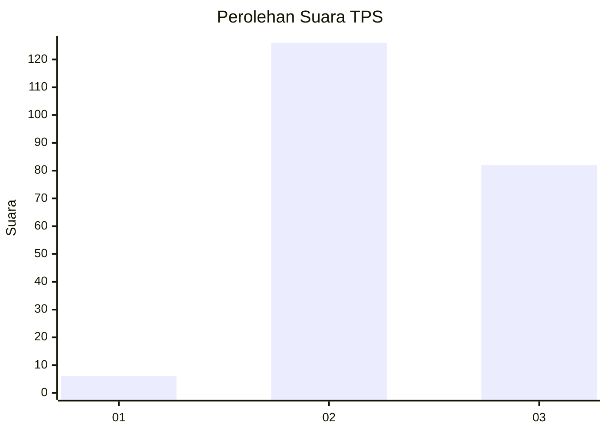
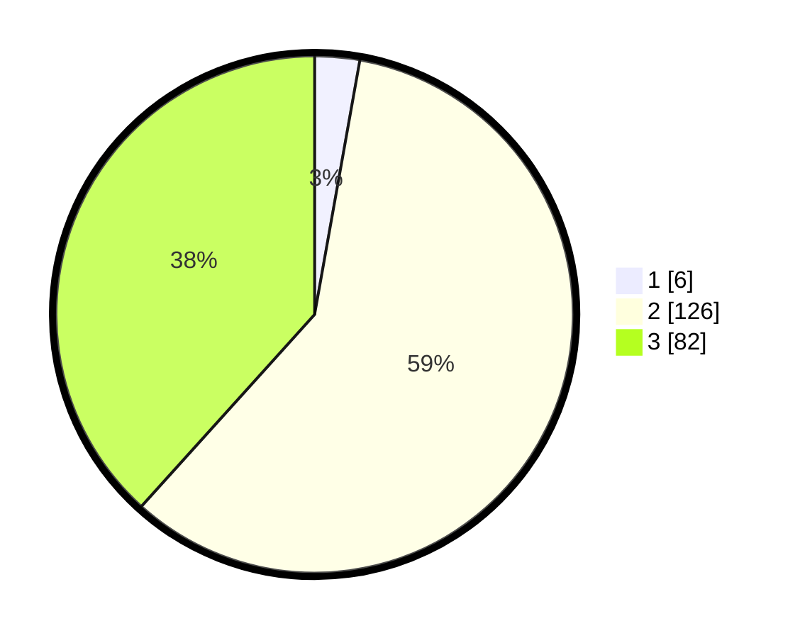

# Hasil

## Grafik

## Tabel

| No. | Nama Paslon    | Suara | Suara (raw) | Persentase |
|:--- |:-------------- | -----:| -----------:| ----------:|
| 1   | ANIES MUHAIMIN | 6     | [6][p-1]    | 2,80       |
| 2   | PRABOWO GIBRAN | 126   | [126][p-2]  | 58,88      |
| 3   | GANJAR MAHFUD  | 82    | [82][p-3]   | 38,32      |

[p-1]: https://github.com/gigit-pemilu/pemilu-2024-51-bali/blob/main/pilpres/hitung-suara/sub/51-bali/sub/02-tabanan/sub/07-marga/sub/2010-cau-belayu/sub/004-tps/sub/paslon-1.txt
[p-2]: https://github.com/gigit-pemilu/pemilu-2024-51-bali/blob/main/pilpres/hitung-suara/sub/51-bali/sub/02-tabanan/sub/07-marga/sub/2010-cau-belayu/sub/004-tps/sub/paslon-2.txt
[p-3]: https://github.com/gigit-pemilu/pemilu-2024-51-bali/blob/main/pilpres/hitung-suara/sub/51-bali/sub/02-tabanan/sub/07-marga/sub/2010-cau-belayu/sub/004-tps/sub/paslon-3.txt

## Foto C Plano

https://sirekap-obj-formc.kpu.go.id/b604/pemilu/ppwp/51/02/07/20/10/5102072010004-20240216-033728--5ef57cfb-6deb-4652-b5a6-2ec70664ff2a.jpg

https://sirekap-obj-formc.kpu.go.id/b604/pemilu/ppwp/51/02/07/20/10/5102072010004-20240216-032714--4272b304-2f57-46e4-a7e2-258c1993a501.jpg

https://sirekap-obj-formc.kpu.go.id/b604/pemilu/ppwp/51/02/07/20/10/5102072010004-20240216-032713--ea13d2fe-3ecd-4b37-8f77-4db463d4e1f0.jpg

## Metadata

| Key        | Value               |
| ---------- | ------------------- |
| Time Stamp | 2024-02-16 12:51:22 |

## DATA PEMILIH TETAP

Jumlah pemilih dalam DPT: **251**.
 * L: **118**.
 * P: **133**.

## DATA PENGGUNA HAK PILIH

Jumlah pengguna hak pilih dalam DPT: **215**.
 * L: **103**.
 * P: **112**.

Jumlah pengguna hak pilih dalam DPTb: **0**.
 * L: **0**.
 * P: **0**.

Jumlah pengguna hak pilih dalam DPK: **5**.
 * L: **2**.
 * P: **3**.

Jumlah pengguna hak pilih: **220**.
 * L: **105**.
 * P: **115**.

## JUMLAH SUARA SAH DAN TIDAK SAH

JUMLAH SELURUH SUARA SAH: **214**.

JUMLAH SUARA TIDAK SAH: **6**.

JUMLAH SELURUH SUARA SAH DAN SUARA TIDAK SAH: **220**.

