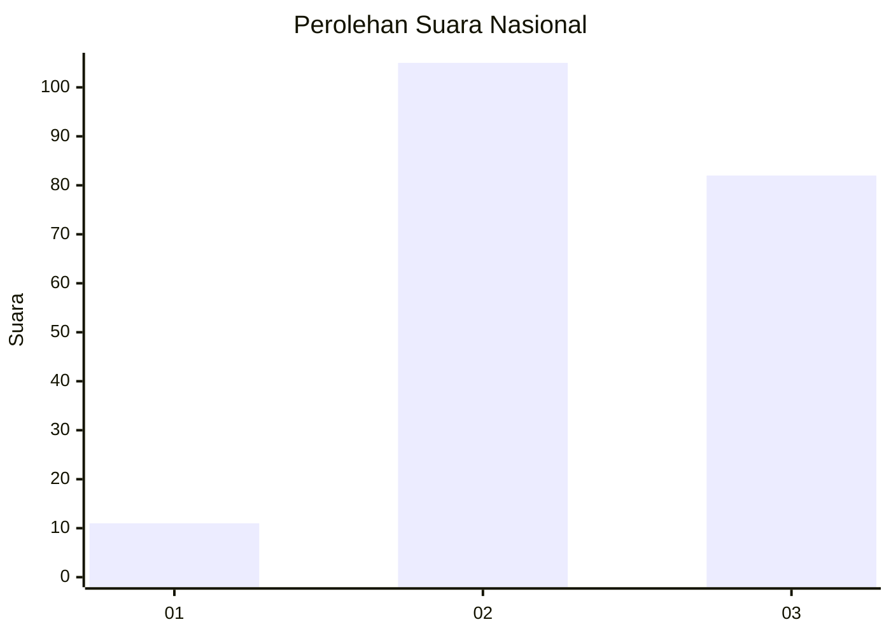
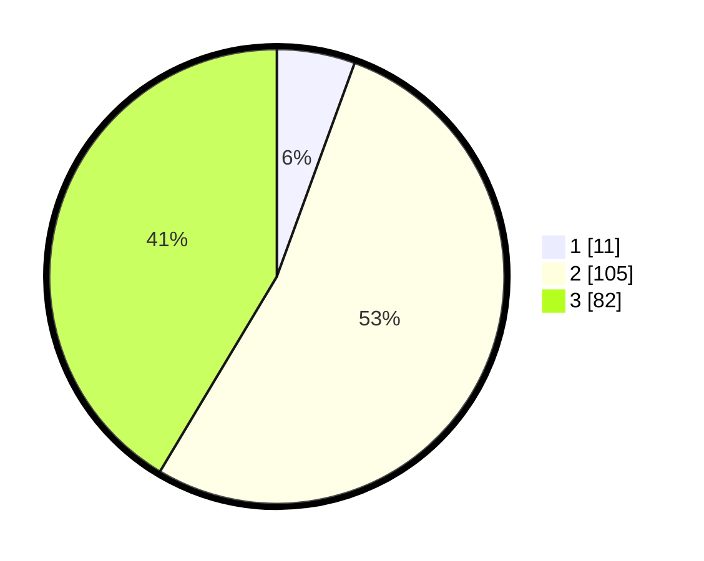

# Hasil

## Grafik

## Tabel

| No. | Nama Paslon    | Suara | Suara (raw) | Persentase |
|:--- |:-------------- | -----:| -----------:| ----------:|
| 1   | ANIES MUHAIMIN | 11    | [11][p-1]   | 5,56       |
| 2   | PRABOWO GIBRAN | 105   | [105][p-2]  | 53,03      |
| 3   | GANJAR MAHFUD  | 82    | [82][p-3]   | 41,41      |

[p-1]: https://github.com/gigit-pemilu/pemilu-2024/blob/main/pilpres/hitung-suara/sub/51-bali/sub/02-tabanan/sub/07-marga/sub/2011-tua/sub/004-tps/sub/paslon-1.txt
[p-2]: https://github.com/gigit-pemilu/pemilu-2024/blob/main/pilpres/hitung-suara/sub/51-bali/sub/02-tabanan/sub/07-marga/sub/2011-tua/sub/004-tps/sub/paslon-2.txt
[p-3]: https://github.com/gigit-pemilu/pemilu-2024/blob/main/pilpres/hitung-suara/sub/51-bali/sub/02-tabanan/sub/07-marga/sub/2011-tua/sub/004-tps/sub/paslon-3.txt

## Foto C Plano

https://sirekap-obj-formc.kpu.go.id/2a8a/pemilu/ppwp/51/02/07/20/11/5102072011004-20240214-220321--a8dfdd44-33da-4a29-af26-03ad5d94a6f5.jpg

https://sirekap-obj-formc.kpu.go.id/2a8a/pemilu/ppwp/51/02/07/20/11/5102072011004-20240214-220517--7d26a7b4-acce-4ec8-af20-f39d4ac93e10.jpg

https://sirekap-obj-formc.kpu.go.id/2a8a/pemilu/ppwp/51/02/07/20/11/5102072011004-20240214-225810--f08f5aee-e30f-452b-94e4-b8e7d8cfdbb2.jpg

## Metadata

| Key        | Value               |
| ---------- | ------------------- |
| Time Stamp | 2024-02-15 23:29:50 |

