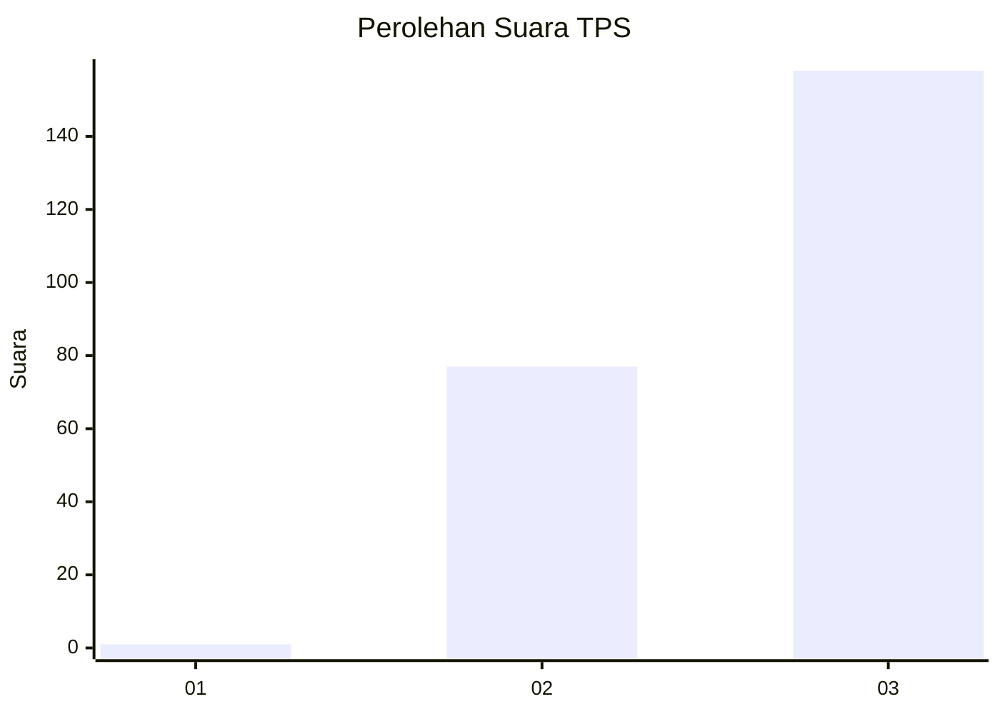
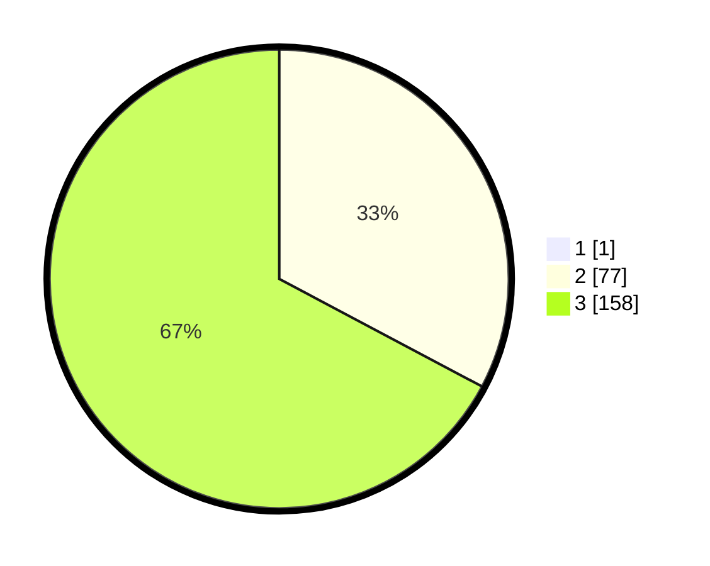

# Hasil

## Grafik

## Tabel

| No. | Nama Paslon    | Suara | Suara (raw) | Persentase |
|:--- |:-------------- | -----:| -----------:| ----------:|
| 1   | ANIES MUHAIMIN | 1     | [1][p-1]    | 0,42       |
| 2   | PRABOWO GIBRAN | 77    | [77][p-2]   | 32,63      |
| 3   | GANJAR MAHFUD  | 158   | [158][p-3]  | 66,95      |

[p-1]: https://github.com/gigit-pemilu/pemilu-2024-51-bali/blob/main/pilpres/hitung-suara/sub/51-bali/sub/02-tabanan/sub/07-marga/sub/2012-payangan/sub/001-tps/sub/paslon-1.txt
[p-2]: https://github.com/gigit-pemilu/pemilu-2024-51-bali/blob/main/pilpres/hitung-suara/sub/51-bali/sub/02-tabanan/sub/07-marga/sub/2012-payangan/sub/001-tps/sub/paslon-2.txt
[p-3]: https://github.com/gigit-pemilu/pemilu-2024-51-bali/blob/main/pilpres/hitung-suara/sub/51-bali/sub/02-tabanan/sub/07-marga/sub/2012-payangan/sub/001-tps/sub/paslon-3.txt

## Foto C Plano

https://sirekap-obj-formc.kpu.go.id/77c0/pemilu/ppwp/51/02/07/20/12/5102072012001-20240216-045233--7ffbe7c7-26c3-451d-8b9b-9be80aae8d2f.jpg

https://sirekap-obj-formc.kpu.go.id/77c0/pemilu/ppwp/51/02/07/20/12/5102072012001-20240216-045234--ea8bf2f3-1b59-419b-af9e-bccd8cf497f2.jpg

https://sirekap-obj-formc.kpu.go.id/77c0/pemilu/ppwp/51/02/07/20/12/5102072012001-20240216-045234--f7808dc5-4738-4694-b9c1-aa73f294bf9f.jpg

## Metadata

| Key        | Value               |
| ---------- | ------------------- |
| Time Stamp | 2024-02-16 12:51:22 |

## DATA PEMILIH TETAP

Jumlah pemilih dalam DPT: **274**.
 * L: **124**.
 * P: **150**.

## DATA PENGGUNA HAK PILIH

Jumlah pengguna hak pilih dalam DPT: **274**.
 * L: **124**.
 * P: **150**.

Jumlah pengguna hak pilih dalam DPTb: **0**.
 * L: **0**.
 * P: **0**.

Jumlah pengguna hak pilih dalam DPK: **0**.
 * L: **0**.
 * P: **0**.

Jumlah pengguna hak pilih: **274**.
 * L: **124**.
 * P: **150**.

## JUMLAH SUARA SAH DAN TIDAK SAH

JUMLAH SELURUH SUARA SAH: **236**.

JUMLAH SUARA TIDAK SAH: **3**.

JUMLAH SELURUH SUARA SAH DAN SUARA TIDAK SAH: **239**.

