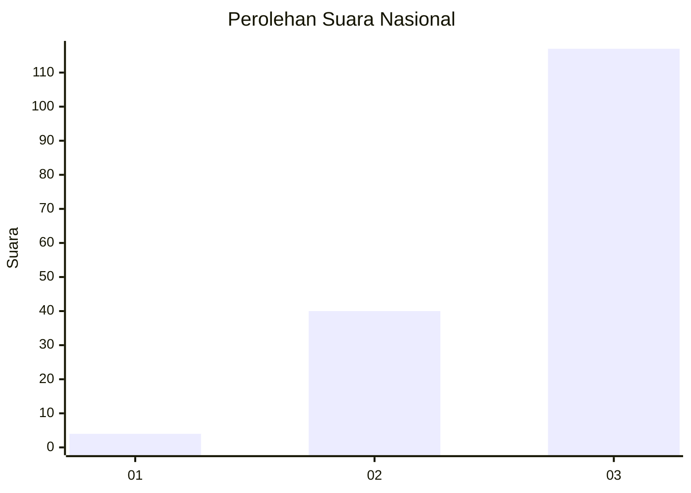
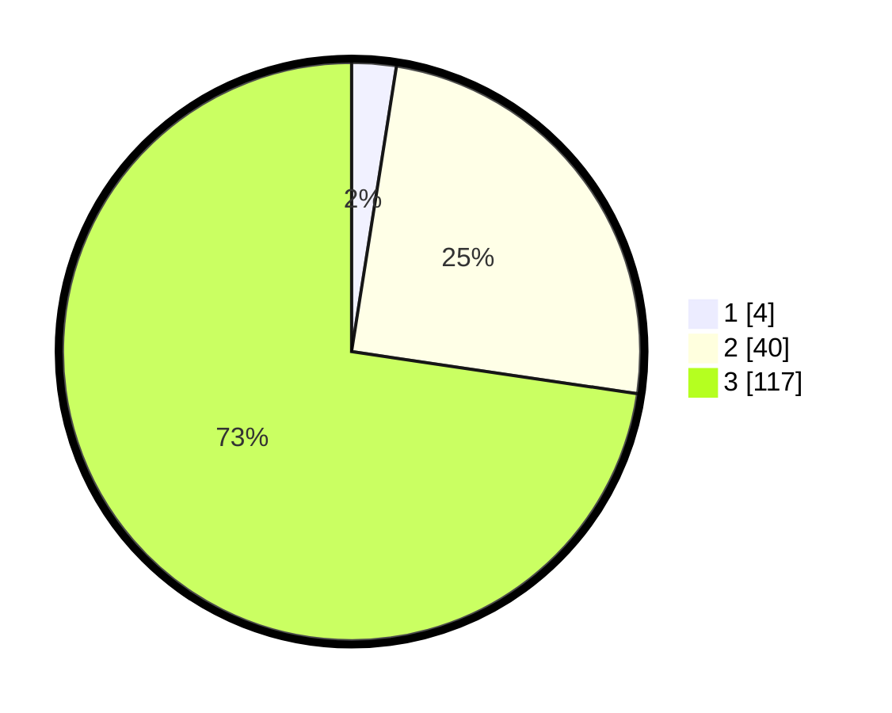

# Hasil

## Grafik

## Tabel

| No. | Nama Paslon    | Suara | Suara (raw) | Persentase |
|:--- |:-------------- | -----:| -----------:| ----------:|
| 1   | ANIES MUHAIMIN | 4     | [4][p-1]    | 2,48       |
| 2   | PRABOWO GIBRAN | 40    | [40][p-2]   | 24,84      |
| 3   | GANJAR MAHFUD  | 117   | [117][p-3]  | 72,67      |

[p-1]: https://github.com/gigit-pemilu/pemilu-2024/blob/main/pilpres/hitung-suara/sub/51-bali/sub/02-tabanan/sub/07-marga/sub/2012-payangan/sub/003-tps/sub/paslon-1.txt
[p-2]: https://github.com/gigit-pemilu/pemilu-2024/blob/main/pilpres/hitung-suara/sub/51-bali/sub/02-tabanan/sub/07-marga/sub/2012-payangan/sub/003-tps/sub/paslon-2.txt
[p-3]: https://github.com/gigit-pemilu/pemilu-2024/blob/main/pilpres/hitung-suara/sub/51-bali/sub/02-tabanan/sub/07-marga/sub/2012-payangan/sub/003-tps/sub/paslon-3.txt

## Foto C Plano

https://sirekap-obj-formc.kpu.go.id/bfb0/pemilu/ppwp/51/02/07/20/12/5102072012003-20240216-000336--e8bd1227-ff08-4ed1-bfb3-626acd816a4a.jpg

https://sirekap-obj-formc.kpu.go.id/bfb0/pemilu/ppwp/51/02/07/20/12/5102072012003-20240216-000339--f18c5728-dd0a-4904-8b01-70b1eb76df71.jpg

https://sirekap-obj-formc.kpu.go.id/bfb0/pemilu/ppwp/51/02/07/20/12/5102072012003-20240216-000338--e677e4e1-917d-450b-a4cb-af39a7bccec0.jpg

## Metadata

| Key        | Value               |
| ---------- | ------------------- |
| Time Stamp | 2024-02-16 12:51:22 |

## DATA PEMILIH TETAP

Jumlah pemilih dalam DPT: **175**.
 * L: **83**.
 * P: **92**.

## DATA PENGGUNA HAK PILIH

Jumlah pengguna hak pilih dalam DPT: **161**.
 * L: **76**.
 * P: **85**.

Jumlah pengguna hak pilih dalam DPTb: **0**.
 * L: **0**.
 * P: **0**.

Jumlah pengguna hak pilih dalam DPK: **0**.
 * L: **0**.
 * P: **0**.

Jumlah pengguna hak pilih: **161**.
 * L: **76**.
 * P: **85**.

## JUMLAH SUARA SAH DAN TIDAK SAH

JUMLAH SELURUH SUARA SAH: **161**.

JUMLAH SUARA TIDAK SAH: **0**.

JUMLAH SELURUH SUARA SAH DAN SUARA TIDAK SAH: **161**.

