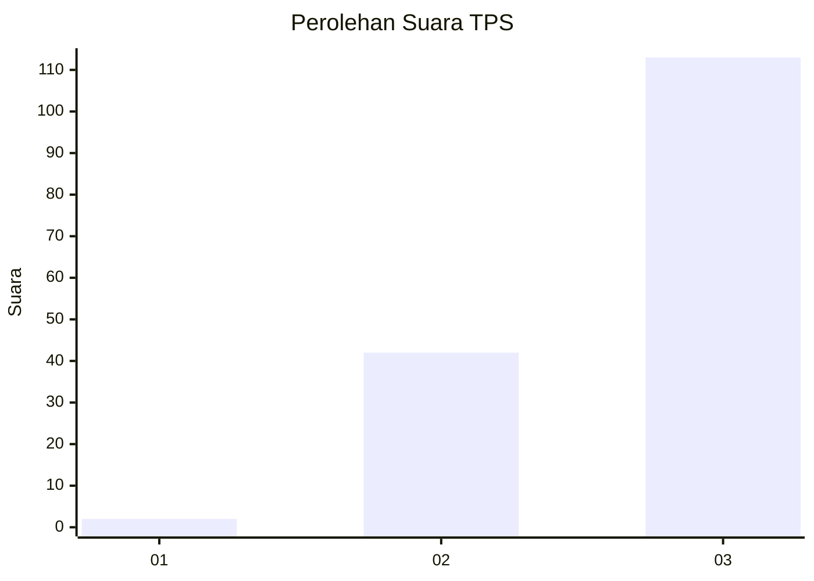
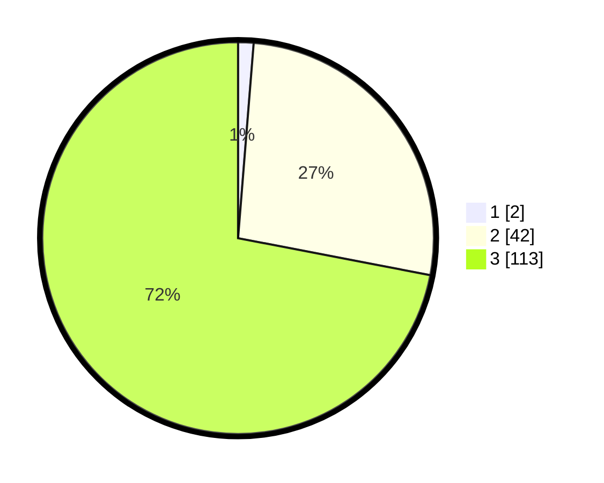

# Hasil

## Grafik

## Tabel

| No. | Nama Paslon    | Suara | Suara (raw) | Persentase |
|:--- |:-------------- | -----:| -----------:| ----------:|
| 1   | ANIES MUHAIMIN | 2     | [2][p-1]    | 1,27       |
| 2   | PRABOWO GIBRAN | 42    | [42][p-2]   | 26,75      |
| 3   | GANJAR MAHFUD  | 113   | [113][p-3]  | 71,97      |

[p-1]: https://github.com/gigit-pemilu/pemilu-2024-51-bali/blob/main/pilpres/hitung-suara/sub/51-bali/sub/02-tabanan/sub/07-marga/sub/2012-payangan/sub/004-tps/sub/paslon-1.txt
[p-2]: https://github.com/gigit-pemilu/pemilu-2024-51-bali/blob/main/pilpres/hitung-suara/sub/51-bali/sub/02-tabanan/sub/07-marga/sub/2012-payangan/sub/004-tps/sub/paslon-2.txt
[p-3]: https://github.com/gigit-pemilu/pemilu-2024-51-bali/blob/main/pilpres/hitung-suara/sub/51-bali/sub/02-tabanan/sub/07-marga/sub/2012-payangan/sub/004-tps/sub/paslon-3.txt

## Foto C Plano

https://sirekap-obj-formc.kpu.go.id/de49/pemilu/ppwp/51/02/07/20/12/5102072012004-20240216-003311--0123c22e-4728-4ab3-b2a6-88fd5979d898.jpg

https://sirekap-obj-formc.kpu.go.id/de49/pemilu/ppwp/51/02/07/20/12/5102072012004-20240216-003315--49accc9f-a514-4245-9050-c049a103177c.jpg

https://sirekap-obj-formc.kpu.go.id/de49/pemilu/ppwp/51/02/07/20/12/5102072012004-20240216-003312--c9c3fc94-6b77-4f38-81a3-e48e44e465ba.jpg

## Metadata

| Key        | Value               |
| ---------- | ------------------- |
| Time Stamp | 2024-02-16 12:51:22 |

## DATA PEMILIH TETAP

Jumlah pemilih dalam DPT: **176**.
 * L: **90**.
 * P: **86**.

## DATA PENGGUNA HAK PILIH

Jumlah pengguna hak pilih dalam DPT: **157**.
 * L: **78**.
 * P: **79**.

Jumlah pengguna hak pilih dalam DPTb: **0**.
 * L: **0**.
 * P: **0**.

Jumlah pengguna hak pilih dalam DPK: **0**.
 * L: **0**.
 * P: **0**.

Jumlah pengguna hak pilih: **157**.
 * L: **78**.
 * P: **79**.

## JUMLAH SUARA SAH DAN TIDAK SAH

JUMLAH SELURUH SUARA SAH: **157**.

JUMLAH SUARA TIDAK SAH: **0**.

JUMLAH SELURUH SUARA SAH DAN SUARA TIDAK SAH: **157**.

