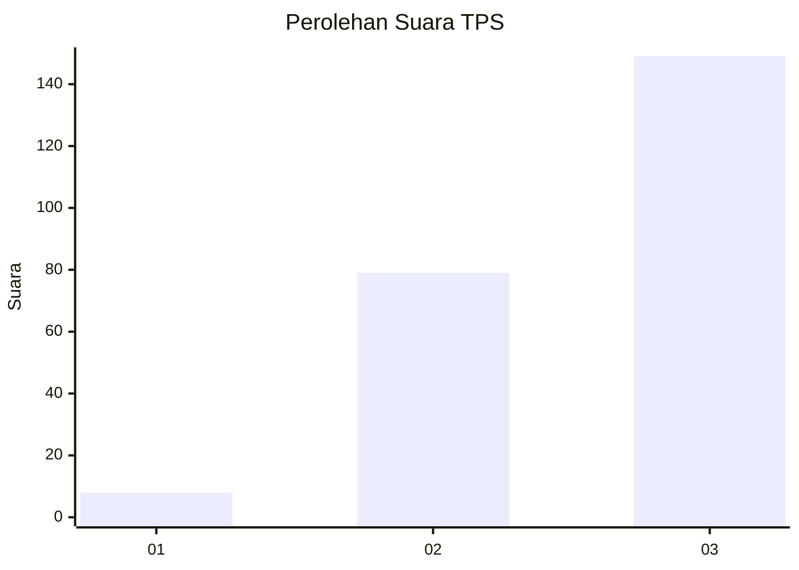
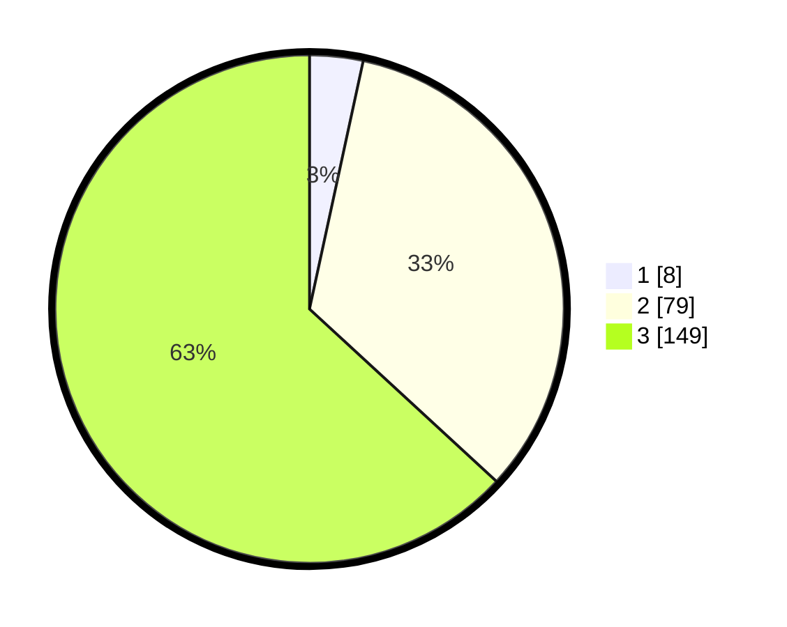

# Hasil

## Grafik

## Tabel

| No. | Nama Paslon    | Suara | Suara (raw) | Persentase |
|:--- |:-------------- | -----:| -----------:| ----------:|
| 1   | ANIES MUHAIMIN | 8     | [8][p-1]    | 3,39       |
| 2   | PRABOWO GIBRAN | 79    | [79][p-2]   | 33,47      |
| 3   | GANJAR MAHFUD  | 149   | [149][p-3]  | 63,14      |

[p-1]: https://github.com/gigit-pemilu/pemilu-2024-51-bali/blob/main/pilpres/hitung-suara/sub/51-bali/sub/02-tabanan/sub/07-marga/sub/2012-payangan/sub/007-tps/sub/paslon-1.txt
[p-2]: https://github.com/gigit-pemilu/pemilu-2024-51-bali/blob/main/pilpres/hitung-suara/sub/51-bali/sub/02-tabanan/sub/07-marga/sub/2012-payangan/sub/007-tps/sub/paslon-2.txt
[p-3]: https://github.com/gigit-pemilu/pemilu-2024-51-bali/blob/main/pilpres/hitung-suara/sub/51-bali/sub/02-tabanan/sub/07-marga/sub/2012-payangan/sub/007-tps/sub/paslon-3.txt

## Foto C Plano

https://sirekap-obj-formc.kpu.go.id/ee4d/pemilu/ppwp/51/02/07/20/12/5102072012007-20240216-132746--30fbd107-6fd7-48ec-a093-cd81186bb39f.jpg

https://sirekap-obj-formc.kpu.go.id/ee4d/pemilu/ppwp/51/02/07/20/12/5102072012007-20240214-232422--7d332dd8-e949-455a-925b-b3d4d1f809ad.jpg

https://sirekap-obj-formc.kpu.go.id/ee4d/pemilu/ppwp/51/02/07/20/12/5102072012007-20240214-232439--608e8a67-699c-427e-9422-3a7508b6429d.jpg

## Metadata

| Key        | Value               |
| ---------- | ------------------- |
| Time Stamp | 2024-02-16 13:30:32 |

## DATA PEMILIH TETAP

Jumlah pemilih dalam DPT: **277**.
 * L: **130**.
 * P: **147**.

## DATA PENGGUNA HAK PILIH

Jumlah pengguna hak pilih dalam DPT: **242**.
 * L: **117**.
 * P: **125**.

Jumlah pengguna hak pilih dalam DPTb: **0**.
 * L: **0**.
 * P: **0**.

Jumlah pengguna hak pilih dalam DPK: **0**.
 * L: **0**.
 * P: **0**.

Jumlah pengguna hak pilih: **242**.
 * L: **117**.
 * P: **125**.

## JUMLAH SUARA SAH DAN TIDAK SAH

JUMLAH SELURUH SUARA SAH: **236**.

JUMLAH SUARA TIDAK SAH: **6**.

JUMLAH SELURUH SUARA SAH DAN SUARA TIDAK SAH: **242**.

