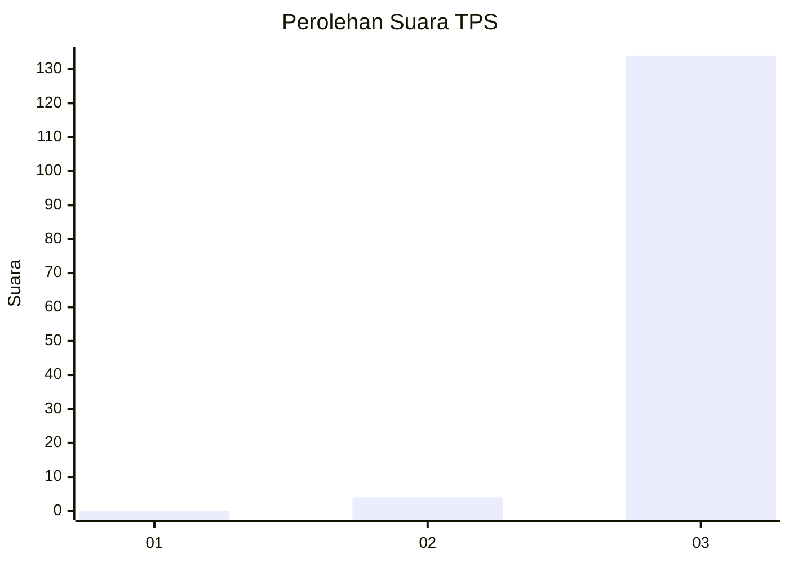
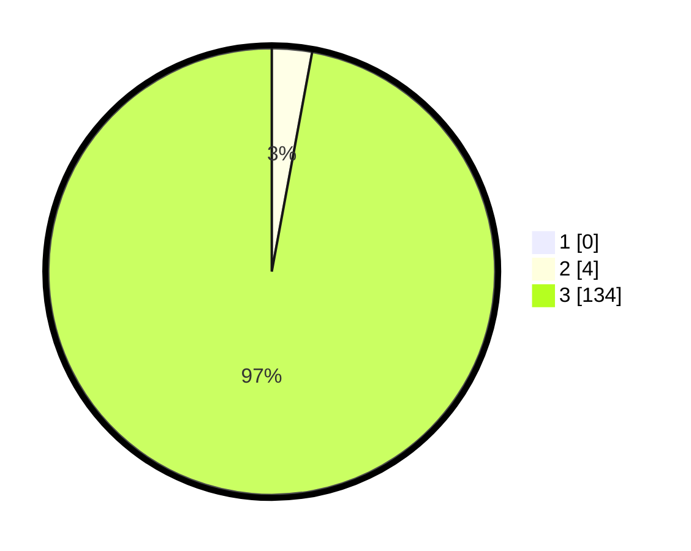

# Hasil

## Grafik

## Tabel

| No. | Nama Paslon    | Suara | Suara (raw) | Persentase |
|:--- |:-------------- | -----:| -----------:| ----------:|
| 1   | ANIES MUHAIMIN | 0     | [0][p-1]    | 0,00       |
| 2   | PRABOWO GIBRAN | 4     | [4][p-2]    | 2,90       |
| 3   | GANJAR MAHFUD  | 134   | [134][p-3]  | 97,10      |

[p-1]: https://github.com/gigit-pemilu/pemilu-2024-51-bali/blob/main/pilpres/hitung-suara/sub/51-bali/sub/02-tabanan/sub/07-marga/sub/2012-payangan/sub/008-tps/sub/paslon-1.txt
[p-2]: https://github.com/gigit-pemilu/pemilu-2024-51-bali/blob/main/pilpres/hitung-suara/sub/51-bali/sub/02-tabanan/sub/07-marga/sub/2012-payangan/sub/008-tps/sub/paslon-2.txt
[p-3]: https://github.com/gigit-pemilu/pemilu-2024-51-bali/blob/main/pilpres/hitung-suara/sub/51-bali/sub/02-tabanan/sub/07-marga/sub/2012-payangan/sub/008-tps/sub/paslon-3.txt

## Foto C Plano

https://sirekap-obj-formc.kpu.go.id/156a/pemilu/ppwp/51/02/07/20/12/5102072012008-20240216-000304--af8e35cf-1df0-41a7-a58a-48ad55f1c3e8.jpg

https://sirekap-obj-formc.kpu.go.id/156a/pemilu/ppwp/51/02/07/20/12/5102072012008-20240216-000307--63e31ea3-a24c-4d5b-94ee-b777965320e1.jpg

https://sirekap-obj-formc.kpu.go.id/156a/pemilu/ppwp/51/02/07/20/12/5102072012008-20240216-000306--a8022c1f-b2e0-4c03-8b38-9c937597fd44.jpg

## Metadata

| Key        | Value               |
| ---------- | ------------------- |
| Time Stamp | 2024-02-16 12:51:22 |

## DATA PEMILIH TETAP

Jumlah pemilih dalam DPT: **151**.
 * L: **70**.
 * P: **81**.

## DATA PENGGUNA HAK PILIH

Jumlah pengguna hak pilih dalam DPT: **138**.
 * L: **66**.
 * P: **72**.

Jumlah pengguna hak pilih dalam DPTb: **0**.
 * L: **0**.
 * P: **0**.

Jumlah pengguna hak pilih dalam DPK: **0**.
 * L: **0**.
 * P: **0**.

Jumlah pengguna hak pilih: **138**.
 * L: **66**.
 * P: **72**.

## JUMLAH SUARA SAH DAN TIDAK SAH

JUMLAH SELURUH SUARA SAH: **138**.

JUMLAH SUARA TIDAK SAH: **0**.

JUMLAH SELURUH SUARA SAH DAN SUARA TIDAK SAH: **138**.

