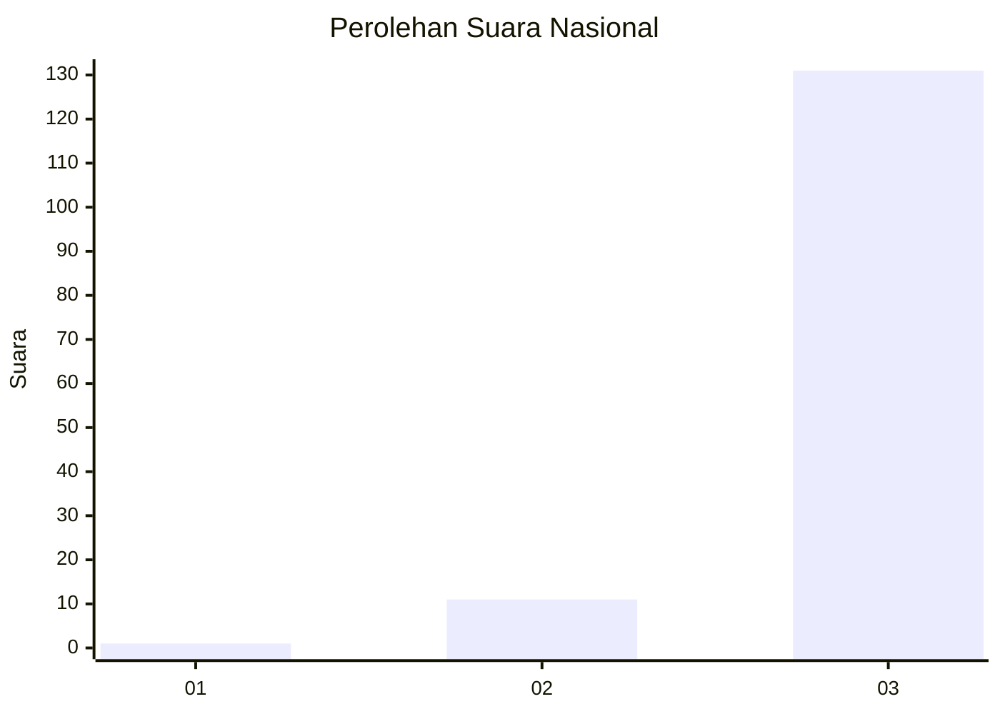
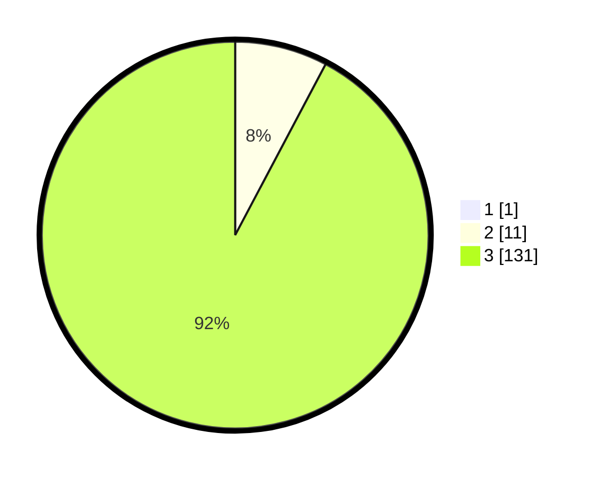

# Hasil

## Grafik

## Tabel

| No. | Nama Paslon    | Suara | Suara (raw) | Persentase |
|:--- |:-------------- | -----:| -----------:| ----------:|
| 1   | ANIES MUHAIMIN | 1     | [1][p-1]    | 0,70       |
| 2   | PRABOWO GIBRAN | 11    | [11][p-2]   | 7,69       |
| 3   | GANJAR MAHFUD  | 131   | [131][p-3]  | 91,61      |

[p-1]: https://github.com/gigit-pemilu/pemilu-2024/blob/main/pilpres/hitung-suara/sub/51-bali/sub/02-tabanan/sub/07-marga/sub/2012-payangan/sub/010-tps/sub/paslon-1.txt
[p-2]: https://github.com/gigit-pemilu/pemilu-2024/blob/main/pilpres/hitung-suara/sub/51-bali/sub/02-tabanan/sub/07-marga/sub/2012-payangan/sub/010-tps/sub/paslon-2.txt
[p-3]: https://github.com/gigit-pemilu/pemilu-2024/blob/main/pilpres/hitung-suara/sub/51-bali/sub/02-tabanan/sub/07-marga/sub/2012-payangan/sub/010-tps/sub/paslon-3.txt

## Foto C Plano

https://sirekap-obj-formc.kpu.go.id/2b09/pemilu/ppwp/51/02/07/20/12/5102072012010-20240214-125949--cb8fd6be-3b0c-489d-8323-aa7e1aa79a43.jpg

https://sirekap-obj-formc.kpu.go.id/2b09/pemilu/ppwp/51/02/07/20/12/5102072012010-20240214-130032--6a3a2a39-2b7f-42ed-84e9-14290668d09f.jpg

https://sirekap-obj-formc.kpu.go.id/2b09/pemilu/ppwp/51/02/07/20/12/5102072012010-20240214-130059--e7b9ca9e-be27-4805-9db2-9dc0f77da484.jpg

## Metadata

| Key        | Value               |
| ---------- | ------------------- |
| Time Stamp | 2024-02-14 21:46:01 |

## DATA PEMILIH TETAP

Jumlah pemilih dalam DPT: **170**.
 * L: **85**.
 * P: **85**.

## DATA PENGGUNA HAK PILIH

Jumlah pengguna hak pilih dalam DPT: **144**.
 * L: **73**.
 * P: **71**.

Jumlah pengguna hak pilih dalam DPTb: **0**.
 * L: **0**.
 * P: **0**.

Jumlah pengguna hak pilih dalam DPK: **0**.
 * L: **0**.
 * P: **0**.

Jumlah pengguna hak pilih: **144**.
 * L: **73**.
 * P: **71**.

## JUMLAH SUARA SAH DAN TIDAK SAH

JUMLAH SELURUH SUARA SAH: **143**.

JUMLAH SUARA TIDAK SAH: **1**.

JUMLAH SELURUH SUARA SAH DAN SUARA TIDAK SAH: **144**.

