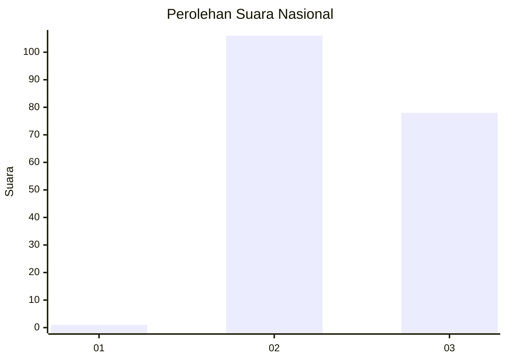
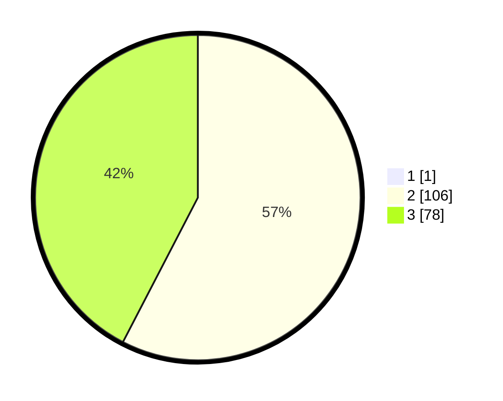

# Hasil

## Grafik

## Tabel

| No. | Nama Paslon    | Suara | Suara (raw) | Persentase |
|:--- |:-------------- | -----:| -----------:| ----------:|
| 1   | ANIES MUHAIMIN | 1     | [1][p-1]    | 0,54       |
| 2   | PRABOWO GIBRAN | 106   | [106][p-2]  | 57,30      |
| 3   | GANJAR MAHFUD  | 78    | [78][p-3]   | 42,16      |

[p-1]: https://github.com/gigit-pemilu/pemilu-2024/blob/main/pilpres/hitung-suara/sub/51-bali/sub/02-tabanan/sub/07-marga/sub/2013-marga-dajan-puri/sub/001-tps/sub/paslon-1.txt
[p-2]: https://github.com/gigit-pemilu/pemilu-2024/blob/main/pilpres/hitung-suara/sub/51-bali/sub/02-tabanan/sub/07-marga/sub/2013-marga-dajan-puri/sub/001-tps/sub/paslon-2.txt
[p-3]: https://github.com/gigit-pemilu/pemilu-2024/blob/main/pilpres/hitung-suara/sub/51-bali/sub/02-tabanan/sub/07-marga/sub/2013-marga-dajan-puri/sub/001-tps/sub/paslon-3.txt

## Foto C Plano

https://sirekap-obj-formc.kpu.go.id/1f28/pemilu/ppwp/51/02/07/20/13/5102072013001-20240215-222433--1ead94f3-717b-4e19-a142-91db0896d78f.jpg

https://sirekap-obj-formc.kpu.go.id/1f28/pemilu/ppwp/51/02/07/20/13/5102072013001-20240215-222435--be14f0c1-7c6b-42ca-ba62-ef0ef592ed10.jpg

https://sirekap-obj-formc.kpu.go.id/1f28/pemilu/ppwp/51/02/07/20/13/5102072013001-20240215-222434--946c0e69-163c-4eaf-9f29-2a281e9438cf.jpg

## Metadata

| Key        | Value               |
| ---------- | ------------------- |
| Time Stamp | 2024-02-15 23:29:50 |

## DATA PEMILIH TETAP

Jumlah pemilih dalam DPT: **192**.
 * L: **97**.
 * P: **95**.

## DATA PENGGUNA HAK PILIH

Jumlah pengguna hak pilih dalam DPT: **187**.
 * L: **96**.
 * P: **91**.

Jumlah pengguna hak pilih dalam DPTb: **0**.
 * L: **0**.
 * P: **0**.

Jumlah pengguna hak pilih dalam DPK: **0**.
 * L: **0**.
 * P: **0**.

Jumlah pengguna hak pilih: **187**.
 * L: **96**.
 * P: **91**.

## JUMLAH SUARA SAH DAN TIDAK SAH

JUMLAH SELURUH SUARA SAH: **185**.

JUMLAH SUARA TIDAK SAH: **2**.

JUMLAH SELURUH SUARA SAH DAN SUARA TIDAK SAH: **187**.

