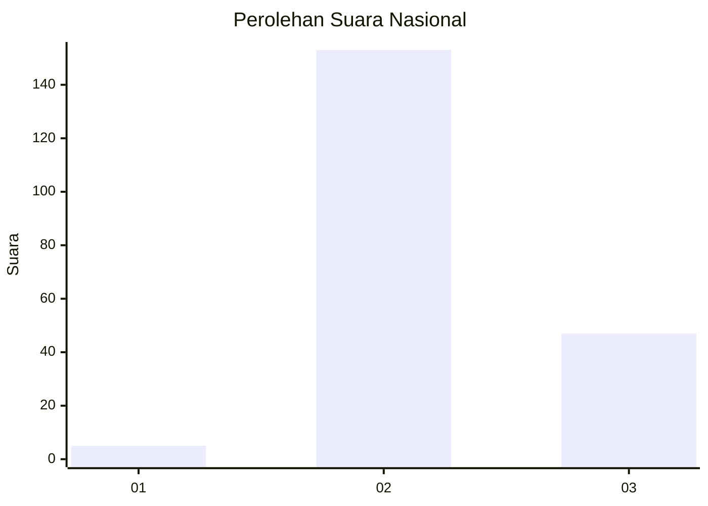
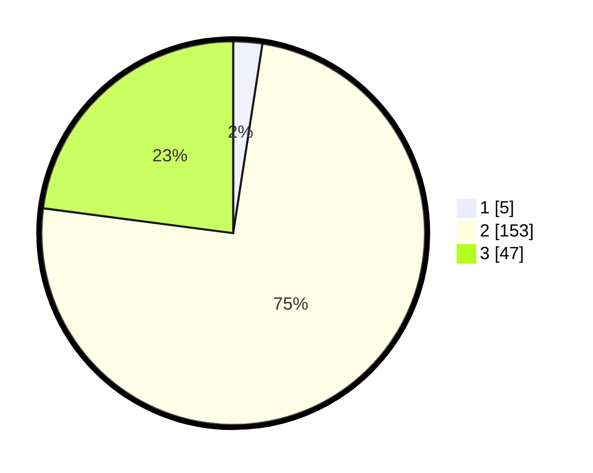

# Hasil

## Grafik

## Tabel

| No. | Nama Paslon    | Suara | Suara (raw) | Persentase |
|:--- |:-------------- | -----:| -----------:| ----------:|
| 1   | ANIES MUHAIMIN | 5     | [5][p-1]    | 2,44       |
| 2   | PRABOWO GIBRAN | 153   | [153][p-2]  | 74,63      |
| 3   | GANJAR MAHFUD  | 47    | [47][p-3]   | 22,93      |

[p-1]: https://github.com/gigit-pemilu/pemilu-2024/blob/main/pilpres/hitung-suara/sub/51-bali/sub/02-tabanan/sub/07-marga/sub/2013-marga-dajan-puri/sub/003-tps/sub/paslon-1.txt
[p-2]: https://github.com/gigit-pemilu/pemilu-2024/blob/main/pilpres/hitung-suara/sub/51-bali/sub/02-tabanan/sub/07-marga/sub/2013-marga-dajan-puri/sub/003-tps/sub/paslon-2.txt
[p-3]: https://github.com/gigit-pemilu/pemilu-2024/blob/main/pilpres/hitung-suara/sub/51-bali/sub/02-tabanan/sub/07-marga/sub/2013-marga-dajan-puri/sub/003-tps/sub/paslon-3.txt

## Foto C Plano

https://sirekap-obj-formc.kpu.go.id/fded/pemilu/ppwp/51/02/07/20/13/5102072013003-20240215-224924--9e1e03c7-2df8-4313-b1d4-afc25e2ee35d.jpg

https://sirekap-obj-formc.kpu.go.id/fded/pemilu/ppwp/51/02/07/20/13/5102072013003-20240215-224928--e4e55f9e-4bc9-4648-bd03-c23c5ea98bd7.jpg

https://sirekap-obj-formc.kpu.go.id/fded/pemilu/ppwp/51/02/07/20/13/5102072013003-20240215-224926--8f00660f-b3b9-4d17-94b5-f4fb0b261b3e.jpg

## Metadata

| Key        | Value               |
| ---------- | ------------------- |
| Time Stamp | 2024-02-15 23:29:50 |

## DATA PEMILIH TETAP

Jumlah pemilih dalam DPT: **228**.
 * L: **118**.
 * P: **110**.

## DATA PENGGUNA HAK PILIH

Jumlah pengguna hak pilih dalam DPT: **209**.
 * L: **107**.
 * P: **102**.

Jumlah pengguna hak pilih dalam DPTb: **0**.
 * L: **0**.
 * P: **0**.

Jumlah pengguna hak pilih dalam DPK: **0**.
 * L: **0**.
 * P: **0**.

Jumlah pengguna hak pilih: **209**.
 * L: **107**.
 * P: **102**.

## JUMLAH SUARA SAH DAN TIDAK SAH

JUMLAH SELURUH SUARA SAH: **205**.

JUMLAH SUARA TIDAK SAH: **4**.

JUMLAH SELURUH SUARA SAH DAN SUARA TIDAK SAH: **209**.

