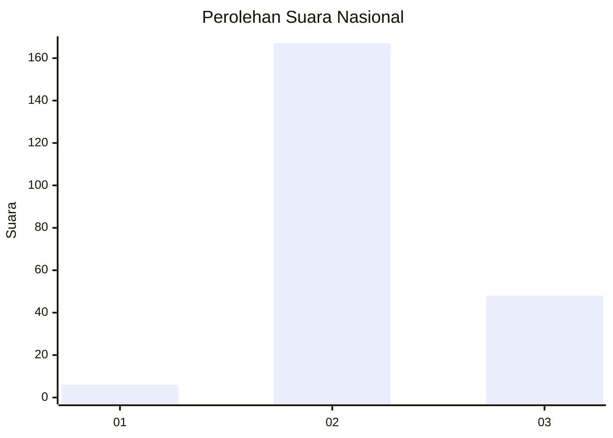

# Hasil

## Grafik

## Tabel

| No. | Nama Paslon    | Suara | Suara (raw) | Persentase |
|:--- |:-------------- | -----:| -----------:| ----------:|
| 1   | ANIES MUHAIMIN | 6     | [6][p-1]    | 2,71       |
| 2   | PRABOWO GIBRAN | 167   | [167][p-2]  | 75,57      |
| 3   | GANJAR MAHFUD  | 48    | [48][p-3]   | 21,72      |

[p-1]: https://github.com/gigit-pemilu/pemilu-2024/blob/main/pilpres/hitung-suara/sub/51-bali/sub/02-tabanan/sub/07-marga/sub/2013-marga-dajan-puri/sub/004-tps/sub/paslon-1.txt
[p-2]: https://github.com/gigit-pemilu/pemilu-2024/blob/main/pilpres/hitung-suara/sub/51-bali/sub/02-tabanan/sub/07-marga/sub/2013-marga-dajan-puri/sub/004-tps/sub/paslon-2.txt
[p-3]: https://github.com/gigit-pemilu/pemilu-2024/blob/main/pilpres/hitung-suara/sub/51-bali/sub/02-tabanan/sub/07-marga/sub/2013-marga-dajan-puri/sub/004-tps/sub/paslon-3.txt

## Foto C Plano

https://sirekap-obj-formc.kpu.go.id/a246/pemilu/ppwp/51/02/07/20/13/5102072013004-20240216-001555--9b4012c0-065b-43ed-bffe-6acf99a28449.jpg

https://sirekap-obj-formc.kpu.go.id/a246/pemilu/ppwp/51/02/07/20/13/5102072013004-20240216-001556--387614dc-b03c-46fb-8dec-87188ea9df8b.jpg

https://sirekap-obj-formc.kpu.go.id/a246/pemilu/ppwp/51/02/07/20/13/5102072013004-20240216-001555--dd4e8cf8-82e2-4f91-8b8f-103aee00178a.jpg

## Metadata

| Key        | Value               |
| ---------- | ------------------- |
| Time Stamp | 2024-02-16 12:51:22 |

## DATA PEMILIH TETAP

Jumlah pemilih dalam DPT: **240**.
 * L: **122**.
 * P: **118**.

## DATA PENGGUNA HAK PILIH

Jumlah pengguna hak pilih dalam DPT: **226**.
 * L: **116**.
 * P: **110**.

Jumlah pengguna hak pilih dalam DPTb: **0**.
 * L: **0**.
 * P: **0**.

Jumlah pengguna hak pilih dalam DPK: **0**.
 * L: **0**.
 * P: **0**.

Jumlah pengguna hak pilih: **226**.
 * L: **116**.
 * P: **110**.

## JUMLAH SUARA SAH DAN TIDAK SAH

JUMLAH SELURUH SUARA SAH: **221**.

JUMLAH SUARA TIDAK SAH: **5**.

JUMLAH SELURUH SUARA SAH DAN SUARA TIDAK SAH: **226**.

