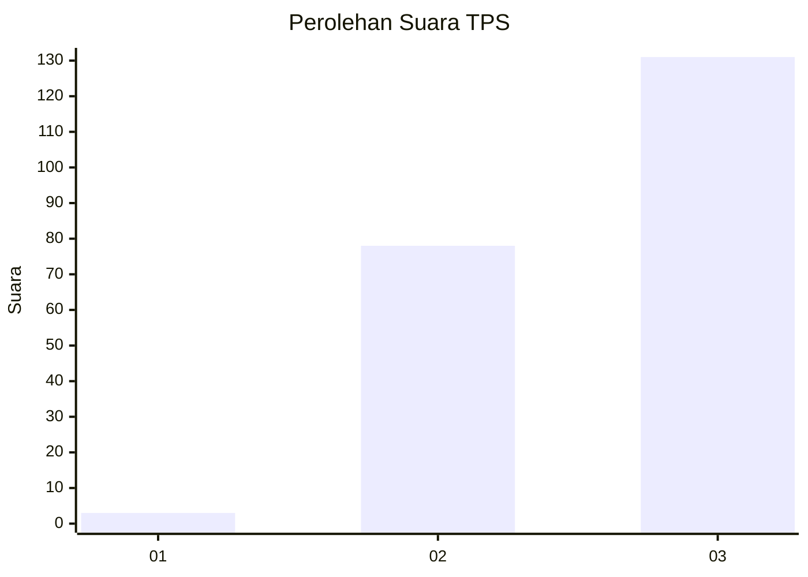
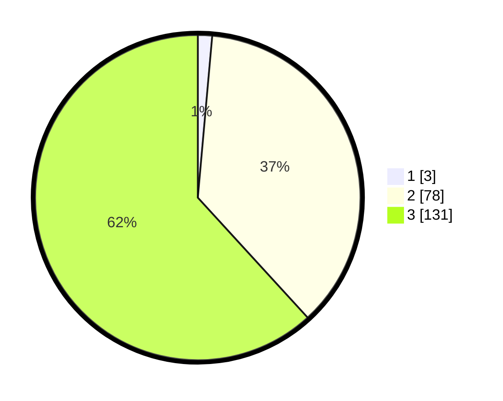

# Hasil

## Grafik

## Tabel

| No. | Nama Paslon    | Suara | Suara (raw) | Persentase |
|:--- |:-------------- | -----:| -----------:| ----------:|
| 1   | ANIES MUHAIMIN | 3     | [3][p-1]    | 1,42       |
| 2   | PRABOWO GIBRAN | 78    | [78][p-2]   | 36,79      |
| 3   | GANJAR MAHFUD  | 131   | [131][p-3]  | 61,79      |

[p-1]: https://github.com/gigit-pemilu/pemilu-2024-51-bali/blob/main/pilpres/hitung-suara/sub/51-bali/sub/02-tabanan/sub/07-marga/sub/2013-marga-dajan-puri/sub/005-tps/sub/paslon-1.txt
[p-2]: https://github.com/gigit-pemilu/pemilu-2024-51-bali/blob/main/pilpres/hitung-suara/sub/51-bali/sub/02-tabanan/sub/07-marga/sub/2013-marga-dajan-puri/sub/005-tps/sub/paslon-2.txt
[p-3]: https://github.com/gigit-pemilu/pemilu-2024-51-bali/blob/main/pilpres/hitung-suara/sub/51-bali/sub/02-tabanan/sub/07-marga/sub/2013-marga-dajan-puri/sub/005-tps/sub/paslon-3.txt

## Foto C Plano

https://sirekap-obj-formc.kpu.go.id/7e51/pemilu/ppwp/51/02/07/20/13/5102072013005-20240215-224338--964a0507-65cf-4024-88da-2423ddf3b0c9.jpg

https://sirekap-obj-formc.kpu.go.id/7e51/pemilu/ppwp/51/02/07/20/13/5102072013005-20240215-224341--7081bd50-6335-4996-91e3-d261d50d580e.jpg

https://sirekap-obj-formc.kpu.go.id/7e51/pemilu/ppwp/51/02/07/20/13/5102072013005-20240215-224340--835ee167-9824-40de-84ae-c3a4b0862c13.jpg

## Metadata

| Key        | Value               |
| ---------- | ------------------- |
| Time Stamp | 2024-02-15 23:29:50 |

## DATA PEMILIH TETAP

Jumlah pemilih dalam DPT: **236**.
 * L: **113**.
 * P: **123**.

## DATA PENGGUNA HAK PILIH

Jumlah pengguna hak pilih dalam DPT: **213**.
 * L: **102**.
 * P: **111**.

Jumlah pengguna hak pilih dalam DPTb: **0**.
 * L: **0**.
 * P: **0**.

Jumlah pengguna hak pilih dalam DPK: **0**.
 * L: **0**.
 * P: **0**.

Jumlah pengguna hak pilih: **213**.
 * L: **102**.
 * P: **111**.

## JUMLAH SUARA SAH DAN TIDAK SAH

JUMLAH SELURUH SUARA SAH: **212**.

JUMLAH SUARA TIDAK SAH: **1**.

JUMLAH SELURUH SUARA SAH DAN SUARA TIDAK SAH: **213**.

