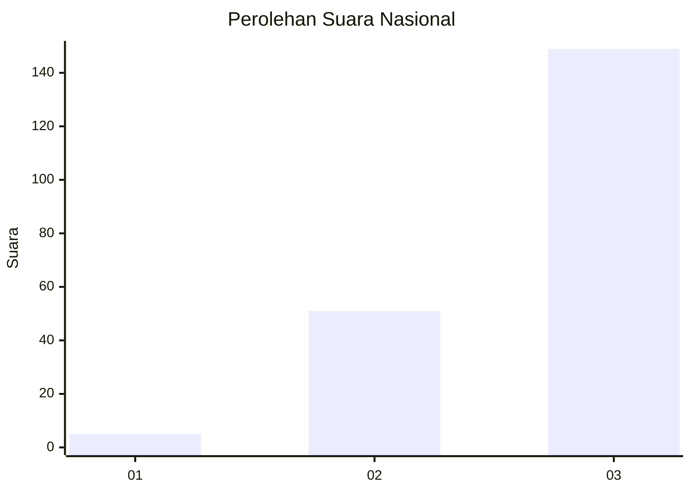
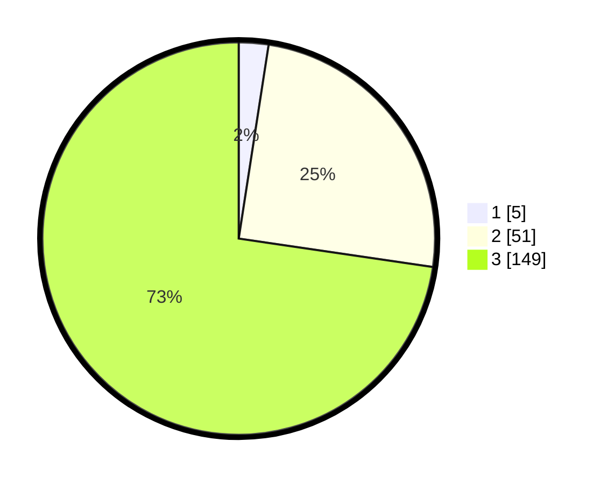

# Hasil

## Grafik

## Tabel

| No. | Nama Paslon    | Suara | Suara (raw) | Persentase |
|:--- |:-------------- | -----:| -----------:| ----------:|
| 1   | ANIES MUHAIMIN | 5     | [5][p-1]    | 2,44       |
| 2   | PRABOWO GIBRAN | 51    | [51][p-2]   | 24,88      |
| 3   | GANJAR MAHFUD  | 149   | [149][p-3]  | 72,68      |

[p-1]: https://github.com/gigit-pemilu/pemilu-2024/blob/main/pilpres/hitung-suara/sub/51-bali/sub/02-tabanan/sub/07-marga/sub/2013-marga-dajan-puri/sub/006-tps/sub/paslon-1.txt
[p-2]: https://github.com/gigit-pemilu/pemilu-2024/blob/main/pilpres/hitung-suara/sub/51-bali/sub/02-tabanan/sub/07-marga/sub/2013-marga-dajan-puri/sub/006-tps/sub/paslon-2.txt
[p-3]: https://github.com/gigit-pemilu/pemilu-2024/blob/main/pilpres/hitung-suara/sub/51-bali/sub/02-tabanan/sub/07-marga/sub/2013-marga-dajan-puri/sub/006-tps/sub/paslon-3.txt

## Foto C Plano

https://sirekap-obj-formc.kpu.go.id/f35f/pemilu/ppwp/51/02/07/20/13/5102072013006-20240216-012251--9da3ba01-78f5-42cc-b606-56131216c960.jpg

https://sirekap-obj-formc.kpu.go.id/f35f/pemilu/ppwp/51/02/07/20/13/5102072013006-20240216-012257--78949d13-9cba-45e0-a93d-a53e92de0148.jpg

https://sirekap-obj-formc.kpu.go.id/f35f/pemilu/ppwp/51/02/07/20/13/5102072013006-20240216-011819--b606e87f-1ca2-489d-a25b-3c20b7568f0f.jpg

## Metadata

| Key        | Value               |
| ---------- | ------------------- |
| Time Stamp | 2024-02-16 12:51:22 |

## DATA PEMILIH TETAP

Jumlah pemilih dalam DPT: **237**.
 * L: **118**.
 * P: **119**.

## DATA PENGGUNA HAK PILIH

Jumlah pengguna hak pilih dalam DPT: **207**.
 * L: **105**.
 * P: **102**.

Jumlah pengguna hak pilih dalam DPTb: **1**.
 * L: **1**.
 * P: **0**.

Jumlah pengguna hak pilih dalam DPK: **0**.
 * L: **0**.
 * P: **0**.

Jumlah pengguna hak pilih: **208**.
 * L: **106**.
 * P: **102**.

## JUMLAH SUARA SAH DAN TIDAK SAH

JUMLAH SELURUH SUARA SAH: **205**.

JUMLAH SUARA TIDAK SAH: **3**.

JUMLAH SELURUH SUARA SAH DAN SUARA TIDAK SAH: **208**.

